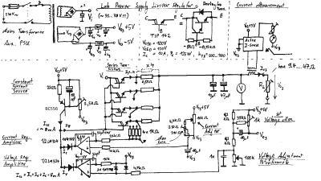

# 来自破损音频放大器的混合实验室电源

> 原文：<https://hackaday.com/2018/06/18/hybrid-lab-power-supply-from-broken-audio-amp/>

实验室电源是任何体面的电子工作台必不可少的一部分。然而，对于这样一个看似简单的设备来说，购买一个拥有所有所需功能的单元的成本可能会高得惊人。[后启示录发明家]向我们展示了如何从一个旧音频放大器的内部构建一个高质量的台式电源。

我们已经在 Hackaday 分享了我们自己的 DIY 电源，尽管这个已经有一年的历史了，但是由于一些原因，它走得更远。首先，许多昂贵和关键的组件是从故障音频放大器中抢救出来的:变压器、大型散热器和机箱，以及各种电容器、电位计、功率电阻器和继电器。其次，这个电源是混动的。除了现成的降压和升压转换器的两个输出，还有一个线性电源。对于一般用途的工作，开关电源的效率非常高，但在抽头上提供低纹波线性输出来测试 RF 和音频项目确实非常方便。

线性调节器的添加在第二个视频中有[介绍，它在技术上非常全面。[TPAI]很好地解释了组成他的线性供应的所有部件的功能，并从分立元件手动建立起来。为了监控前面板上的电压和电流，使用了两个老式表盘电压表，其中一个被转换成电流表。正是这些小辅助黑客使这个项目脱颖而出，另一个例子是重新布线变压器次级和桥式整流器，以获得额定电流两倍于原始电流的 38V 轨。](https://www.youtube.com/watch?v=_CFIovMkRyg)

作为这个版本核心的中国 DC-DC 开关转换器最近非常受欢迎，事实上我们甚至看到了为它们开发的开源固件。如果你想更多地了解它们在基本层面上是如何工作的，这里有[降压转换器如何工作](https://hackaday.com/2016/06/04/how-does-a-buck-converter-work-anyway/)，还有[升压转换器背后的科学](https://hackaday.com/2017/05/05/the-science-behind-boost-converters/)。

 [https://www.youtube.com/embed/J3N6RX_wAJg?version=3&rel=1&showsearch=0&showinfo=1&iv_load_policy=1&fs=1&hl=en-US&autohide=2&wmode=transparent](https://www.youtube.com/embed/J3N6RX_wAJg?version=3&rel=1&showsearch=0&showinfo=1&iv_load_policy=1&fs=1&hl=en-US&autohide=2&wmode=transparent)

