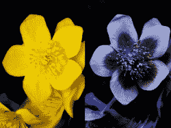
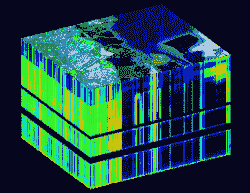
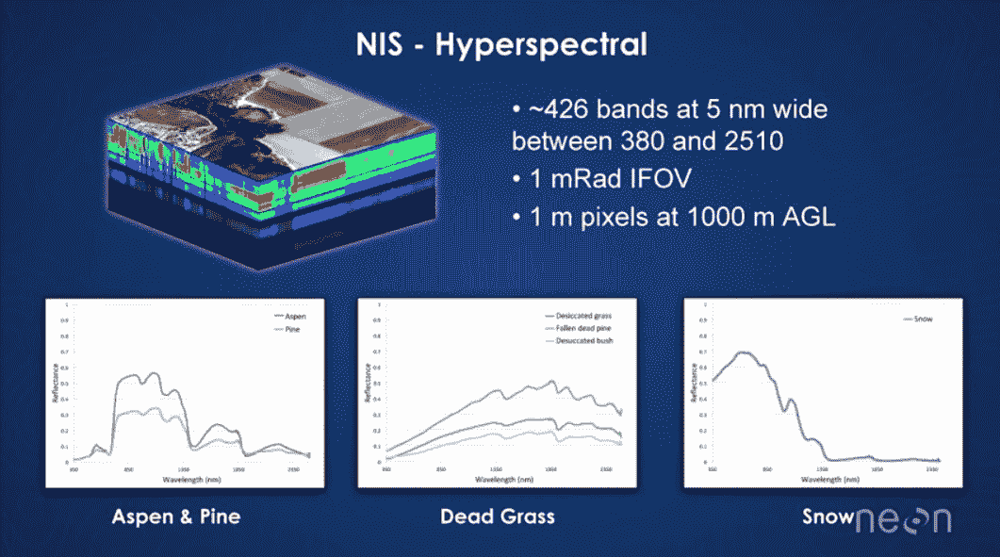

# 超光谱成像——看到看不见的东西

> 原文：<https://hackaday.com/2017/10/25/hyperspectral-imaging-seeing-the-unseeable/>

他们说一张图片胜过千言万语。但是图片到底是什么呢？一个定义将是我们所看到的完美反映，就像用基本相机拍摄的一样。我们对自然世界的看法被限制在电磁波谱中 400 到 700 纳米的带宽内，所以我们的相机在同样的带宽内产生图像。

Image via [Cosmos Magazine](https://cosmosmagazine.com/biology/incredible-bizarre-spectrum-animal-colour-vision).

例如，如果我用手机给一朵黄色的花拍照，图像看起来就像我亲眼所见的一样。但是如果我们能从电磁波谱的另一个部分看到那朵花呢？如果我们能看到小于 400 纳米或大于 700 纳米的东西会怎么样？像许多其他昆虫一样，蜜蜂能看到光谱中位于 400 纳米以下的紫外线部分。在我们看来，这种“黄色”的花与蜜蜂完全不同。

在本文中，我们将探索如何制作图像来显示我们有限视觉能力之外的光谱信息，并看看用于制作图像的多光谱相机。我们会发现，虽然一幅图像可能比一千个单词更有价值，但用超光谱相机拍摄的图像也可能比数十万甚至数百万的有用数据点更有价值。

## 数据立方体

光谱学是研究光如何与物质相互作用的。通常，从材料反射或发射的光穿过棱镜，以便将其分离成其光谱成分。然后对每个组件进行信息分析。在高端三 CCD 数码相机中；每幅图像都被分成红色、绿色和蓝色光谱分量。然后，每个 RGB 分量被赋予一个应用于像素的值。由此产生的图像或多或少反映了你所看到的。

Data Cube example via [U. of Texas](http://www.csr.utexas.edu/projects/rs/hrs/hyper.html)

应该可以遵循相同的过程，但是要观察除了视觉 RGB 光谱之外的其他光谱成分。这正是超光谱相机所做的。与 RGB 相机每像素获取 3 个数据点不同，高光谱相机每像素可能有数十或数百个数据点。总的高光谱图像是三维的，并且在数据立方体中表示。立方体的 X 和 Y 平面代表图像的空间部分，光谱信息记录在立方体的 Z 轴上:每个像素的完整光谱。

举个实际的例子——国家生态观测网络[ [NEON](http://www.neonscience.org/) ]使用了一台超光谱相机，范围在 380 到 2510 纳米之间，分辨率为 5 纳米。当相机距离地面 1000 米时，分辨率约为每像素一米，每个像素将包含 26 个数据点。从所有这些信息中，可以收集到不同类型的植被、水分含量等信息。

超光谱相机在生态研究、地理监测和农业管理中非常有用。农民可以使用高光谱相机来查看她的作物需要肥料、杀虫剂和/或水的区域。这使得她可以将所需的肥料用于作物的特定区域，而不是整个区域，从而为农民节省了大量的时间和金钱。

## 你为什么要告诉我这些？

你可能已经知道或者已经猜到，超光谱成像已经存在很长时间了。但是，创建超光谱图像所需的设置和软件过去非常昂贵，就像过去的许多技术一样，成本已经大幅下降。现在，任何有几千美元可以玩的人都可以加入多光谱游戏。在你对这个价格嗤之以鼻之前，想想你可以用多光谱装置获得多少有价值的信息。多光谱与超光谱相似，但看到的波段较少。

[NEON’s Hyperspectral camera](https://www.youtube.com/watch?v=jaARDWeyNDE)

我们能找到的最便宜的多光谱相机是鹦鹉红杉，标价 3500 美元。这种特殊的照相机是为农业设计的。

它的传感器观察红色、绿色和两个“看不见的”红外波段。它有自己的 GPS 和其他内置的导航硬件，所以你不必担心保持你的无人机的高度和速度固定。当然，摄像机会在一定范围内相应调整。它可以在 30 英尺到 500 英尺的高度操作，重量不到 80 克，所以在任何一架制作精良的无人机上安装一架都是可行的。

另一款稍微贵一点的相机是 Micasense 的 RedEdge T1，价格略高于 5000 英镑。它重了一点，只有 180 克，配备了和 Parrot 一样的传感器，但增加了蓝色。在 400 英尺的高度，它的分辨率可以达到每像素 8 厘米。该软件是基于云的，他们有一个很好的[在线演示](https://atlas.micasense.com/app/map/mosaics/c0f9f579-aec2-4d34-aeac-bb431be9070c?token=iWIOVnN-2FYPqrIalT41QA)。

## 结论

超光谱遥感并不新鲜。但是，正如 3D 打印已经存在了很长时间，并且由于专利到期，现在是一个蓬勃发展的行业一样，由于价格下降，超光谱成像可能会遵循同样的道路。明显的市场是小农场。但是黑客们有一种诀窍，那就是将技术远远推向其目标受众之外，并拓展可能性的边界。你能用超光谱或多光谱相机做什么？或者更好的是，你打算怎么做你自己的？

**来源**

通过 [Vespadrones](http://vespadrones.com/2015/11/29/hyperspectral-imaging-and-the-latest-sensors-for-uav-applications/) 的标题图像。

通过 [NIST](https://www.nist.gov/image/hyperspectralcube4501png) 的缩略图。

食品和农业的超光谱成像技术 ISBN 978-1-4939-2836-1