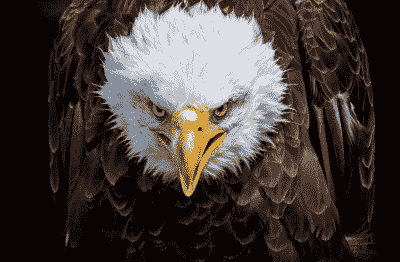
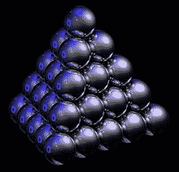
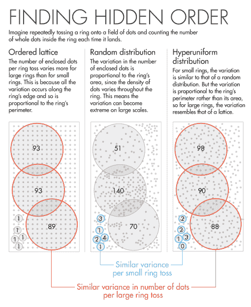

# 超均匀性——在最大的一组眼睛中发现的隐藏秩序

> 原文：<https://hackaday.com/2016/08/29/hyperuniformity-a-hidden-order-found-in-the-greatest-set-of-eyes/>

在进化偶然发现的所有事物中，眼睛是最引人注目的一个。作为一种“生物电磁转换器”，眼睛将进入的光子转换成电和化学尖峰，称为动作电位。这些尖峰然后驱动宿主生命形式的大脑。数十亿年的自然选择产生了几种类型的眼睛，其中一些比另一些更好。认为人类的眼睛处于食物链的顶端是一个诚实的错误，因为事实并非如此。哺乳动物经历了长时间在黑暗的洞穴和裂缝中四处乱窜，导致我们的眼睛让位于其他更重要的功能，如皮层的发育。

所有的眼睛都有颜色敏感的视锥。哺乳动物有三种类型的视锥细胞，分别是……等等……红色、蓝色和绿色。我们的红色和绿色视锥细胞在进化时间尺度上相对较新——大约出现在 3000 万年前。

这些视锥细胞分布在我们眼睛周围的方式并不完美。它们以凹凸不平、不均匀的图案散布在周围，因此给我们的世界带来了不均匀的光线采样。进化根本没有足够的时间来优化我们的眼睛。

然而，在这个星球上还有另一种动物从未像哺乳动物那样经历过“黑暗时代”。这种动物已经在掠食者之上翱翔了 6000 多万年，让它的眼睛达到了自然选择过程的顶峰。秃鹰能在一英里外发现老鼠。鸟类的眼睛有 5 种光敏视锥细胞——红色、蓝色和绿色，就像我们的眼睛一样。但是加入紫色和一种不能探测光线的视锥，或者黑色。但最吸引人的是这些视锥细胞分布在鸟眼周围的方式，这也是今天文章的主题。

## 隐藏的命令

圣路易斯华盛顿大学的乔·科博正在研究一只普通鸡的眼睛，这时他有了一个非常有趣的发现。光锥的分布方式不同于他以前见过的任何东西。这些光锥在人眼中是随机的，在鱼眼中排列成整齐的列和行。但是鸡眼中的光锥分布有某种独特的结构。这五种类型的视锥细胞本身是随机排列的，但是从来没有发现相同类型的视锥细胞彼此靠近。想象一下，拿一把由五种不同颜色组成的弹珠扔在地板上，找到每种颜色之间的等距间隔。

在光锥看似随机的分布中，显然有某种隐藏的秩序。[Corbo]想知道为什么它们不分布在网格或格子类型的结构中，因为这似乎是从外部世界采样光线的最有效的方式。为什么进化选择了这种模式？[Corbo]和他的同事们很快意识到他们遗漏了一些东西……有一些他们不了解的变量在起作用。

## 包装

Spheres optimally packed via [Wikipedia](https://en.wikipedia.org/wiki/Close-packing_of_equal_spheres)

经过一番研究后，[Corbo]向普林斯顿大学教授[[Salvatore Torquato](https://chemistry.princeton.edu/faculty/torquato?__hstc=13887208.9e77543c75b8c7d8aea8026fc039d79e.1472395025840.1472395025840.1472395025841.2&__hssc=13887208.1.1472395025841&__hsfp=409050642)]寻求帮助，他是公认的[打包](https://www.quantamagazine.org/20160330-sphere-packing-solved-in-higher-dimensions/)专家，打包研究的是在一组约束条件中装入最大数量的对象。[Corbo]想知道鸡视网膜中的视锥细胞是否被最佳地“打包”。几个图像和算法之后，发现它们确实以最佳效率打包。

然而，最令[托夸托]惊讶的是，包装是一种物理现象，从晶体到宇宙中的大尺度结构，这种现象随处可见。这一次，它又回过头来盯着他……透过一只普通鸡的眼睛。

## 超均匀性

当物品被最佳包装时，会形成一种特殊的模式。这就是[科尔波]在小鸡眼中看到的模式。它被称为“[超均匀性”](https://www.quantamagazine.org/20160712-hyperuniformity-found-in-birds-math-and-physics/)。鸡眼的独特之处在于，光锥的大小都不一样。考虑下面的演示:

在桌子上摊开一堆硬币，然后把它们包装成最密的状态。你会得到一个很好的规则重复的三角形点阵类型的模式。如果你扔进一些其他大小的硬币，这个模式就被打乱了。现在想象有五个不同大小的硬币被优化包装。不再有任何类型的模式…几何学迫使这是真的。这就是为什么五个光锥在鸡的眼睛里没有任何形式的分布。但是，这是一个大的*但是*，进化将要求不同类型的光锥均匀分布，这导致鸡的视网膜高度均匀。

[Source](https://www.quantamagazine.org/20160712-hyperuniformity-found-in-birds-math-and-physics/) via [Lucy Reading-Ikkanda](http://www.lucyreading.co.uk/)

让我们从半数学的角度来看超统一性，来逗逗你的大脑。想象一个由钉子和一些环组成的格子。我们把环扔到格子上，数一数环内有多少个钉子。这个数字会略有不同，因为每次投掷沿环边的钉子的数量会有所不同。我们可以观察到，随着环的增大，这种差异也在增加。因此对于小环来说，环内的栓钉数量总是相同的。但对于较大的环，覆盖的木栓数量略有不同。我们发现，无论是大环还是小环，覆盖的木栓数量都与环的周长成正比。请看左边的图像。

现在想象我们的钉子以完全随机的模式排列。在这种情况下，我们将发现包含在小环和大环中的栓钉数量的差异。方差将远大于点阵图形，尤其是大年轮。我们发现，无论是大环还是小环，覆盖的木栓数都与环的面积成正比。

如果我们有一个超均匀的图案，会发生一些奇怪的事情。让我们让这些钉子随机排列，但是彼此之间的距离相等…就像鸟眼中的光锥一样。我们发现小环中的木桩数量会以类似于随机木桩布局的方式变化——根据面积。但对于大环来说却不是这样。通过这些，我们发现变化类似于晶格布局——周长。这表明即使图案是随机的，大尺度密度与非随机晶格布局是相同的。

关于超均匀性还有很多要说的，量子杂志有一篇很棒的文章更深入一点。大自然有一种实现一些惊人的技巧的诀窍，它们经常在非常普通的地方被发现。