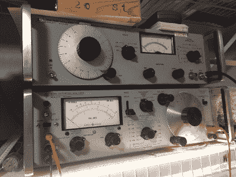
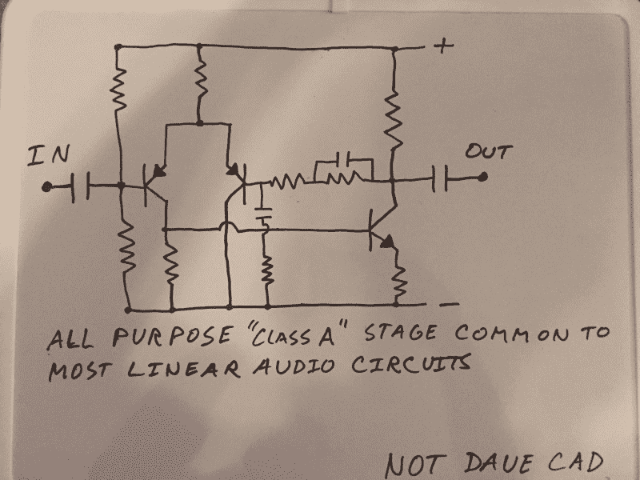

# 我想我失败了。是的，我失败了。

> 原文：<https://hackaday.com/2016/12/21/i-think-i-failed-yes-i-failed/>

你去兔子洞。

在我的特殊情况下，我正在测试一种用于音频前置放大器的新输出匹配变压器设计，并使用我的一种 go to driver 电路设计。非常稳定，非常可靠。振作起来，你就可以无忧无虑地去测试和测量土地了。这种特殊的变压器被设计成由 48 伏的 A 类放大器驱动，在专业音频设置中，你可以用你的小手指在空中转动旋钮。额外的分，如果你能找到一些长期停产的部分扔在那里的高保真信誉，我想要一些。

让我们用一些很酷的复古晶体管吧！我愉快地进行了几个小时的设计。仔细平衡长尾对输入的电流。选择合适的集电极功率电阻和电容值来驱动变压器。计算负反馈电路以获得适当的低频截止和高频稳定性，然后将器件放入试验板——跳线夹、仪表探针和测试引线比比皆是——这真是一件令人欣喜的事情。

所有的电压都检查过了，频率响应是你所期望的，稍微调整一下反馈就能让一切都好起来。是时候启动值得信赖的老 HP 334A 失真分析仪了。这些旧机器要求您校准输入电路和电压表，将滤波器调谐到应用于被测器件的基频，并逐步降低失真水平，直到电压表位于某个范围的中间。

即使是廉价产品中的大多数现代电路，也只是不假思索地将总谐波失真水平降至 0.1%以下，我预计情况也是如此。当我珍贵的电路的失真程度更像一个时钟收音机时，我脸上的恐惧表情一定很明显！疯狂的搜索开始了。是跳线坏了，还是电路板上的导线不干净，还是元件未安装到位？我的函数发生器是不是有些失修了？斯蒂芬·金的故事《最大超速传动》要成真了，我的板凳要把我生吞活剥了吗？在这种恐慌状态下所有明显的可能性。

稍事休息后，当恐慌和寻找一个确切的奇异问题的需要开始消退时，我意识到了一些事情。它正在做它应该做的事情。

在这种情况下，选择的输入器件是几乎被遗忘的 60 年代 Hitachi PNP silicon part 2SA565，采用 TO-1 封装(就像我们说的那样，这是一种高保真产品),长引线非常适合点对点组装。(这方面的内容以后再说。)毕竟，这些零件装饰了无数日本收音机等的音频舞台。一个 PNP 小信号 BJT 是一样好的权利？此外，这些多余的存储电容和电阻非常好。毕竟，它们在仪表上都是“好”的。这些跳线和仪表探头是 Pomona。你能得到的最好的。别担心。各种借口和理由层出不穷。

在这一点上，再多的乐观或幻想也无济于事。藏在我脑袋里的大人说了出来，真相显而易见。一堆旧的噪音部件和线路更像意大利面条，而不是一个合适的电子设备，怎么可能做得更好呢？我正试图用我自己设计的瓶子火箭进入轨道。我失去了洞察力。如此渴望测试我的新部件，以至于我完全忽略了良好的科学实践，因为我相信以前的经验可以指导我通过缺乏适当的设置和实验控制。仅仅这些跳线和探针上的串扰就可以解释这个问题，更不用说不合规格的旧部件的噪声了。

几乎不可能找到所有可能的原因。我从一开始就内置了 failure，只是为了让那些使用了零件的东西在视觉上更有吸引力。我最好去找出我在这件事上失去正直的地方。也许我今天下班回家时把它和我的钱包和钥匙放在一起了。我想我会去清理我的工作台，用新的现代元件来布局 PCB，这样我就可以真正完成测试了。

这是大多数线性音频设计中使用的标准长尾对输入电路。这是一个非常方便熟悉的东西，因为它是非常线性和适应性强的。此处所示为其标准音频配置，包括用于高频稳定性的高频斜坡和用于减少 DC 漂移的低通滤波器。