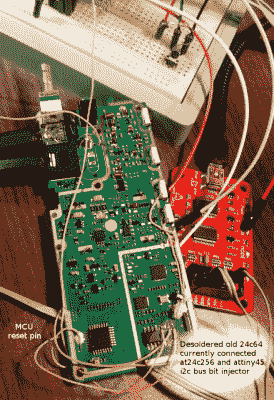

# I2C 位注入给一切增加了记忆库

> 原文：<https://hackaday.com/2016/07/12/i2c-bit-injection-adds-memory-banks-to-everything/>

[Igor]希望用更大的内存升级他新买的收音机——一台 Baofeng UV-82——以存储额外的扫描频道，并提出了一个非常优雅的解决方案:[用更大的 EEPROM 替换它的 EEPROM，并将额外的内存地址位注入 I2C 数据线](http://morethanuser.blogspot.de/2016/07/many-eeproms-inside-of-one-inject.html)。

 这款廉价的手持收音机配有一个 8192 字节大的 24c64 EEPROM，可以存储 128 个频道和一些其他的永久设置。当访问 24c64 时，收音机的固件通过 I2C 总线发送两个字节的存储器地址，但由于 24c64 的最大地址是`B00011111 11111111`，这些地址总是以三个前导零滚动。[Igor]用于他的黑客的 24c512 EEPROM 提供了 8 倍的内存，填充了两字节地址空间的最后三位。破解方法很简单:ATtiny45 监听 I2C 总线，听到内存地址到来。通过在适当的时候将 SDA 线拉高，Tiny 注入一个三位内存页面地址，该地址会覆盖固件发送的前导零。这有效地使 8 个 8192 字节大存储器页(或存储体)中的一个对无线电的固件可见。可以通过按钮选择哪个存储页面是活动的。

[Igor]还将 ATtiny 连接到收音机的复位线上，以便在存储体发生变化时强制其重新读取内存。由于自定义启动信息也存储在 EEPROM 中，收音机甚至在切换后在 LCD 屏幕上显示所选的记忆库。当然，这种方法并不局限于廉价的手持无线电设备，它可以用来为几乎任何带有 I2C EEPROM 的设备添加存储体，而这些设备并没有使用它的全部地址空间。请看下面的视频，其中[Igor]演示了这个技巧:

 [https://www.youtube.com/embed/NBMD-WamMg4?version=3&rel=1&showsearch=0&showinfo=1&iv_load_policy=1&fs=1&hl=en-US&autohide=2&wmode=transparent](https://www.youtube.com/embed/NBMD-WamMg4?version=3&rel=1&showsearch=0&showinfo=1&iv_load_policy=1&fs=1&hl=en-US&autohide=2&wmode=transparent)

