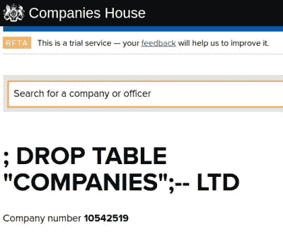

# 小 Bobby Tables 刚刚注册了一家公司…

> 原文：<https://hackaday.com/2016/12/29/if-bobby-tables-had-his-own-company/>

有时会出现一个偏离我们通常的硬件主题的技术故事，但它只是乞求与你分享，因为我们认为你会发现它很有趣。

[XKCD 327, Exploits of a Mom](https://xkcd.com/327/) (CC BY-NC 2.5).

毫无疑问，你对 XKCD 卡通片第 327 号很熟悉，名为“一位母亲的功绩”，但被亲切地称为“[Bobby Tables]”。一位老师正在给小罗伯特的母亲打电话。掉表生；–]他的名字导致了一年学生记录的丢失，原因是数据库输入的数据处理不当。我们都被它逗笑了，这个笑话也出现在其他地方，比如一个不可思议的长车牌，用来抹去超速罚单。

It’s nice to see that Companies House sanitise their database inputs.

今天，我们有一个新的波比表的笑话，因为有人注册了一个英国公司的名称为“[；删除“公司”表；–LTD](https://beta.companieshouse.gov.uk/company/10542519)”。有趣的是，公司办公室的人允许注册继续进行，所以要么他们也理解这个笑话，要么他们没有意识到一个基本 SQL 漏洞的细微差别。如果这个名字让女王陛下的公务员们脸上无光，它很可能会被迅速撤销，所以如果事实证明是这样，那么至少我们保留了一张截图。

当然，这种简单而众所周知的利用方式产生任何效果的可能性微乎其微。总会有一些糟糕的软件存在，其中包含未经净化的输入，但我们希望更适合于 1996 年的漏洞在 2016 年将会消失。

如果你在[之前没有遇到过它，我们建议你阅读关于数据库输入净化](http://bobby-tables.com/)的内容，有一天它可能会把你从令人尴尬的代码中解救出来。同时，我们向这家新公司的所有者和创造者致敬，他们给了我们欢笑，并祝愿他们在创业中一切顺利。