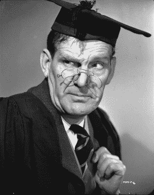
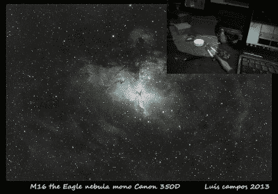
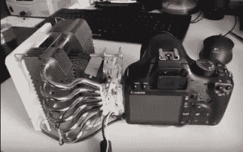
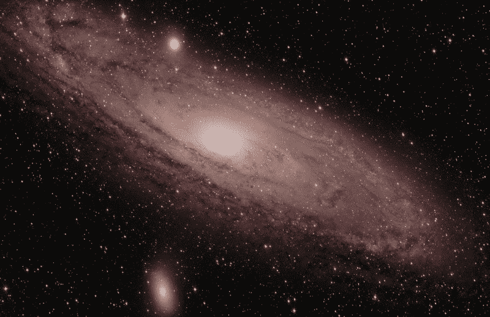
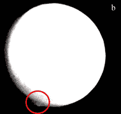

# 如果我们都是天文学家，就不会有战争了

> 原文：<https://hackaday.com/2015/10/27/if-we-were-all-astronomers-thered-be-no-more-war/>

我们最近报道了福里斯特·米姆斯的业余科学工作。作为一名业余科学家，Forrest 在某种程度上是独一无二的，他一直在领先的科学杂志上发表他的工作。然而，几乎从一开始，科学研究的一个领域——业余天文学就吸引了最高质量的业余科学贡献。

Will Hay – Amateur Astronomer

你可能听说过业余天文学家，比如舒梅克-列维 9 号彗星的共同发现者大卫·列维，以及像 T2 星系动物园这样的公民科学项目。但是业余天文学的历史可以追溯到更远，事实上早在 1781 年[威廉·赫歇尔](https://en.wikipedia.org/wiki/William_Herschel)作为一名音乐家发现了天王星。另一位艺人，20 世纪 30 年代的英国喜剧演员 [Will Hay](https://en.wikipedia.org/wiki/Will_Hay) ，也做出了重大贡献，在土星上发现了一个[“大白点”](https://en.wikipedia.org/wiki/Great_White_Spot)的电影角色。威尔是一个狂热的业余天文学家，他定期发表自己的观察结果。

他相信天文学让我们看到人类在宇宙中的真实位置，这让他宣称“如果我们都是天文学家，就不会再有战争了”。

威尔把他的观察记录下来，手绘在日志上。现代天文学家对夜空进行数字成像。数码相机当然围绕人类视觉系统进行了优化(正如我们最近讨论的那样)，这使得它们不太适合天文摄影。因此，黑客们做出了许多创新，其中一个更大胆的创新是[移除了拜耳过滤器](http://stargazerslounge.com/topic/166334-debayering-a-dslrs-bayer-matrix/):

 [https://www.youtube.com/embed/N1Lgju9L23c?version=3&rel=1&showsearch=0&showinfo=1&iv_load_policy=1&fs=1&hl=en-US&autohide=2&wmode=transparent](https://www.youtube.com/embed/N1Lgju9L23c?version=3&rel=1&showsearch=0&showinfo=1&iv_load_policy=1&fs=1&hl=en-US&autohide=2&wmode=transparent)

Image taken with a partially removed bayer filter (top right) and fully modified camera used to [image the Eagle nebula](https://www.flickr.com/photos/37419943@N08/9402541477/)

拜耳滤镜是一种彩色马赛克滤镜，覆盖成像传感器，将光分成红色、绿色和蓝色成分。通过去掉这个滤镜，你可以有效地将相机的分辨率提高三倍，但代价是它的色彩敏感度。有点令人惊讶的是，拜耳过滤器可以通过稍微小心的刮擦来移除(如上所示)。虽然这也移除了将光导向传感器[光电二极管、](http://cpn.canon-europe.com/content/education/infobank/capturing_the_image/microlenses.do)的微透镜，但总体效果在许多情况下是有益的。

Camera modified with [pelter and heatsink](https://www.youtube.com/watch?v=W4QYPIlMnVQ)

这是相当激烈的，但破坏性较小的修改也是可行的。对远距离光源成像时，降噪至关重要。为了消除系统噪声，天文摄影师拍摄一张黑色表面的“暗图像”。然后在处理图像时减去这个背景。这消除了图像中的系统噪声，它存在于所有镜头中。剩余的噪声源是随机的。这种随机噪声的最主要来源是热量。在原子尺度上，热是运动。当电荷载体(电子)被这种产生噪声的运动推来推去时。这种“热”或[约翰逊噪声](https://en.wikipedia.org/wiki/Johnson%E2%80%93Nyquist_noise)会给各种精密应用带来问题，而降低这种噪声的方法只有一个:冷却。由于这个原因，天文摄影师已经用主动冷却技术改进了他们的相机。这通常采用珀耳帖冷却器和散热器的形式，如右图所示。商业数码相机模组也可用，结果图像看起来很棒。

Image taken using a [JTW](http://www.jtwastronomy.com/products/ultimate.html) modified camera which includes sensor cooling

An image of the Martian plume from the Nature paper

业余爱好者经常使用他们先进的光学装置来做出重大的科学贡献，比如韦恩·耶西克最近在火星上发现了羽状物。他与专业天文学家合作证实的工作发表在《自然》杂志上，并引导科学家挖掘他们的档案图像，发现火星羽状物的先前证据，其来源尚不可知。

到目前为止，我们已经讨论了光学望远镜的使用，但业余爱好者在射电天文学方面也取得了进展。虽然很少产生光学望远镜的视觉吸引力的图像，但它们在许多方面更具技术吸引力，更多地依赖于电子和信号处理。随着 RTL-SDR 等廉价软件定义的无线电平台的到来，我们看到了许多很酷的射电天文学项目，如[脉冲星探测](http://www.rtl-sdr.com/detecting-pulsars-rotating-neutron-stars-with-an-rtl-sdr/)、[探测流星](http://www.rtl-sdr.com/detecting-meteor-radio-echoes-using-the-rtlsdr-usb-dongle/)，以及捕捉木星的[噪声爆发](http://www.rtl-sdr.com/capturing-noise-bursts-from-jupiter-with-an-rtl-sdr/)。最容易开始的方法可能是太阳活动监测。一个很好的例子是用于监测太阳耀斑电离层的 SIDmonitor。SIDmonitor 是一款非常简单的 VLF 接收机，使用简单的运算放大器。使用这个接收器，你可以在太阳升起和落下时探测到太阳，以及任何由不寻常的太阳活动引起的峰值。

很难不佩服业余天文学家的科学贡献和毅力。也许就像威尔·海伊建议的那样，如果我们多花一点时间仰望天空，我们的宇宙渺小将会更加明显，我们也不会那么担心自己相对渺小的存在。