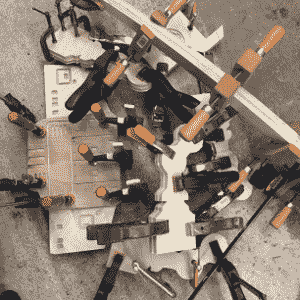

# 帝国摇杆阻止微小的叛军败类

> 原文：<https://hackaday.com/2017/10/25/imperial-rocker-for-stopping-tiny-rebel-scum/>

世界上一些最幸运的孩子肯定是父母都是黑客和制造者的孩子。当正常的孩子还在玩千篇一律的大规模生产的玩具时，这些孩子得到了一次性的小玩意和创造品，这将是游乐场羡慕的对象。坦率地说，有些东西最终变得非常酷，以至于成年人希望他们能回到过去玩它。

 一个这样的母体，一个这样的项目，就是【马修·雷戈尼】的[帝国摇杆。[Matthew]希望向他的后代灌输一种对遥远星系的痴迷，在 Illustrator 中一点一点地设计了这个 AT-AT 摇摆木马，然后用他的 XCarve CNC 路由器将它从桦木中切割出来。然后，每一件作品都被小心翼翼地粘在一起，以从单独的剪纸产生最终的 3D 效果。](https://imgur.com/gallery/acr8e)

随着弹簧夹的自由应用，在它干燥时将它固定在一起，剩下要做的就是费力地打磨所有的部分，这样叠层结构的边缘就会光滑。然后为把手和脚钉添加了销钉，几层聚氨酯密封了胶合板，同时呈现出自然的外观。

[Matthew]注意到这里和那里的一些问题，特别是在一些细节切割和几个错误计算的尺寸方面有相当大的偏差。但他认为摇滚歌手无论如何都将过着相当艰难的生活，所以最好不要为小事担心。

虽然帝国摇滚有着古雅的老派魅力，但我们想知道[马修]的小冲锋队还需要多久才会开始渴望年轻人永远也看不够的闪烁的灯光和按钮。

 [https://www.youtube.com/embed/d2xEEhFAZ2E?version=3&rel=1&showsearch=0&showinfo=1&iv_load_policy=1&fs=1&hl=en-US&autohide=2&wmode=transparent](https://www.youtube.com/embed/d2xEEhFAZ2E?version=3&rel=1&showsearch=0&showinfo=1&iv_load_policy=1&fs=1&hl=en-US&autohide=2&wmode=transparent)

