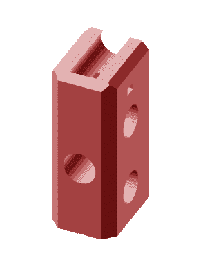
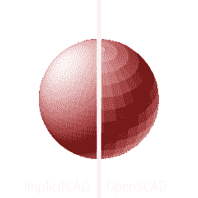
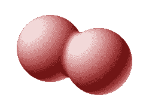
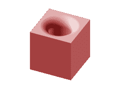
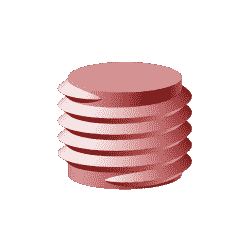
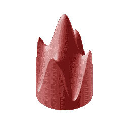

# ImplicitCAD:考虑到 3D 打印而构建的程序化 CAD

> 原文：<https://hackaday.com/2016/04/18/implicitcad-programmatic-cad-built-with-3d-printing-in-mind/>



Cornerstone of many useful things: This Prusa i3 part was modeled in OpenSCAD.

编程式 CAD，尤其是 OpenSCAD 语言和 IDE，已经伴随着创客运动有一段时间了。在 2009 年推出后，它很快就进入了许多制造商的 3D 打印工具箱，并最终成为开放硬件实验室、制造商空间和修补匠之间的行业标准。最受欢迎的 DIY 3D 打印机之一 Prusa i3 是在 OpenSCAD 中设计的，甚至销售了 100，000 台 3D 打印机的 Makerbot 公司也在其“定制器”中使用该语言，这是一种在线工具，允许用户以最小的努力定制 3D 可打印模型。

OpenSCAD 确实是一个很棒的工具，我们一直在大量使用它。我们已经习惯了它的怪癖，并接受了我们试图设计的模型的多边形网格近似。我们已经忍受了过多的渲染时间、脚本工作区和创建圆角的痛苦，并且我们已经学会了保持较低的审美期望。我们很高兴有一种方法可以编程地创建和共享几乎任何对象，但有时我们希望在开源世界中有更好的方法。提示:有。

# 隐式 CAD

受 OpenSCAD 的启发， [ImplicitCAD](http://implicitcad.org/) 最初是由 Christopher Olah 在 2012 年初发起的，旨在创建一个可靠的程序化 CAD 工具，为 3D 打印创建复杂的模型。它借用 OpenSCAD 语言进行建模，但有自己的 3D 几何引擎。在核心部分，引擎依赖于 3D 几何图形的[连续数学描述](https://christopherolah.wordpress.com/2011/11/06/manipulation-of-implicit-functions-with-an-eye-on-cad/)，而不是多边形网格近似。然后，完成的模型可以转换成基于网格的格式，如 STL，通过光线跟踪渲染成图像，或直接转换成 g 代码。在许多情况下，这在 ImplicitCAD 中比在 OpenSCAD 中发生得更快更有效。此外，ImplicitCAD 在编程方面提供了更多的灵活性——以及全面的 CSG 操作。ImplicitCAD 完全是用 Haskell 编写的，尽管有一种通用的建模语言，但它没有与 OpenSCAD 共享任何通用代码。

## 入门指南

ImplicitCAD 不是预编译的二进制文件，没有集成 IDE。有雄心创造一个基于网络的编辑器，但目前，它没有功能。我建议您使用 MeshLab 以及您最喜欢的文本编辑器来预览您的模型。

Linux、Mac 和 Windows 的[安装和构建说明](http://www.implicitcad.org/faq#local-installation)很容易理解，应该足以让你入门。要获得最新的开发版本 0.0.6，你需要从~~[ImplicitCAD 源代码](https://github.com/colah/ImplicitCAD)~~ 【编辑:[这个 implicit CAD 源代码](http://kalli1.faikvm.com/ImplicitCAD/Stable)，谢谢 Julia】。

### 你好世界

在系统上安装了 ImplicitCAD 之后，您就可以开始建模了。只需在桌面上创建一个名为 *'helloworld.escad'* 的空文本文件，并在您喜欢的编辑器中打开它。类型:



Mesh output quality at default rendering resolution.

```
sphere(r=10);
```

然后打开终端，通过键入以下命令来呈现您的模型:

```
$ extopenscad ~/Desktop/helloworld.escad
```

Mac 用户可以尝试这样做:

```
$ ~/.cabal/bin/extopenscad ~/Desktop/helloworld.escad
```

这将在你的桌面上创建一个 *'helloworld.stl'* 。在 mesh lab 中打开文件。哇，一个粗糙的球体。

ImplicitCAD 自动将渲染分辨率设置为一个合理的值(并在其终端输出中显示)，但是您可以通过在模型文件中定义$res 来指定渲染分辨率。值越小，渲染质量越高:

```
$res=0.5;
sphere(r=10);
```

渲染这个，再看一下 STL。现在质量应该好很多了。

## 它闪耀的地方

### 圆形 CSG 变换

ImplicitCAD 可以执行舍入联合。这会在融合的对象之间创建平滑的过渡。



Passing the ‘r’ parameter to the ‘union()’ module smooths out the transition between arbitrary geometries.

```
$res=0.5;
sphere_size=10;
fillet_radius=2;
union(r=fillet_radius)
{
  translate([-0.8*sphere_size,0,0])
    sphere(sphere_size);
  translate([0.8*sphere_size,0,0])
    sphere(sphere_size);
}
```

舍入差额也一样有效:



OpenSCAD’s ‘minkowski()’ module also allows convex smoothing – too bad it is such a handbrake. ImplicitCAD does this on the fly.

```
$res=0.5;
cube_size=10;
fillet_radius=2;

difference(r=fillet_radius){
  cube(cube_size,center=true);
  cylinder(r=cube_size/4, h=2*cube_size, center=true);
}
```

### 线

不幸的是，要从 OpenSCAD 中获得一个合适的线程，需要做大量的 CSG 工作。然而，ImplicitCAD 支持 rotate_extrude 模块中的转换，使线程更容易、更快:



An M16 thread in ImplicitCAD.

```
$res=0.05;
inner_diameter=13.55;
outer_diameter=16;
pitch=2;
turns=5;

union()
{
  cylinder(r=inner_diameter/2,h=(turns+1)*pitch);
  rotate_extrude(a=turns*360,translate=[0,turns*pitch],r=1)
    polygon([
      (inner_diameter/2-pitch,pitch),
      (inner_diameter/2,pitch),
      (outer_diameter/2,pitch/2),
      (inner_diameter/2,0),
      (inner_diameter/2-pitch,0)
    ]);
}
```

### 功能

ImplicitCAD 中的许多模块接受函数作为参数。此示例将拉伸高度设置为 x 和 y 的函数:



```
$res=0.05;
linear_extrude(height(x,y)=15+5*cos(x/4)+5*cos(x/2)+5*cos(y/4)+5*cos(y/2))
 circle(r=10);
```

## 它的作用

这只是几个例子，你可以在[项目的网站](http://www.implicitcad.org/examples/)上找到更多。除了圆角的*‘union()’*、*‘difference()’*和*‘intersection()’*转换，ImplicitCAD 还提供了圆角的原语，如*‘cube()’*。一些模块接受函数而不仅仅是参数，这允许更有效地创建曲面。更多细节，请看一下 [API 文档](http://www.implicitcad.org/docs/api)。与依赖单线程 OpenCSG 的 OpenSCAD 不同，ImplicitCAD 的几何引擎在多个内核上高度并行化。除了 STL 文件，ImplicitCAD 导出光线跟踪的 PNG 图像，DXF 文件和激光切割机的 g 代码。

## 它没有什么

还有很多 ImplicitCAD 做不到的事情。它缺少一个专用的文本模块，尽管文本仍然可以通过使用多边形来呈现。感谢其他的舍入工具，没有*‘闵可夫斯基()’*我当然可以活下去，但是我真的很怀念**‘赫尔()’**模块*。*目前，自定义模块不能处理子模块，2D 子系统缺少*‘偏移’*操作。在渲染之前，必须使用 *'union()'* 合并多个对象，而 ImplicitCAD 显然不会隐式地这样做。

## 3D 打印的潜力

ImplicitCAD 通过另一个用于建模零件的伟大工具扩展了您的 3D 打印工具箱。然而，在 3D 打印中，我们目前依赖于一个工具链，该工具链首先创建模型的网格近似，然后在生成刀具路径时创建另一个甚至更差的第一个近似，通常是 g 代码。ImplicitCAD 已经考虑到 3D 打印而构建，并且已经包括一些粗略的 g 代码导出功能。直接从模型生成用于 3D 打印的 g 代码，绕过网格生成，可能允许将来更快和更精确的切片过程。

## ImplicitCAD 的过去和未来

开发进度一直有点不稳定，但 ImplitCAD 的代码库一直是干净、简洁、可读的。在 Christopher 放弃项目并转向机器学习之后，开发工作停滞了一段时间，直到 Julia Longtin 接任新的维护者。她现在在 [HacDC](http://www.hacdc.org/) 用 ImplicitCAD 作为她的 3D 打印和微控制器课程的教学工具。原始功能几乎没有改变，但 Julia 成功地提高了几何引擎的精度和速度。她还试图修复基于浏览器的编辑器，这将降低使用 ImplicitCAD 的门槛。通过在整个代码中添加注释，她旨在让新的贡献者更容易阅读代码。目前，该项目正处于“重建年”，我们可能有很好的机会在 2016 年看到它获得新的动力。

感谢[Jasper1984]为本帖精选图片中使用的开放硬件徽标编写的 [ImplicitCAD 脚本。](http://www.thingiverse.com/thing:86133)