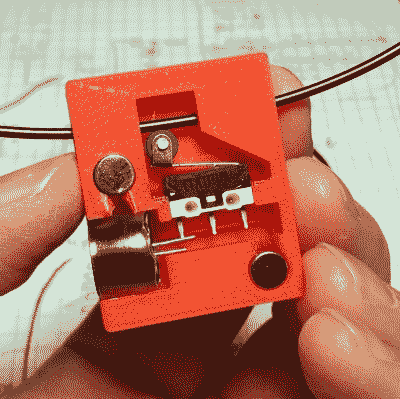
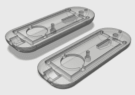
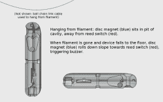
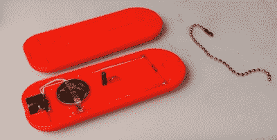
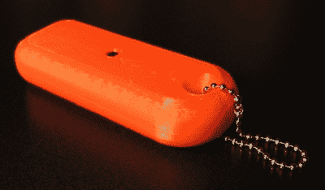

# 提高尖叫先生；80 分贝的灯丝报警器

> 原文：<https://hackaday.com/2017/06/07/improving-mister-screamer-an-80-decibel-filament-alarm/>

我创建了一个原型 3D 打印机灯丝警报，它工作正常，但这个过程也带来了一些新的问题，这些问题是我刚开始时没有预见到的。今天，我将进一步深入原型制作过程，以获得一些关于为一个明确指定的问题进行设计的见解。我想出的是一个易于制作的挂件，它被动地悬挂在灯丝上，如果有任何变化，它会提醒你。

首先，我需要知道我的 3D 打印机何时用完了灯丝，这样我就可以放下手头的工作，插入一个新的灯丝卷轴，紧靠前一个卷轴的末端。通过在灯丝耗尽后的四分钟内这样做，打印大量的工作可以不间断地继续。我设计的装置叫做“尖叫先生”。

## 基本概念

这个想法是，如果 3D 打印机有人值守(但不是在持续的监督下)，并且操作员准备在需要时更换细丝卷，那么打印机就没有必要执行任何“智能”任务，例如暂停打印。只要有一种在灯丝耗尽时触发警报的手段，操作员就可以做一切需要的事情来保持机器打印不间断，打印机本身甚至不需要知道。

## 第一个原型

The previous prototype used a roller switch to trigger a buzzer. Filament was fed through the device.

先前的原型通过滚轮开关物理感应灯丝，当灯丝耗尽时触发蜂鸣器。它的试运行很成功，但也暴露了一些新问题:

1.  当用手拉动细丝通过设备时，几乎没有阻力，但是一旦细丝在打印机中骑在一卷细丝上，就会产生比预期更多的束缚和摩擦。印刷是成功的，但是印刷商的挤压机必须比平时更加努力地工作。我曾希望这个装置会对供给系统和灯丝产生可以忽略不计的压力。事实并非如此。
2.  当灯丝用完时，这个装置掉落到桌面上一段距离。这是意料之中的。但这一冲击几乎将电池从摩擦配合的电池支架上完全撞松，这是不可预料的。如果电池完全弹出，这个设备就不会完成它的主要任务。该设备需要防摔，但原型设计并没有反映这一点。

尽管以前的原型做了它应该做的工作，但很明显存在问题，需要更新设计。

## 设计目标总结

对尖叫先生的基本要求没有太大变化。该设备的职责是:

1.  如果有灯丝，什么也不会发生。
2.  如果灯丝用完了，尖叫你的傻瓜头去提醒附近的操作员。

该设计的其他元素运行良好，足以保留，并且大部分保持不变:

*   外壳可以 3D 打印
*   独立的(无外部电源或信号)
*   无需对要监控的 3D 打印机进行任何修改
*   电气简单，使用最少的易采购零件
*   电池寿命长，功耗低
*   响应警报时易于关闭

从构建和测试第一个原型中获得的经验教训被用来增加以下设计目标:

*   不得干扰打印机的正常运行。理想情况下，打印机甚至不会注意到它。
*   设备必须坚固且耐摔。
*   能够轻松地将设备添加到已经在进行的打印的细丝上。

## 新的原型

新的原型保持了同样的基本功能，但采用了完全不同的方法。这种装置现在对方向很敏感，只能间接地感知实际的灯丝。它被设计成像一个垂饰一样用一个球链悬挂着。

当设备挂起时，它是无声的。如果它掉了，警报器会一直响，直到它被捡起来。因此，在操作中，只要灯丝馈入打印机，它就像挂件或钥匙链一样被动地悬挂在灯丝上。一旦线轴上的灯丝用完，这个装置就会掉到桌面上并触发警报。

新系统改变了技术。我去掉了滚轮开关，代之以簧片开关。在 3D 打印的外壳内部有一个空隙，可以容纳一个小圆盘磁铁。这种空隙被设计成一种形状，当悬挂在球链上时，它可以使磁铁远离簧片开关，但将*先生尖叫者*放在一个平坦的表面上，磁铁会靠近开关足够近，以启动它。

  Rounded edges ensure it always lays flat after falling.  Central M3 bolt secures both halves together.  Illustrated operation. Click to enlarge.

当从链条上垂直悬挂时(无论是为了存放还是悬挂在灯丝线上)，该装置是完全惰性的，并且不消耗能量。外壳设计有平坦的侧面和圆形的边缘，这样，当它落下时，装置总是偏向一侧或另一侧。

Central M3 bolt is plastic, so as not to interfere with the magnet.

Currently shrieking like a banshee in this orientation.

## 其他设计笔记

Once the filament runs out, the device will fall to the tabletop.

关于该设计，还有其他一些事情需要提及:

1.  球链可以打开和关闭。这意味着该设备可以在打印机使用时安装在灯丝周围。不需要像以前的版本那样卸下细丝并穿过设备。
2.  球链还有另一个优点:光滑的球就像细丝上的小轴承一样滚动。没有明显的磨损或污染风险。
3.  将所有部件(尤其是两个电池触点)连接到外壳的一侧意味着两个外壳之间没有飞线。这使我能够将电线粘合到位，这反过来意味着更容易组装(没有挤压电线！)和总体上更健壮的设备。
4.  磁铁对球链的吸引力会产生少量的磁滞现象。这种设备打开后需要轻轻“敲击”一下才能关闭。这是令人愉快的，但不是故意的，并说明了物理设计选择如何密切影响操作。
5.  在设计原型之前，我为一个不同的想法做了一个小的概念验证:使用滚动球倾斜开关来感应方向并触发蜂鸣器。这些小型设备使用外壳内的两个金属球，根据方向关闭或打开电气连接。不幸的是，这种连接很小，而且它们不能很好地传导电流。蜂鸣器只发出微弱的窒息声，电源直接通过滚动的球形开关。这个问题可以通过在设计中增加更多元件来解决，但我们选择了滚动磁铁和簧片开关的方法。

## 视频游览

警告:音频包含很大的蜂鸣声

[https://videopress.com/embed/1iGiCldF?hd=1&cover=1&loop=0&autoPlay=0&permalink=1&muted=0&controls=1&playsinline=0&useAverageColor=0](https://videopress.com/embed/1iGiCldF?hd=1&cover=1&loop=0&autoPlay=0&permalink=1&muted=0&controls=1&playsinline=0&useAverageColor=0)