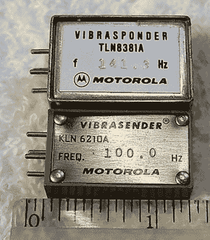

# 带内信令:编码静噪系统

> 原文：<https://hackaday.com/2017/09/13/in-band-signaling-coded-squelch-systems/>

在我们带内信令系列的第一部分中，我们讨论了一种最常见、最容易识别的音频控制形式，对于在过去五十年里打过电话的人来说，这种形式是再熟悉不过的了——双音多频(DTMF)拨号。我们的第二部分将探讨一种很少有人听说过的带内信令方法，正是因为它被设计为公共服务和其他无线电服务的亚音编码静噪系统。

### 打破静噪

回顾一下，带内信令系统被宽泛地定义为随传输的主要内容一起发送控制信息的任何系统。在打电话的情况下，主要内容将是你与另一端的朋友的对话，或者对着语音应答系统大喊大叫，该系统目前正在搞砸你的电费账单。控制信号将是你的电话发送到电信中心局的 DTMF 音调，以将你的电话连接到你的朋友，或者是试图连接到一个人的愤怒的按键声。在这两种情况下，DTMF 信号音与语音通话在同一信道或频带上传输，尽管可能是单向的。

带内信令也适用于无线电传输，作为一种无线电控制另一种无线电的方式。最常见的遥控形式是静噪系统。业余无线电操作员和其他双向无线电用户无疑熟悉接收机上的静噪控制，它用于手动设置一个阈值，输入信号需要比听到的信号更强。这消除了持续的白噪声，并屏蔽了远距离的微弱传输。

自动静噪系统有一点不同:接收器保持安静，直到它检测到来自发射器的编码信号，这时它打开静噪并允许传输被听到。可能大多数人熟悉它的地方是你在沃尔玛花几块钱买的那些泡罩包装的双向家庭无线电服务(FRS)收音机。所有这些小型超高频对讲机无线电都有某种“隐私代码”功能，这实际上是一种编码静噪系统。

自动静噪系统在双向公共服务和商业无线电时代很早就出现了。由于有限的带宽和大量的用户在广播，无线电制造商想出了共享频率的方法，而不必听到信道上的所有传输。例如，一个花店可以和一个拖车运营商共享同一个频率，但是每个公司只能听到他们自己的流量。至少理论上是这样的；这些功能很少像营销团队让它们看起来那么简单。

### 振动簧片

早期的静噪系统是基于“次可听”音调的，每次发射机被键控时都会发射这种音调。这些音调的范围从 60 赫兹到 250 赫兹左右，显然在人类听觉的范围内，但是考虑到接收器音频再现的限制，这些音调实际上是听不见的。但它们仍然被调制到载波上，一旦解码，接收器将打破静噪，允许所有设置为相同音调的无线电设备听到传输。

PL reeds for Motorola Micor radios. Source: [Repeater-Builder.com](http://www.repeater-builder.com/tech-info/ctcss/ctcss-overview.html)

这个系统正式名称为*连续音调编码静噪系统*，或 CTCSS，不同的制造商有不同的名称。摩托罗拉的系统被称为“专线”或“PL”，通用电气公司有“信道保护”，而美国无线电公司有“安静信道”音调频率根据 EIA RS-220 进行标准化，以实现品牌间的互操作性，整个系统最终被统称为“PL 音调”

早期的收音机使用振动机电簧片，本质上是连接在一个小线圈上的微小音叉。来自接收器的音频通过线圈馈入，如果存在正确的 PL 音，与该频率共振的簧片将振动并紧密接触以打开音频通道。音调在发射端用类似的簧片进行编码。

### 数字静噪及其他

谐振簧片 PL 系统在 20 世纪 80 年代达到了最先进的水平，今天服务的许多业余无线电中继器都是基于旧的摩托罗拉 UHF 和 VHF 基站，这些基站已经过调谐，仍然带有簧片。从现代的角度来看，簧片可能看起来很粗糙，特别是考虑到固态锁相环解码器取代了它们，簧片在通常恶劣的移动和远程条件下仍然稳定可靠，是小型化机电工程的奇迹。

但是技术不断进步，最终数字编码静噪(DCS)系统加入了 CTCSS 系统。实现方式各不相同，但摩托罗拉的“数字专线”或 DPL 成为了标准。它将连续的 134 bps 方波混合到音频信号中，并提供 83 个单独的代码，远远超过 PL 指定的 38 个音调。

双向陆地移动无线电技术已经走过了漫长的道路，因为早期的无线电收发机中的振动簧片塞满了真空管，占据了汽车后备箱的大部分空间。今天的全数字集群系统类似于分组交换网络，严重依赖带外信令进行控制。但是用于静噪控制的带内信令不会很快普及。