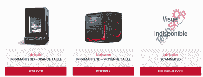
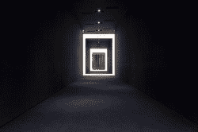
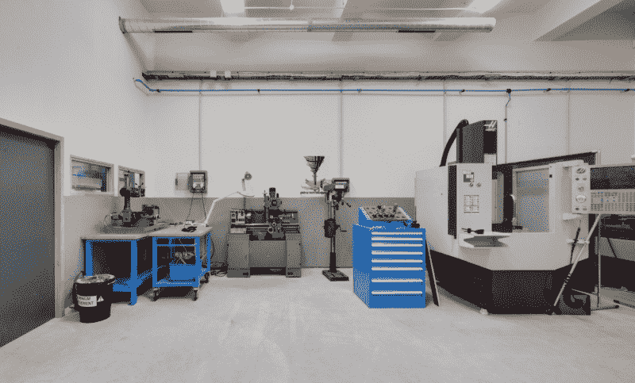

# 在巴黎，购买一台 3D 打印机比租用机器时间更便宜

> 原文：<https://hackaday.com/2016/08/08/in-paris-buying-a-3d-printer-is-cheaper-than-renting-machine-time/>

正如布莱恩·本考夫仇恨/粉丝俱乐部的许多成员所知，黑客作家的生活是游牧式的，充满了令人兴奋的冒险。珍妮·李斯特实际上是打击犯罪的机器人(想想邦德)；这就是为什么她对电子学了解这么多。詹姆斯·霍布森是钢铁侠。这样的例子不胜枚举。这里有很多不必要的细节，但总结一下:上个月我住在华盛顿州，这个月我在法国巴黎。这里真的很好，建筑很漂亮，大教堂令人惊叹，食物也非常美味。

但是，作为一名承包工程师，负责一个有期限的项目；在我去法国工作的假期里，我发现自己迫切需要大量快速周转的 3D 打印。通过大量的试验和磨难，我最终发现，最具成本效益的打印方式是购买一台便宜的 3D 打印机，然后在地下运行。

Appropriately, LVL1 is also home to the [world’s largest 3D printed trashcan](http://hackaday.com/2015/03/27/wrapping-up-the-last-midwest-reprap-festival/) (full of failed 3D prints).

我被我在肯塔基州路易斯维尔的黑客空间宠坏了。他们有足够的 3D 打印机，价格固定在每克 10 美分。对于我需要的打印量，这将是一个非常经济的安排。所以，我开始在巴黎寻找一个黑客空间。于是我达到了我的第一个明显的问题；我几乎不会说法语。

据我所知，巴黎列出的大部分黑客空间都是非法占据在镇上一个可怕的地方，只属于一所大学，只属于一家企业，或者已经关闭。

所以，我更努力地搜索了一下。哇！显然巴黎开了一家技术店。离我住的地方大约有一个小时的路程，但是我以前参观过一个技术商店，我知道他们会有我需要的工具的好版本。因此，一个明媚的清晨，我坐上地铁，前往这个地方参观。

我的发现是这样的:如果你需要像喷水切割机，焊接站，或 50，000 数控机床这样的东西，Techshop 是一种非常经济的方式来获得和使用这样的工具。然而，如果你想要的只是一台激光切割机和一台 3D 打印机，这将花费你 500 美元，而且你必须跳过一些令人难以置信的麻烦才能获得它们。

Only a small fee of 400 euros to used these bad boys.

你看，科技商店的大部分设备都需要预订。只有每月 150 欧元和 300 欧元的会员级别才能预订设备。150 层可以预订两个小时，300 层可以预订四个小时。如果你曾经进行过 3D 打印，你可以立即发现问题所在。对于小照片来说这是可行的，但是如果你有很多大照片，四个小时是不够的。但是，身边有一个工作。如果你愿意在深夜乘坐地铁，在晚上 10:00 到达技术商店，你当然可以通宵打印。

科技商店的计划还有两个小问题。要接触打印机，需要两个小时的课程，费用为 100 欧元。灯丝每 500 克也要 65 欧元。我的打印需求很容易让我花费几十个小时在路上，启动费是 400 欧元。

The entrance to Usine.io is terrifying. It’s this massive pitch black hallway. I had no idea if I was in the right place until I got to the desk.

现在，我并不是说 Techshop 在更先进的工具方面不太好。这可能是世界上唯一的黑客空间，在这里你有资格期待数控机床处于正常工作状态，经过适当的训练，并且实际上有切割钻头。但是，如果你需要的只是一台 3D 打印机，那就别麻烦了。

现在，我又询问了一些人，发现巴黎有一个名为 Usine.io 的竞争空间。它的固定费用是每月 180 欧元，培训是免费的。事实上，我最终获得了这里的会员资格，可以使用 CNC 和基本工具，但对于 3D 打印来说，这是一个失败。他们只有三台打印机为相当多的会员服务。这使得印刷商有 48 小时的时间来开始印刷，一个月最多印刷 40 小时。3D 打印的铁杆用户可以在 3 天内轻松使用 40 个小时。因为我不得不为我的项目测试许多迭代，下个月我的需求很容易达到这个数字的三倍。

However, the shop itself is really nicely outfitted.

除了 3D 打印机所有权之外，我可以利用的最后一个途径是与拥有 3D 打印机的人签约，为我打印照片。然而，经过询问，我发现这项服务相当昂贵。巴黎的房租毕竟不便宜。如果我只需要一个小的印刷，这是值得的，但如果我需要大量的印刷，它会很快增加到比我更多的钱。

这让我只有一个选择。老实说，对于一个要在一个国家呆上几个月的人来说，这听起来绝对疯狂。买一台打印机。这是 3D 打印状态的一个标志，价格已经下降到如此之低，以至于购买一台打印机比有人为你做更经济。甚至在几年前，这还是不可能的。然而，欧洲亚马逊 Prime 有一台足够好用的进口打印机送到我家门口，比任何商业服务处理我订单的速度都快。自达尔文时代以来，我们已经走过了漫长的道路。那是肯定的。

*精选照片来自[巴黎著名建筑](http://www.thingiverse.com/thing:311002)LeFabShop*