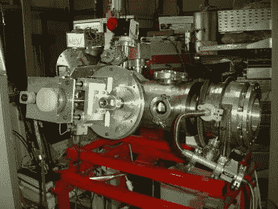
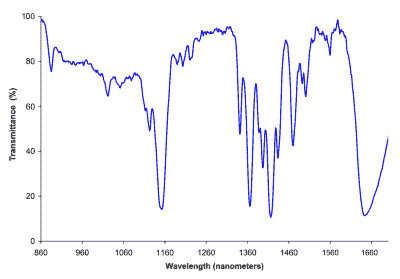
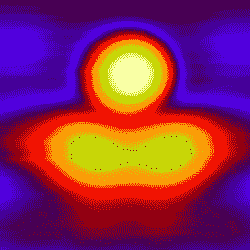

# 实验室表征的半导体结的白炽发光

> 原文：<https://hackaday.com/2018/04/01/incandescent-luminescence-of-semiconductor-junctions-characterised-in-the-lab/>

The semiconductor devices were put to the test under different atmospheres in this chamber.

当我们遇到我们的读者，了解我们社区的广度以及你所代表的各种技能和职业时，为 Hackaday 写作的一件令人羞愧的事情就来了。在你们的成员中有一个科学家的重要代表，因此我们经常收到对他们工作的迷人的预览和见解。有时候，它们比我们日常生活中的小片段更值得关注，这样的时刻本周已经来到了。

我们很幸运地提前看到了一篇论文，该论文对半导体结的一个迄今为止几乎没有表征的特性进行了详细的观察，这可能会对普通读者的工作产生一些兴趣。在他们的论文中，英格兰东北部 Fulchester 大学的[Mellie]，[Bacon] *等人*研究了白炽发光，这是一种短暂而奇特的效应，所有半导体结都表现出这种效应，当有高水平的电流时，它们会发出短时间高强度的红外线和可见光，上升时间极快。这是一种在商业设备中很少利用的特性，因为需要大电流密度来再现它。

## 解释了白炽发光

如果你以前从未听说过白炽发光，那么你是一个很好的公司，因为在有人向我们解释之前，我们也没有听说过。似乎在半导体结中存在一组更高能量状态的导带，只有当通过它的电流超过由所讨论的半导体材料的可用量子等离子体偶极矩决定的阈值时，才能到达这些导带。此时，结呈现等离子体状态，导致红外和可见辐射的突然发射，触发了白炽发光阶段。

A near-infra-red spectrum of incandescent luminescence in a silicon semiconductor junction.

虽然自 20 世纪初半导体结领域的最早实验者首次观察到这种现象以来，科学界就已经知道这种现象，但这种现象的短暂性传统上一直是对其进行适当检查的障碍。英国研究小组选择了一些与黑客阅读器可能使用的类型非常相似的商业半导体设备，将它们放在一个小室中，并使用一系列光电传感器和使用镅-241α辐射源的电离探测器来测量它们的发射。

然后，通过一堆定制的高速 ADC 卡采集数据进行处理。使用计算机控制的 DC 电源，在正向偏置的 PN 二极管结上测试了从低至几毫安到数百安培的电流密度，产生了各种光谱，并显示了在较高电流下产生的热电子光子发射在红外区具有优势。

Incandescent luminescence in action, through an infra-red pyrometer.

进行了一系列实验来研究由该领域的早期科学家首先描述的相关效应:半导体结所处的大气对其呈现白炽发光的方式有显著影响。发现将其浸泡在气态 CO₂或氮气中可以减少 95%的现象，而将其浸泡在液氮中则完全观察不到。相比之下，富氧气氛有助于增强所观察到的发光，在纯氧气氛中，发光效率达到 100%。

白炽发光的高转换效率和一旦被触发后的快速启动与现有装置如 led 或线绕电阻器相比是有利的，这些装置用于需要红外线或可见光的场合。研究人员预计，这种效应将被应用于照相闪光发生器、电子点火器和其他短时高强度应用等产品系列。鉴于它们明显的优势，我们预计它们对这些特定市场的影响无异于煽动。

感谢 Ellie D. Martin-Eberhardt 在报道这个故事时提供的一些宝贵的灵感和技术帮助。

近红外光谱:deglr 6328[【CC-BY-SA-3.0】](https://commons.wikimedia.org/wiki/File:Dichloromethane_near_IR_spectrum.png)。

试验箱:David Monniaux[[CC-BY-SA-3.0](https://commons.wikimedia.org/wiki/File:Particle_accelerator_dsc04485.jpg)。

红外图像:美国国家标准技术研究院[ [公共领域](https://commons.wikimedia.org/wiki/File:Scanning_tunneling_microscope;_Semiconductor;_Spintronics_(5884298881).jpg)。