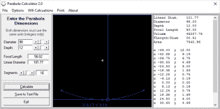
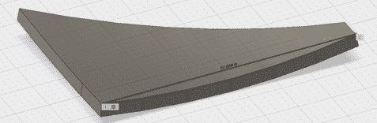
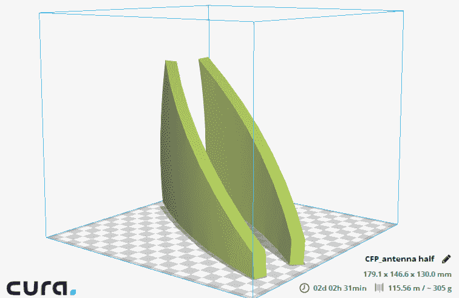
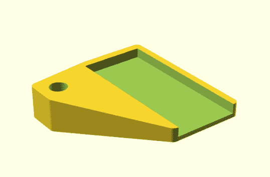
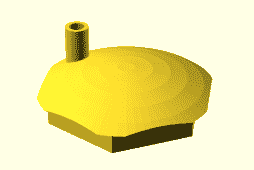
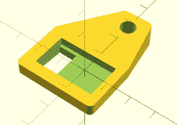
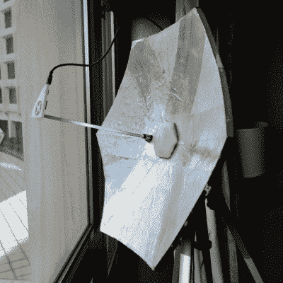
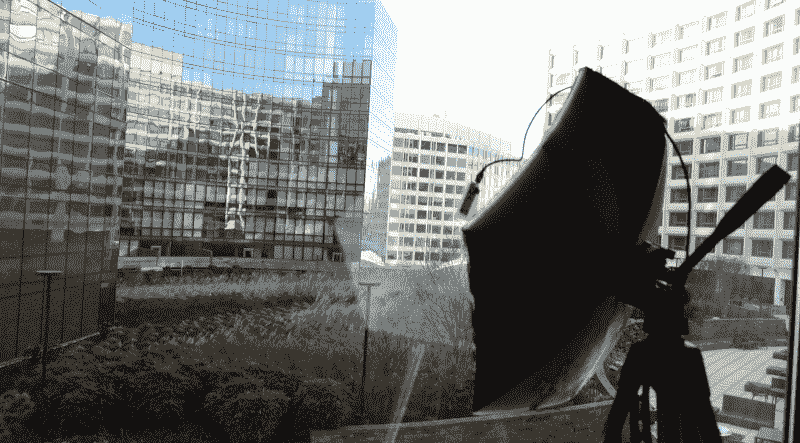
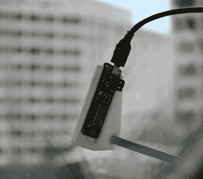

# 用胶带增加 ESP8266 的范围

> 原文：<https://hackaday.com/2017/01/30/increase-the-range-of-an-esp8266-with-duct-tape/>

长久以来，我一直想建造一个真正的、合适的射电望远镜。对我来说，这意味着一个大型抛物面反射器，一个由黄铜片制成的馈电喇叭，衣架线，以及至少在最初的实验中，一个 RTL-SDR 加密狗。我已经做了计算，在 Craigslist 上查看了旧的 C 波段天线，甚至设计了一两个可以使指向碟形天线成为可能的支架。我做了足够的计划，知道结果不会很好。经过几个月的工作，我所能期望的最好结果是一张非常低分辨率的银道面图像。如果我幸运的话，可能会有一个对应人马座 a 的亮点。

有更好的方法在你的后院建造一个射电望远镜，但是有一个巨大的抛物面天线在后院窥视天空的想法，一直困扰着我。我甚至设计了一个可以轻松拆卸和运输的盘子，因为自己做一个盘子远比在 Craigslist 上从一个家伙那里买一朵西弗吉尼亚州的花酷。

最近，我被要求为一个即将上映的视频设计一个未来的太空道具。我的定制，易于运输的抛物面天线立即跃入脑海。三米直径抛物面天线的想法被拒绝，因为它更实用，也更便宜，但我还是做了一些计算，打开 CAD 程序，开始实际的设计工作。作为测试，我决定 3D 打印这个盘子的小模型。在创建这个模型时，我不经意间为 ESP8266 模块创建了完美的 WiFi 天线，只使用了 3D 打印零件、一点环氧树脂和胶带。

### 设计一道菜

抛物面 WiFi 天线的设计与光学望远镜的设计没有太大区别。事实上，除了我们看到的光的频率之外，没有什么不同。光学的经验法则是，完美的反射器需要具有在反射器将被使用的光波长的 1/10 到 1/20 内的表面光洁度。对于波长为 400 纳米的可见光望远镜，这意味着抛物面镜需要具有完美的 40 纳米以内的表面光洁度。这是*病毒*的大小，但它仍然可以用氧化铈、沥青和第二块玻璃制成。

而 WiFi 的波长是 12.5 厘米，抛物面 WiFi 天线的表面需要完美到只有一两毫米以内。用 3D 打印机很容易做到这一点。

为了设计这个碟形天线，[我在互联网上找到了一些旧的免费软件](http://mscir.tripod.com/parabola/),它们可以测量碟形天线的相关尺寸——焦距和直径——并输出抛物线弧的 XY 坐标。然后，这些坐标可以导入到您选择的 CAD 软件中，拉伸成 3D 形状，并导出为 3D 可打印对象。

  Parabola Generator, a bit of freeware from the 90s.  The parabola, imported into Fusion 360, extruded into a dish, and cut into hexagonal segments.

### 它是六边形的，因此很酷

这个项目最初只是一个测试，看看我如何能建立一个大型的，易于运输的抛物面反射器。这需要一些设计考虑。第一，菜要由段组成，这些段要适合我的车。我决定做一个六边形的盘子，六边形的六分之一由左半部分和右半部分组成。这使得这道菜的各个部分足够小，可以装进我的车里，并且给了我额外的好处，那就是我只需要制作两个主模具就可以了。

把盘子做成六边形有一个小缺点:我漏掉了盘子的 17%。圆内接的六边形的面积是圆本身的 83%。然而，在盘子的外面有直线简化了我需要建立的任何加固或支撑。无论如何，这只是一个实验。

另一个设计考虑是如何将天线安装到支架上。理想情况下，你应该把它安装在靠近重心的地方。在圆形的情况下，这是中心。对于抛物面天线来说这不是问题。我们不需要天线的中心，因为它总是被馈电喇叭遮住。切掉盘子中间的部分，我们就有了一个漂亮的六边形孔作为安装点。

Fusion 360 里的几个快切，导出到 STL，丢到 Cura 里。我以这个结尾:

这是一个盘子的 1/12，另一个盘子的 1/12 沿 Y 轴复制和镜像。不，没用两天就印了六分之一的菜；我提高了图层高度，减少了填充物，但打印这两个部分仍然需要大约 10 个小时。总的来说，这是 60 个小时的打印时间和这个实验盘的两卷细丝。

除了 3D 打印的碟形部分，我还需要一些部件来将它变成一个合适的 WiFi 碟形部分。我需要一些方法来将这个东西安装到相机三脚架上，以及一些东西来将 ESP8266 固定在抛物面天线的焦点上。这是我想到的:

  The feedhorn for an Adafruit Feather Huzzah, a USB ESP breakout I quite enjoy  The center of the dish holds a dowel (or 6mm diameter knitting needle)  The mount for an ESP-01 module

六边形的部分简单地滑入盘子的中心。在背面，有一个用于相机三脚架的 1/4-20 螺纹插件。在前面，有一个为 6mm 销钉设计的孔，或者在我的情况下，一个塑料织针被切割成一定尺寸。我为 ESP8266 模块设计了两个支架。第一个是非常流行和非常便宜的 ESP-01 模块的简单安装。第二个支架适合 Adafruit Feather Huzzah 板，这是一个 ESP 分线板，具有一些简洁的功能，包括 USB 到串行适配器和电池的 JST 连接器。

### 不是管道胶带，是你用在管道上的胶带。

The reflective, metallic duct tape of my 3D printed dish

零件打印出来了，所有的东西都组装好了，这个实验盘仍然有一个问题。它对广播来说是相对透明的。虽然我可以使用金属细丝来建造，但我真的不想花那么多钱。相反，我找到了一个更好的解决方案:胶带。

在美国,“管道胶带”有几个意思。到目前为止，最常见的是一种涂有塑料的布背胶带，类似于钩形胶带。这种管道胶带或“鸭胶带”可能看起来像金属，但它不是。这也是你不应该在管道工程中使用的东西。不要把这东西放在空调系统上。

我用的不是布背的“管道胶带”，而是你应该在管道工程中使用的东西。这种“管道胶带”实际上是厚铝箔，一面带有压敏粘合剂。它具有无线电反射性，坚固且足够厚，因此可以打磨光滑。我用胶带来反射无线电波，这样做创造了有史以来最好的 clickbait 标题。

### 测试盘子

The Adafruit Feather feed horn, pointed at downtown DC

我住在森林中央河边的一辆货车里，所以测试 WiFi 连接的范围或天线的增益并不容易。理想情况下，我会去沙漠，去山顶，让一个有对讲机的朋友带着无线路由器开车离开。第二个最好的选择是在人口稠密的城市建一座高楼。幸运的是，[几周前，我在 DC 希尔顿酒店参加 Shmoocon](http://hackaday.com/tag/shmoocon/) 。我就是这样测试我的盘子的。

在 Shmoocon 的菜肴和甜甜圈聚会之后，我拿着我的菜上了几层楼，指着广阔的联排别墅和大使馆。实验装置由 Adafruit ESP Huzzah 组成，编程为通过串行连接报告所有可见的 SSIDs(带有 RSSI)。没有天线，我可以看到十几个 SSIDs。随着菜，我看到了大约 150 个 SSIDs 在最大计数。这道菜很好用，而且非常好用。

对于由 3D 打印零件和五分钟环氧树脂拼凑而成的东西来说，这个盘子的性能非常好。这是一个 19 英寸直径的碟，F/D 比为 0.5。理论上，如果它是圆形的，并且如果碟形天线的中心不在馈电喇叭的阴影中，它应该有 18.1 dBi *的增益。*我的六边形碟形天线不是圆形的，并且碟形天线的整个区域都没有被照亮，但我应该仍然有大约 16 到 17 dBi 的*增益。与 12dBi 的商业 Cantenna 相比，记住分贝是对数标度，我在这里做得很好！*

### 一个我不会重复的实验

这原本是一个实验，以确定是否有可能建立一个抛物面反射器，可以很容易地拆卸和重新组装。成功了吗？是的。但是有一些警告。

我最初的金属化计划是用 3M 喷胶和铝箔。这是一次彻底的失败。尽管盘子的表面可能离完美的光滑有一两毫米，但还是有太多的褶皱，超出了我想要处理的范围。相对无褶皱的金属表面的最佳解决方案是管道胶带。

我仍然需要正确地描述这道菜。我知道增益已经足够好了，理论上，它应该远远高于常见的，廉价的，商业天线或 WiFi 贴片天线。量化这种差异完全是另一回事。我乐于接受如何做到这一点的建议，但请记住，我家周围的所有山峰都有树。视线是一种奢侈。

和我所有的项目一样，[我把这个项目的所有细节都放在了 Hackaday.io](https://hackaday.io/project/18866-esp8266-parabolic-reflector) 上。这包括所有的。STL 文件打印自己的。我很有兴趣看看其他人是否能建造他们自己的 3D 打印抛物面天线，如果设计能改进就更好了。如果你设法打印出其中一份，请将它发送到[黑客热线](http://hackaday.com/submit-a-tip/)。