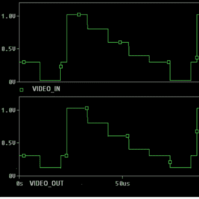

# 精密视频应用中增加电缆长度

> 原文：<https://hackaday.com/2015/12/04/increasing-cable-length-in-precision-video-applications/>

长距离传输视频信号可能会很棘手。便宜的同轴电缆做不到这一点。路径上要么需要放大器，要么需要使用昂贵的高质量屏蔽同轴电缆，这两种方式最终都会花费很高。[Maurizio]构建了一个低成本解决方案，使用双绞线电缆远距离传输视频。

这个系统很便宜，并且使用现成的零件。其思想是使用一对运算放大器将视频信号转换为差分输出，并通过一对双绞线传输，然后使用另一个放大器在接收端提取信号。

差分放大器通常需要双极性电源，在现有系统中增加这一升级时可能无法提供。为了克服这一限制，[Maurizio]使用了等于电源值一半的偏置电压。该偏置电压被加到非反相放大器信号上，并从反相放大器信号中减去。然后，产生的差分信号通过阻抗匹配电阻馈入双绞线电缆。在接收端，单个放大器接收差分信号并输出对应于原始视频信号的信号。

这种对称配置使系统不受外部噪声的影响。该设计经过测试，可在廉价的 CAT-3 双绞线上传输视频。据他说，当在 300 米长的电线上传输时，高质量的彩色视频显示在具有 NTSC 输入的监视器上。他在这个实验中使用了 [LMH6643 运算放大器](http://www.ti.com/lit/ds/symlink/lmh6643.pdf)，但也可以使用其他具有类似特性的器件。这里有一个有用的 [PDF 文件](http://www.kramerelectronics.com/downloads/manuals/cable.pdf)，讨论信号，电缆和连接。

如果你想了解更多[Maurizio]的工作，看看他是如何想出如何从 Excel 发送序列数据的。