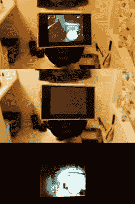

# 带屏幕的红外手电筒揭开隐藏的东西

> 原文：<https://hackaday.com/2016/08/01/infrared-flashlight-with-screen-uncovers-whats-hidden/>

手电筒在家里很方便，但是如果你想要一个更隐秘的方法来照亮夜晚呢？红外 LED 手电筒可以以相对较低的成本获得，但这有什么意思呢？为此，[johnaldmilligan]花了几个小时制作了一个带 LED 显示屏的红外手电筒来冒险进入黑夜。

[johnaldmilligan]拆卸了一个手持聚光灯作为外壳，留下了触发器组件和 12V DC 充电端口。一个微型摄像机被用作视频源后，删除其红外过滤器。注意:如果你这样做，不要忘记你将需要手动重新调整焦点！相机安装在手电筒灯泡的位置，而不是 LED 阵列，因为后者对于狭小的空间来说不切实际——但将其安装在手电筒顶部同样有效。红外发光二极管并联成八组，每组三个，向每组提供 1.5V 电压，防止烧毁。如果这听起来令人困惑，这里有一个非常详细的图表。

 PWM 用于在不需要发光二极管的亮度时对其进行调光，同时降低八节 AA 电池的电流。将组件连接在一起，将所有东西塞进手电筒，用 x 光胶片覆盖 LCD 屏幕，使显示器变暗，以达到其预期的夜间目的，这样就产生了一个适合 DIY 间谍的功能性设备。

对于另一个隐形的多用途选择，一个带[可更换 LED、红外线和紫外线灯头](http://hackaday.com/2012/04/27/a-flashlight-for-any-occasion/)的手电筒也将为你的工具包增加一些功能。

[通过 [/r/DIY](https://www.reddit.com/r/DIY/comments/4ufupx/diy_infrared_night_vision_gun/)