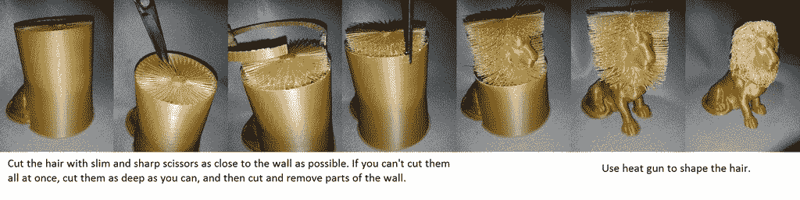

# ingenius 使用 3d 打印机给 simba 他应得的鬃毛

> 原文：<https://hackaday.com/2017/02/13/ingenious-use-of-3d-printer-gives-simba-the-mane-he-deserves/>

在 Hackaday，我们喜欢巧妙的 3D 打印。这个由[ _primoz_]重新混音的[令人惊叹的狮子雕像](http://www.thingiverse.com/thing:2007221)，让我们感觉没有什么不同。众所周知，在开源社区的热情支持下，FDM 3D 打印机取得了长足的进步。

然而，FDM 3D 打印机有一些固有的局限性；其中一些起因于有限的打印喷嘴直径，逐层描绘出 3D 物体。简而言之，一些印刷几何形状和尺寸是无法实现的。我们在之前的文章中讨论了传统 FDM 技术被限制在平面层的解决方案。

这里的例子是一只 3D 打印的狮子，它的原始版本没有完全捕捉到它雄伟的鬃毛。[_primoz_]解决方案是在头部周围构建一个支撑圆柱体，并将实际的头发形成为一系列平面刷毛，其宽度为一个挤出宽度。

接下来是一些简单的后处理，用热风枪将鬃毛加工成短小精悍的鬃毛。

结果是相当辉煌的，我们迫不及待地想有人火了双挤出机，拿出这种打印的柔性丝！

【通过[智多星](http://www.thingiverse.com/)