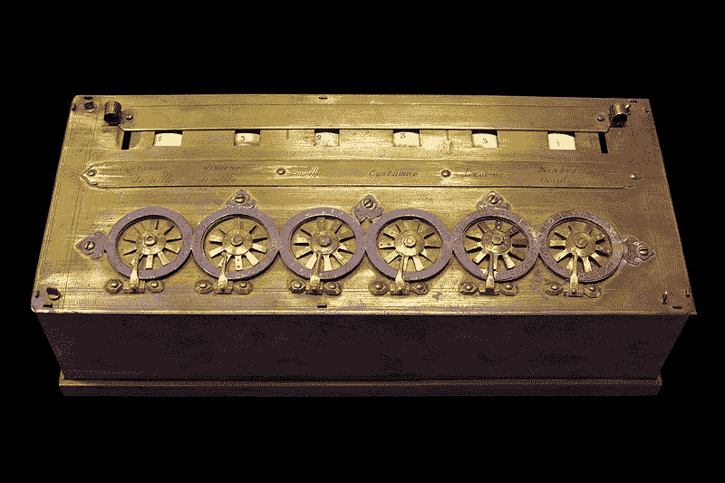
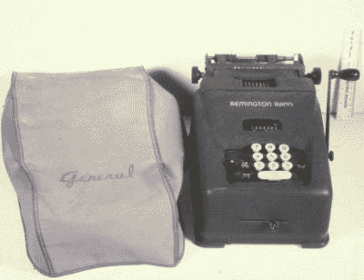

# 内部机械计算器

> 原文：<https://hackaday.com/2018/05/01/inside-mechanical-calculators/>

在一个典型的下午，就在晚餐时间之前，杂货店里的东西会变得非常繁忙，但至少现代人的经历有一点是有利的:相对安静。除了含糊不清的问候和“纸还是塑料？”收银员的问题，以及隔壁过道里偶尔传来的婴儿的尖叫，你可能听到的唯一声音就是商品结算时条形码扫描仪的嘟嘟声。

回到 40 年前，同样的场景是喧闹的，收银员阅读价格标签，在庞大的机电收银机上敲数字。那时候，如果你想在一些运算之外的算术上得到帮助，某种机械计算器是你唯一的选择。从简单的“一个香肠”加法机到复杂的模拟计算机，机械设备是令人惊讶的强大的数据处理工具。下面简要介绍一些简单的方法是如何工作的。

## 谢谢，爸爸

 

帕斯卡林。By Rama [ [CC BY-SA 3.0 fr](https://creativecommons.org/licenses/by-sa/3.0/fr/deed.en) ， [CC BY-SA 2.0 fr](https://creativecommons.org/licenses/by-sa/2.0/fr/deed.en) 或 [CeCILL](http://www.cecill.info/licences/Licence_CeCILL_V2-en.html) ，[来自 Wikimedia Commons](https://commons.wikimedia.org/wiki/File:Pascaline-CnAM_823-1-IMG_1506-black.jpg)

第一个实用的机械计算器出现在 17 世纪中叶(我将“机械计算器”定义为包含齿轮、杠杆、凸轮、弹簧等的设备。与早期的算盘不同。而[Antikythera 机制](http://hackaday.com/2015/11/23/the-antikythera-mechanism/)完全是另外一回事)。那时，年轻的布莱士·帕斯卡目睹了他父亲的雇员在鲁昂税务局忍受的单调乏味，他们一页一页地计算税收数字。不愿意被拉进家族企业，帕斯卡发明了一台机器来代替他做这项工作。

这个被称为帕斯卡林的装置是一台直接加法机，能够对一长串数字进行加减运算。该设备经历了 50 个原型，并在商业上取得了一些成功；Pascal 甚至为专业领域(如测量)制作了适用于不同基数的版本。然而，这种机器的复杂性超出了当时的制造技术，因此无法负担得起。但是帕斯卡的数学和机械天才为后来的发明家们拿起火炬铺平了道路。

## 拿着那个

帕斯卡的机器是所有机械计算器的关键操作，其突破在于完善了进位机制。在算术上，进位是将一个数字转移到下一个最高有效数字的行为。在机械计算器中，一个数字的数字通常由齿轮连接起来的轮子表示，将最右边(最低有效位)的数字增加到 9 以上意味着某种机制需要将该值带到左边的下一列，因此显示器显示为 10。如果一台机器不能可靠地运行——这是威廉·席卡德比帕斯卡早二十年发明的机器的致命缺陷——它就不能加法。

 [https://www.youtube.com/embed/nmwSmwNF9XY?version=3&rel=1&showsearch=0&showinfo=1&iv_load_policy=1&fs=1&hl=en-US&autohide=2&start=90&wmode=transparent](https://www.youtube.com/embed/nmwSmwNF9XY?version=3&rel=1&showsearch=0&showinfo=1&iv_load_policy=1&fs=1&hl=en-US&autohide=2&start=90&wmode=transparent)

## 轮子和齿轮

19 世纪中期，当复杂零件的制造得到改进时，实用的计算机在商业上变得可行。剥这只机械猫的皮有很多种方法，但几乎所有的机器都有共同的特征:

1.  输入操作数的机制；
2.  选择所需操作的方法；
3.  曲柄，用于对操作数执行期望的操作；
4.  显示结果的累加器

托马斯·德·科尔马的算术计是第一台在商业上成功的机器，它开创的许多原则将被用于下一个世纪。它使用莱布尼茨轮，即带有九个齿的圆筒，齿的长度逐渐增加，均匀分布在圆筒的半个表面上。每一个输入数字都由一个齿轮代表，这个齿轮在与莱布尼茨轮轴平行的轴上滑动。滑动齿轮只有在莱布尼兹轮上的齿啮合时才会旋转，它旋转的距离取决于齿轮的位置。齿轮所在的轴旋转该位置的累加器数字，旋转次数与输入数字的设定次数相同，进位机制负责溢出到下一个累加器数字。每个莱布尼兹轮的旋转与其相邻轮偏移 18°，以确保在执行高阶运算之前，来自较低有效位的所有进位在累加器中波动。

 [https://www.youtube.com/embed/nyCrDI7hRpE?version=3&rel=1&showsearch=0&showinfo=1&iv_load_policy=1&fs=1&hl=en-US&autohide=2&wmode=transparent](https://www.youtube.com/embed/nyCrDI7hRpE?version=3&rel=1&showsearch=0&showinfo=1&iv_load_policy=1&fs=1&hl=en-US&autohide=2&wmode=transparent)

尽管算术运算器很复杂，功能也很强大，但它决不是经过优化的。在 20 世纪 40 年代，Curt Herzstark 完善了他的 Curta 计算器，它可以在一个操作者可以用一只手握着的紧凑、优雅的包中完成算术计算器的所有功能。赫兹斯塔克的天才之处在于他意识到单个的莱布尼茨轮子可以被压缩成一个鼓。Curta 计算器具有很高的收藏价值，爱好者甚至用 3D 打印复制品重现了 Herzstak 的杰作[。](https://hackaday.com/2017/08/01/3d-printed-curta-gets-upgrades/)

## 移动到乘法

Remington-Rand Model 73 adding machine. Source: [National Museum of American History](http://americanhistory.si.edu/collections/search/object/nmah_690092)

使用现代用户能够理解的输入方法的机械计算器将会等待相当长的时间。20 世纪 40 年代，雷明顿·兰德公司发布了他们的 73 型加法机，带有熟悉的 10 键键盘。基本原理是输入一个操作数，并通过一次操作机械地将它送入累加器，这与早期的机器相似，但细节不同。

首先，键盘用于通过按下对应于键盘下矩阵中每个数字的木栓来组成加数。当机器侧面的曲柄转动时，每个数字的滑动齿条移动，直到它碰到从矩阵下侧伸出的该数字的销钉，停止在正确的位置，以在纸带上打印正确的数字。当曲柄返回时，齿条啮合一系列齿轮，将加数加到累加器上。总计和小计键允许打印最终和中间总计。

加法是机械计算器的主要工作，但它不是唯一可能的操作。减法通常很简单——只要倒着运行机器。一些机器，如 Curta，使用九的补码加法来简化过程。乘法也很容易；因为它只是连续加法，大多数机器都有办法将当前操作数锁定在输入部分，并允许曲柄转动被乘数指示的次数。但是有些机器允许累加器机制相对于输入区域左右移动，大大加快了乘法运算的速度。

 [https://www.youtube.com/embed/0CNqWY_kNZ8?version=3&rel=1&showsearch=0&showinfo=1&iv_load_policy=1&fs=1&hl=en-US&autohide=2&start=199&wmode=transparent](https://www.youtube.com/embed/0CNqWY_kNZ8?version=3&rel=1&showsearch=0&showinfo=1&iv_load_policy=1&fs=1&hl=en-US&autohide=2&start=199&wmode=transparent)

到 20 世纪 70 年代，机械计算器在很大程度上被功能更强、体积更小、噪音更小的电子计算器所取代。它们今天可能看起来很古怪，但它们是神奇的工具，用现有的资源完成了工作，甚至帮助我们登上了月球。

(如需一些机械计算器的惊人照片，请查看[凯文·图米(Kevin Twomey)的优秀作品集](http://kevintwomey.com/calculators.html)。)