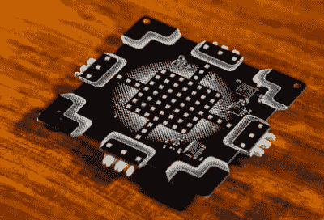

# 在今年的奎尔康徽章里

> 原文：<https://hackaday.com/2017/08/07/inside-this-years-queercon-badge/>

在这一点上，将 DEF CON 描述为一个单一的、大型的安全、技术和其他“黑客”活动会议是不正确的。DEF CON 更多的是一个组织，举办村庄、聚会、聚会和派对，志趣相投的人分享他们的时间、公司、电子战争故事和威士忌。以可骑可充气独角兽的数量来衡量，最大的团体之一是 queer con T1，这是一个致力于 LGBT 事业的“会议中的会议”,是一个派对狂欢者，也是一个杀手会议徽章。

Queercon 徽章总是一件艺术品，今年也不例外。去年，我们看了一下[一个完美的乌贼/墨鱼徽章](http://hackaday.com/2016/08/10/what-we-learned-from-the-2016-queercon-badge/)，几年前，[queer con 徽章是一个漂亮的 3.5 英寸软盘](http://hackaday.com/2014/09/15/the-queercon-11-badge/)，嵌入了太多的 RGB LEDs。今年的 Queercon 徽章同样令人惊叹，毫不夸张地将 badgecraft 推向了另一个维度。奎尔康徽章[背后的人们刚刚在徽章](https://blinkylights.ninja/blinky-lights/queercon-14-defcon-25-2017/)上写下了他们的尸检，这是如何将多氯联苯推向人类互动空间的一个极好的例子。

2017 年 Queercon 徽章的开发有一个非常艰难的过程要遵循。去年的大失败乌贼/乌贼徽章是功能 PCB 艺术世界的一个高点，到今年 1 月，该团队不知道下一步将 badgecraft 带到哪里。

最终，QC badge 团队决定采用“故障保护”设计——这不一定是最好的主意，但这种设计可以最大限度地减少风险和开发时间。

A single 2017 Queercon badge

这种徽章的两个明显特征是数量惊人的微型 RGB LEDs 和非常奇怪的雌雄同体边缘连接器，允许这些徽章一起插入一个徽章面板*或*立方体。这个徽章是做什么的？它会闪烁。如果你有五个朋友，你可以做一些看起来像来自*门户的同伴立方体的东西。*

### 五金器具

这个徽章的杀手锏是一个巨大的 RGB LEDs 阵列。Queercon badge 团队没有使用 WS2812s 或 APA101s，而是找到了简单的 0604 RGB LEDs，每只价格约为 0.026 美元。总共有 73 个 LED，全部由前几年使用的相同 TI LED 驱动器驱动，结合两个移位寄存器和 15 个 fet 来控制 LED 共用。虽然 led 驱动器能够处理所有 219 个，尽管徽章由 32 位 ARM Cortex M3 微控制器供电，但这几乎是该设置可以控制的 LED 数量的极限。

 奎尔孔徽章总是有一点内在的关联性，今年也不例外。今年，徽章使用了一种奇怪的通用连接器，安装在徽章的四个侧面。当一个徽章插入另一个时，它们配对产生发光徽章的“织物”。该连接器的运动范围允许 180 度旋转，但令人惊讶的是，大多数 Queercon 徽章固定器仅组装了单一平面的徽章。从徽章制造者那里花了一点时间让人们组装一个立方体，并且没有其他的*怪异的*形状是由多个徽章构成的。如果有人喜欢这个互联徽章的想法，我个人会建议等边三角形——这将允许二十面体或六边形立体。

### 一个游戏

没有游戏的徽章是不完整的，而奎尔孔徽章绝对有。UI/UX/图形设计师(Jonathan)基于一款名为“炼金术”的游戏开发了一款游戏。每个徽章都带有一组基本元素(气、火、水、土)，以像素艺术的形式呈现在 7×7 RGB LED 矩阵上。结合这些元素会产生更多的元素——例如，水加火等于啤酒。把它想象成《我的世界》的手工制作，但是有徽章。

星巴克负责赞助今年奎尔康的一部分，所以十个特别徽章都装载了第五种元素:咖啡。从咖啡元素派生的元素需要星巴克赞助商徽章。

正如我们所有人对 DEF CON 徽章的期望，有一个加密挑战和竞赛。[此处](https://avizc.github.io/2017/08/01/queercon-14-contest.html)提供了完整的记录，解决方案有点类似于一个徽章立方体。

### 圆满成功

当徽章从 fab house 返回时，今年 Queercon 徽章的失败率为 0.7%。对于任何独立的硬件徽章来说，这都是一个惊人的产量，也是今年 Queercon 最令人印象深刻的方面之一。失败模式*在*期间，这个骗局可能与把饮料洒在徽章上有关，尽管出现了一连串失败的 CPU。这可能与 ESD 有关，在 con 期间，由于在灯光昏暗的酒店房间里醉酒焊接，不合格徽章的返工基本不可能。

如果说今年的奎尔康有什么失败的话，那就是它变得太受欢迎了。从去年开始，奎尔孔的主要政党增长了 200%，这意味着不是每个人都得到了徽章。这是不幸的，但计划是在工程中为更多的库存明年，提供 DEF CON 26 不被取消，这是它。真可惜。