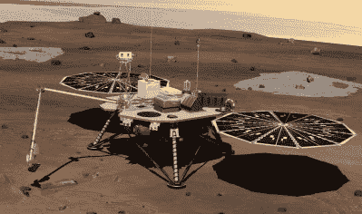

# 洞察号为火星带来新技术

> 原文：<https://hackaday.com/2018/05/18/insight-brings-new-tech-to-mars/>

 除非你的耳朵在发射台上可以这么说，否则你可能不知道[人类刚刚向红色星球](https://mars.nasa.gov/insight/)派出了一名新特使。InSight 着陆器预计将于 11 月 26 日在 Elysium Planitia 着陆，就行星际任务而言，它相对低调。作为美国宇航局“发现计划”的一部分，它比旗舰任务如*好奇号*漫游者的预算低得多；这意味着像大型广告和社交媒体活动这样让公众兴奋的细节没有一个项目。

这是一种耻辱，因为不仅有比提高公众对科学努力的认识更糟糕的事情要用纳税的钱去做，而且坦率地说，洞察力应该得到更多的尊重。InSight 拥有许多第一，其背后的工程师和科学家可能缺少资金，但雄心却很充足。

因此，为了庆祝成功发射，让我们来看看洞察号的任务，船上的独特技术，以及科学家们希望它能够在黑暗中找到的答案。

## 一个差点失败的任务

最初，InSight 应该在 2016 年 3 月推出。但是就在计划发射的三个月前，着陆器上的一个关键仪器在最终检查中被发现有缺陷。美国国家航空航天局确定无法及时开发和充分测试修复方案，这使他们别无选择，只能放弃 2016 年的发射窗口。

由于地球和火星的轨道，最佳发射机会每 26 个月才出现一次。这意味着 NASA 不仅要花钱将 InSight 小心翼翼地保存两年，还要出资重新设计故障仪器。总的来说，这一延误将使该机构损失 1 . 5 亿美元。当你考虑到 InSight 的设计、建造和运营的整个预算只有 6.75 亿美元时，这是一个特别令人痛苦的数字。

在如此短的时间内解决这个问题的任务被交给了美国宇航局的喷气推进实验室。如果他们没能在 26 个月的延迟期内设计并测试出解决问题的方法，这次任务完全有可能会被彻底取消。多亏了 JPL 争分夺秒的工程努力，洞察号目前正在前往火星的路上，而不是在美国宇航局的某个存储大楼里受煎熬。

## 老爷车，新装备

Phoenix Lander

如果 InSight 看起来很熟悉，不要担心，这不是你的记忆在捉弄你:着陆器与 2008 年在火星着陆的凤凰号任务基于相同的平台。

像这样建立在经过验证的设计上，不仅增加了任务成功的可能性，而且作为一个额外的奖励，比从头开始设计一个新的飞行器更便宜。美国国家航空航天局目前正在基于好奇号开发一种新的火星探测器，该探测器目前计划在 2020 年发射窗口期间前往红色星球，当然，双探测器*精神号*和*机遇号*取得了巨大的成功。

两艘飞船之间的主要区别是船上的一系列科学实验。InSight 的目标是帮助我们更好地了解火星内部的*,它带来的设备自然反映了这一点。该展览的明星是内部结构地震实验(SEIS)，这是一种不仅可以测量地震等内部现象，还可以测量火星地壳和地幔如何受到陨石撞击的工具。顺便说一句，这是同样的设备，它没有通过飞行前的检查，导致了两年的任务延迟。但是，考虑到它对这项任务的科学目标是多么不可或缺，可以理解为什么 NASA 不想让 InSight 离开它。*

虽然 SEIS 可能会在这次任务中提供最多的数据，但热流和物理特性包可以说是最闪光的。绰号为“鼹鼠”的这个装置被设计成可以在火星土壤中挖掘 5 米(约 16.5 英尺)深的洞穴；比以前任何仪器都要深得多。在它后面将是一条每 10 厘米(~4 英寸)包含一个敏感温度计的系绳，它将用于确定火星地壳的温度梯度。人们希望这将揭示到底有多少热量来自行星的核心。

## 深空立方体卫星

洞察号着陆器并不是 Alas V 火箭发射时唯一带入太空的东西。在巡航阶段(实际上携带洞察号前往火星的航天器)与助推器分离后不久，两颗相同的立方体卫星被部署在同一轨道上。它们被称为火星立方体一号(MarCO) A 和 B，是第一批进入深空的立方体卫星。它们将在飞往火星的途中与 InSight 一起编队飞行，如果它们成功到达那里，将在着陆器进入火星大气层期间作为信号中继来协助地面控制。

 [https://www.youtube.com/embed/P_8ZEAPrrHQ?version=3&rel=1&showsearch=0&showinfo=1&iv_load_policy=1&fs=1&hl=en-US&autohide=2&wmode=transparent](https://www.youtube.com/embed/P_8ZEAPrrHQ?version=3&rel=1&showsearch=0&showinfo=1&iv_load_policy=1&fs=1&hl=en-US&autohide=2&wmode=transparent)

正如[【Nacer cha hat】去年在接受 Hackaday 采访时解释的那样](https://hackaday.com/2017/02/22/interview-nacer-chahat-designs-antennae-for-mars-cubesats/)，与 2.25 亿公里外的公文包大小的物体进行通信不是一件小事，因此美国宇航局小心翼翼地不要对马可飞船承诺太多。但是可以肯定的说，很多人将会关注这个实验。立方体卫星已经是在地球轨道上进行科学研究的一个非常受欢迎的选择。如果美国宇航局能够证明这些小型飞行器能够在星际飞行中遇到的恶劣条件下生存，它可能会开辟一个全新的市场。

## 现在我们等待

在过去的几十年里，我们在向火星发射飞船方面已经取得了很大进步，但这仍然不是没有风险的。这是一个危险的六个月的旅程，穿越分隔我们世界的虚空，这还不是最难的部分。一旦洞察号抵达火星，它将不得不[执行复杂的自主着陆](https://hackaday.com/2017/12/13/extraterrestrial-autonomous-lander-systems-to-touch-down-on-mars/)，而我们被迫作为观众观看。

事实上，我们能够做到这一点是一个不可思议的工程师和科学家的证明，他们倾注了他们的心和灵魂到这些工艺。Hackaday 的每个人都希望 InSight 团队好运，我们期待着随着任务的进展而跟进。