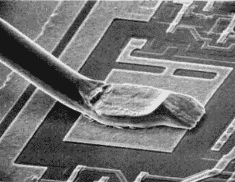

# 集成电路逆向工程，20 世纪 70 年代风格

> 原文：<https://hackaday.com/2017/06/02/integrated-circuit-reverse-engineering-1970s-style/>

在这些页面中，我们已经习惯了关于集成电路逆向工程的故事。一些经典芯片的引人入胜的曝光是由像永远努力工作的[Ken Shirriff]这样的人制作的。

你可能会认为这种做法是新的，仅限于那些对现在已经过时的硅的工作方式感兴趣的人。但是这些芯片的秘密在当时是被严密保护的商业情报，并且有一个小型的专家产业，他们的生活来源于解锁它们。

Electron micrograph of a wire bond to the Z80 CTC die

集成电路工程公司是一家位于亚利桑那州斯科茨代尔的公司，专门研究半导体行业数据。他们早已被一系列企业收购所吞噬，但我们有一个了解他们活动的迷人窗口，因为他们的档案由史密森学会保存。他们对集成电路进行逆向工程，以生成包含其机械性能和操作的详细信息的报告，而这样的报告正是我们今天的主题。[他们在 1979 年对 Zilog Z80 CTC](http://smithsonianchips.si.edu/ice/OCR_ScanPE125/PE125(10379-K).pdf) (PDF)的检查从检查封装开始，在这种情况下是更昂贵的陶瓷变型，然后详细查看芯片本身的内部结构及其焊线。然后，我们通过对芯片上电路的广泛分析，进入其打字页面，用门级电路来解释每个部分的操作。

这份报告中包含的细节是非同寻常的，很明显，它的制作投入了大量的工作，这对 Zilog 的某些客户和竞争对手来说具有巨大的价值。在当时，这可能是极其敏感的商业信息，即使现在看起来像是一件历史珍品。

Z80 CTC 是一款 4 通道计数器/定时器外设芯片，用于大获成功的 Z80 8 位微处理器，采用 28 引脚双列直插式封装。我们惊讶地发现，通过快速搜索，你仍然可以从一些常见的供应商那里买到这种芯片，而不是多余的房子，所以它甚至可能仍然在生产。

如果你喜欢集成电路逆向工程，看看我们的[Ken Shirriff]帖子档案。

谢谢你的提示。