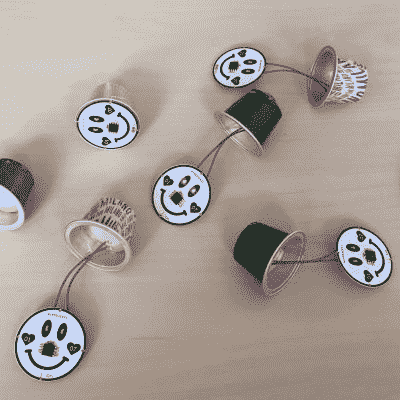

# Nespresso 胶囊内置互动婚礼机器人

> 原文：<https://hackaday.com/2016/07/01/interactive-weddingbots-built-into-nespresso-capsules/>

今天对(曼迪和塞巴斯蒂安)来说是一个非常特殊的日子，因为他们完成了神圣的婚姻焊接。我们向这对新婚夫妇致以最诚挚的祝贺和最美好的祝愿，不禁羡慕婚礼的来宾，他们收到了一份非常特别的婚礼礼物:一个婚礼机器人。

 为了他们的婚礼派对，【曼迪和塞巴斯蒂安】[自己创造了一个小游戏](https://sebastianfoerster86.wordpress.com/2016/07/01/weddingbot-nespresso-bot/) ( [译](https://translate.google.com/translate?sl=auto&tl=en&js=y&prev=_t&hl=en&ie=UTF-8&u=https%3A%2F%2Fsebastianfoerster86.wordpress.com%2F2016%2F07%2F01%2Fweddingbot-nespresso-bot%2F&edit-text=))。每位客人都会收到一个独特的小型婚礼机器人。其中的每一个都是为某一位客人量身定制的，具有合适的外观，独特的行为，并会播放对这位客人有意义的特殊旋律或顺口溜。然而，客人们没有得到他们的婚礼机器人，他们得到了另一位客人的婚礼机器人——以及在派对上找到这位客人的挑战。然后客人们会交换他们的结婚机器人，这也是一个互相介绍的好机会。如果婚配机器人本身提供的线索不足以找到正确的主人，客人可以将婚配机器人放在线索站，然后它会通过显示图像、文本甚至谜语来提供进一步的提示。

该设计基于 ATtiny45 微控制器，主要组件包括用于眼睛的 led、光传感器和用于声音的压电盘。作为一个外壳，他们选择重新利用空 Nespresso 胶囊，它看起来很好，增加了 PCB 的体积。然后用黑色记号笔将 PCB 上的笑脸丝网印刷个性化，并包装在一个漂亮的手工制作的盒子中。这些小家伙通过以特定模式闪烁他们的 led 来与基于 Raspberry Pi 的线索站进行交流。连接到 Pi 的光传感器让工作站识别机器人，并在屏幕上显示相应的线索。看看下面的视频，看看它是如何工作的:

 [https://www.youtube.com/embed/BukNiV7U7hs?version=3&rel=1&showsearch=0&showinfo=1&iv_load_policy=1&fs=1&hl=en-US&autohide=2&wmode=transparent](https://www.youtube.com/embed/BukNiV7U7hs?version=3&rel=1&showsearch=0&showinfo=1&iv_load_policy=1&fs=1&hl=en-US&autohide=2&wmode=transparent)

