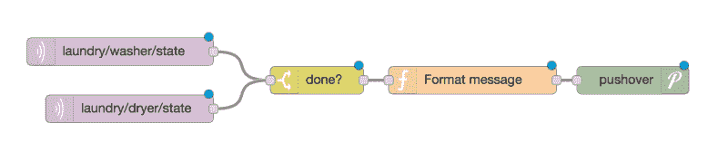

# 洗衣网络——让 ESP8266 看着你的脏抽屉变干净

> 原文：<https://hackaday.com/2018/05/20/internet-of-laundry-let-the-esp8266-watch-your-dirty-drawers-get-clean/>

当你想到改变世界的设备时，你通常不会想到洗衣机。然而，让洗衣变得易于管理不仅改变了我们的着装方式，也改变了人们清洗衣服所花费的时间。因此，抱怨我们今天的洗衣有多费力会让 19 世纪的人发笑。尽管如此，我们都讨厌洗衣服，尤其是安德鲁·杜邦(Andrew Dupont)，讨厌不得不去检查洗衣机是否洗好了。于是他做了[洗衣间谍](https://andrewdupont.net/2018/02/15/laundry-spy-part-1-the-hardware/)。

你如何感觉洗衣机或烘干机已经洗完了？[Andrew]想过感应电流，但不想干扰室内电流。他的机器没有 LED 指示灯，所以使用光传感器也行不通。然而，加速度计可以检测机器的振动，大多数洗衣机和烘干机在运行时振动很大。

[四部分构建日志](https://andrewdupont.net/series/laundry-spy/?order=asc)展示了他如何在洗衣机和烘干机完成后使用 ESP8266 并使其有意义，以便它可以给他的手机发短信。他已经和一个 Adafruit HUZZAH 做了一个类似的项目。但他想加入一些新的想法，目前喜欢使用 NodeMCU。在此期间，他将运动传感器升级为 LIS3DH，比原来的传感器更便宜。

[Andrew]已经在 Raspberry Pi 上运行了 Node-RED，因此将该项目与他的系统结合起来非常容易。当然，您也可以将这种方法应用到许多其他事情上。设备产生 MQTT 消息，Node-RED 订阅这些消息。Pushover 处理文本消息。node-RED 有一个图形化的工作流程，可以非常直观地集成所有部分。以下是高级工作流程:

你可能想知道为什么他不直接让 ESP8266 与 Pushover 对话。当然，这是可能的，但是在第 2 部分中，[Andrew]列举了他的设计的一些很好的理由。他希望分离系统中的组件，以便将来更容易升级。与目前由 Raspberry Pi 处理的 API 调用相比，MQTT 很容易在传感器端发布。

洗衣监控并不是一个独特的想法，每个人对此都有稍微不同的看法，甚至 T2 的一些黑客作者也有不同的看法。如果电话通知对你来说太微妙，你总是可以把[放大](https://hackaday.com/2016/10/11/64x16-led-mqtt-laundry-display/)。