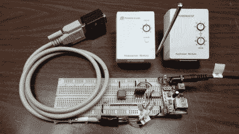

# 五分钟后的物联网

> 原文：<https://hackaday.com/2016/01/08/internet-of-things-in-five-minutes/>

如果你正在寻找从零到语音控制家庭自动化系统的最快方法，你应该花五分钟看看[Hari Wiguna]在 Hackaday.io 上的项目，在那里他[将物联网小工具和服务连接到一个正常工作的灯开关](https://hackaday.io/project/8958-internet-of-things-in-5-minutes)。(视频下方休息。)

【Hari】演示了如何建立一个复杂的链:[Amazon Echo](http://www.amazon.com/dp/B00X4WHP5E)to[if TTT](https://ifttt.com/)to[ada fruit . io](https://io.adafruit.com/)作为一个数据代理，然后由他家中的一个 ESP8266 单元轮询，该单元控制他的 [X10 设置](http://www.x10.com/x10-home-automation.html)。(Pshwew。)但这一过程中的每一步都被设计成近乎即插即用，所以这真的很像一起点击乐高积木。[Hari]的视频是一个很好的概述。

如果你要自己复制这个，只有一个问题:用于最后一英里的 X10 系统。除非你已经有了这些设置，否则你只能靠自己来控制开关灯的插座。考虑到价格和可攻击性，我们建议使用常见的 433MHz 无线插座开关，并将其与便宜的 433MHz 发射机配对，在易贝售价约为 1 美元。我们已经看到了许多针对这些[系统](http://hackaday.com/2015/06/14/hacking-a-wireless-ac-power-outlet/)的[攻击——它们在美国和欧洲](http://hackaday.com/2013/01/31/getting-an-arduino-to-control-a-wireless-outlet/)[相当普遍](http://hackaday.com/2015/02/11/wifi-controlled-power-outlets-with-raspberry-pi/)。

我们之前也报道过[Hari]的项目:他的自学电视遥控器和 T2 的万圣节黑客。他的视频制作技术非常出色。我们对他在[的 YouTube 视频](https://www.youtube.com/user/hwiguna/videos)中塞入的信息量感到敬畏。

 [https://www.youtube.com/embed/MWebdJwr6ks?version=3&rel=1&showsearch=0&showinfo=1&iv_load_policy=1&fs=1&hl=en-US&autohide=2&wmode=transparent](https://www.youtube.com/embed/MWebdJwr6ks?version=3&rel=1&showsearch=0&showinfo=1&iv_load_policy=1&fs=1&hl=en-US&autohide=2&wmode=transparent)

