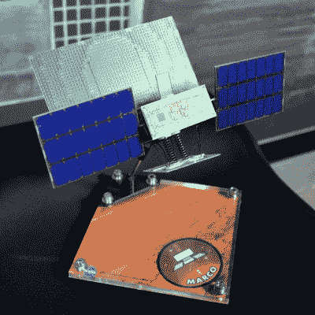
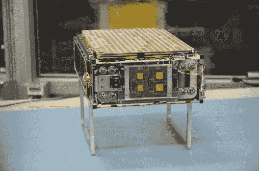
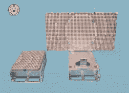
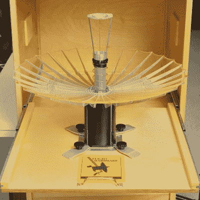

# 采访:Nacer Chahat 为火星立方体卫星设计天线

> 原文：<https://hackaday.com/2017/02/22/interview-nacer-chahat-designs-antennae-for-mars-cubesats/>

你有一个鞋盒大小的计算机，你想用在火星飞行。你怎么和它交流？答案是一组非常聪明的天线。我采访了纳塞尔·查哈特，他是喷气推进实验室团队中负责火星立方体一号(MarCO)天线设计的工程师之一。其中两颗立方体卫星将很快用于帮助着陆器到达火星。我们谈到了进入 MarCO 的工作，他为 RainCube 项目工作的可展开雷达天线，以及 OMERA 的早期进展，一米反射阵列。

这是一场关于应对众多工程挑战的精彩讨论，包括天线元件可用空间不足，以及功率和重量限制。查看视频采访，看看 JPL 的人们是如何将这一切融入到这个和其他小卫星中的，然后在下面加入我们，了解更多细节。

 [https://www.youtube.com/embed/qv1j-VQUO_Y?version=3&rel=1&showsearch=0&showinfo=1&iv_load_policy=1&fs=1&hl=en-US&autohide=2&wmode=transparent](https://www.youtube.com/embed/qv1j-VQUO_Y?version=3&rel=1&showsearch=0&showinfo=1&iv_load_policy=1&fs=1&hl=en-US&autohide=2&wmode=transparent)

### 弯管通信

Small scale model of MarCO

火星表面的车辆很难与地球直接通信，但火星轨道上的卫星要容易得多。已经有一颗大型卫星环绕地球运行，即 2006 年进入轨道的[火星勘测轨道飞行器](http://www.jpl.nasa.gov/missions/mars-reconnaissance-orbiter-mro/) (MRO)。它与地球有联系，但有时没有视线，因为它在火星后面。这意味着通信不可用的时间窗口。

美国宇航局计划在 2018 年发射[InSight](http://insight.jpl.nasa.gov/home.cfm)——一种将在红色星球表面下挖掘的着陆器。两个 6U 立方体卫星将伴随飞行，当它们接近火星时，与其余的有效载荷分离。这些卫星将在 UHF 上的进入下降和着陆期间与 InSight 通信，并在 X 波段上与地球通信。这一点很重要，因为在那段时间 MRO 将在火星后面，无法执行这项任务。

“弯管”指的是这些立方体卫星与着陆器和地球都保持联系的能力，以与从着陆器接收数据相同的速率实时中继数据。一旦着陆器着陆，马可卫星将完成它们的任务，飞过这颗行星，但不会进入轨道。

这是一个迷人的发展，原因有几个。目前，MRO 能够进行超高频和 X 波段通信，但不能同时进行。立方体卫星更便宜，建造速度更快，可以同时在两个波段上进行通信，并将在 InSight 的 EDL 期间提供数据中继。

### 一个很远的很小的目标

平均来说，火星距离地球大约 225，000，000 公里。JPL 在这两者之间建立的通讯联系只有鞋盒大小。一个 6U 的立方体卫星大约有 10x20x30 厘米。这是一个难以置信的工程挑战。这些卫星需要自给自足，能够正确定位，能够在从一个星球到另一个星球的旅行中幸存下来，并拥有必要的无线电设备进行远距离通信。这就是 Nacer 的团队参与进来的地方。

  Actual MarCO hardware in folded state  MarCO CubeSat UHF antennas  MarCO Cube Sat. X-band antenna

天线工程师和机械工程师与 CubeSat 团队的其他成员一起设计和构建通信阵列。在这种情况下，[一款名为 IRIS](http://www.jpl.nasa.gov/cubesat/missions/iris.php) 的全新无线电被开发出来，以帮助满足功率和尺寸限制。车内几乎没有空间放置天线阵列，所以反射器被设计成可以折叠平放在车外。与火星地面车辆通信的超高频天线平放在卫星底部，但像盒子里的杰克一样突然出现。

传输回地球的 X 波段天线折叠成三块面板。展开时，反射器阵列的宽度大于高度，因此信号源也具有利用全反射器的阵列。有趣的是，你在反射器阵列上看到的图案有助于平板更像抛物面反射器。MarCO 也能够使用上面折叠模型正面看到的阵列接收来自地球的 X 波段。这些立方体卫星无法在超高频波段上传输，它们只能接收地面车辆的超高频通信。

MarCO antenna team at JPL poses with the prototypes

### 更大的反射器，相同的 6U 外形

RainCube Ka-band reflector in deployed configuration

我最初是在 12 月参观了美国国家航空航天局的喷气推进实验室后认识 Nacer 的。我对[SMAP](https://smap.jpl.nasa.gov/mission/description/)——一颗全尺寸卫星——的可展开天线惊叹不已，他联系我提到这些立方体卫星的可展开性有多棒。他没开玩笑。他还参与了[雨立方](http://www.jpl.nasa.gov/cubesat/missions/raincube.php)项目，该项目将围绕地球运行，利用雷达收集降水数据。

RainCube 包括一个用于 Ka 波段操作的 0.5 米抛物面反射器。反射器仍然需要安装在 10x20x30 厘米的卫星内部。具体来说，设计团队被分配了一个 10x10x15 厘米的存储区域，用于放置反射器和支撑副反射器的臂。

结果是这个奇妙的两级抛物面反射器在立方体卫星的一端延伸到罐外，然后展开第二级。副反射镜臂然后弹出到适当的位置，离主反射镜大约 0.24 米。视频访谈中展示了部署演示。

### 你称之为挑战？

Nacer Chahat poses next to OMERA fixed protoype in one of JPL’s anechoic chambers

对于 JPL 团队来说，半米的反射器似乎不是一个足够大的挑战。他们现在正在进行一个名为 OMERA 的项目。我能找到的关于这个项目的信息很少，所以我很高兴 Nacer 能够分享。这个首字母缩写代表一米反射阵列，这是一个每边一米的方形反射器。

该团队刚刚完成了反射器设计的固定模型，你可以看到 Nacer 在 JPL 的一个消声室中与 OMERA 原型合影。这个原型不会折叠，但在证明了系统的射频特性后，机械工程师的下一步是为 15 个面板添加铰链，并开发一个部署系统。这个反射器阵列的馈电需要从阵列延伸大约 0.7 米，这本身就是一个不小的壮举。这在 Ka 波段操作，因此表面精度比 X 波段通信要差得多。

进入这些立方体卫星的工作太棒了！看到这些工程师面临的限制和他们的解决方案，真是令人惊讶。这些程序的成本比以往任何时候都低，我们希望这意味着在更短的时间内有更多的硬件。它也有激励像 Nacer 这样从事这些项目的工程师的效果，因为无论你走到哪里，都有一个令人兴奋的新挑战要迎接。

如果你是你自己的工程项目的一部分，我们也很乐意与你交谈。请务必通过[联系我们的黑客日提示热线](http://hackaday.com/submit-a-tip/)让我们知道您在做什么。