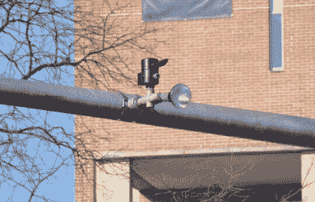

# 北美交通信号简介

> 原文：<https://hackaday.com/2017/08/07/intro-to-the-north-american-traffic-signal/>

交通灯无处不在，我们几乎不会再去想它们，除非当它们妨碍我们日常驾驶时，我们诅咒它们的存在。但是，不管交通灯看起来多么像有能力读懂我们的思想，告诉我们什么时候迟到，它们实际上只不过是一组灯和一个可编程控制器。在实践中很简单，但是像往常一样，细节决定成败，对于一个需要尽可能接近 100%时间工作的系统来说，细节很重要。让我们来探索交通信号的内部工作原理。

### 机电计时

当然，十字路口的交通灯和人行横道信号只是公共用户界面。有趣的事情发生在控制盒里。每个十字路口至少有一个，通常是一个远离道路的普通金属柜，有时伪装成公共票据或涂鸦。但在里面，是什么让十字路口工作，并保持车辆和行人交通顺畅和安全。

不出所料，大多数交通信号控制装置最初都是纯机电设备。橱柜里塞满了同步电机，它们转动带凸轮的定时轮，让十字路口的灯按照正确的顺序循环。一个直到最近还很常见的旧时间控制器是由 Econolite 制造的，其内部是坚固设计的典范。

 [https://www.youtube.com/embed/eTYMGll7D-w?version=3&rel=1&showsearch=0&showinfo=1&iv_load_policy=1&fs=1&hl=en-US&autohide=2&wmode=transparent](https://www.youtube.com/embed/eTYMGll7D-w?version=3&rel=1&showsearch=0&showinfo=1&iv_load_policy=1&fs=1&hl=en-US&autohide=2&wmode=transparent)

视频中显示的控制器非常简单，适用于简单的十字路口，只需运行一两个固定的程序，并允许在夜间交通流量减少的特定时间后，定时切换到“仅闪光灯”模式。更复杂的机电控制器实现了与交通信号协调的人行横道信号，并提供了安装在路面上的磁力计或压力开关，以检测车辆的存在并改变信号的定时。

### 一个相互关联的系统

几十年来，机电控制器为市政当局提供了很好的服务，一些十字路口可能仍然由这些简单但强大的设备控制。随着技术的进步和交通工程师提出越来越复杂的交叉路口来支持增长的需求，旧的机电箱被淘汰，取而代之的是固态控制。

第一代固态控制器于 20 世纪 70 年代中期开始在美国街头出现，提供了更复杂的控制和更好的安全性。现代管制员必须实现一个冲突监控单元(CMU)来检测程序的任何故障并安全地解决它们。当所有其他方式都失败时，CMU 会将交叉路口切换到全闪故障安全模式，这样所有交通都必须停止。

在全闪存上离开一个主要的十字路口显然不是市政当局想要持续很长时间的事情，所以联网控制器出现了，可以给家里打电话寻求帮助。网络控制器还提供了协调控制的可能性，其中能够监控来自多个十字路口的传感器的中央控制系统可以在任何十字路口超越程序。协调控制有可能极大地提高道路的承载能力，但也不是没有成本；像任何其他网络系统一样，协调控制系统是攻击的目标。

关于交通系统如何实现自动化的故事还有很多很多，我们的[Bob Baddeley]将在本周晚些时候的文章中进行更深入的探讨。但是在这个介绍结束之前，我们先来说说先占权。

### 先占

An Opticom preemption receiver and notifier light. Source: [Wikimedia Commons](https://commons.wikimedia.org/wiki/File%3AMillersville_opticom.jpg)

在一些现代十字路口看到的一个有趣的特征是紧急车辆优先权。这些系统使用传感器来检测正在靠近的紧急车辆，并将十字路口切换为全红色，除了车辆正在靠近的方向。美国的大多数先占系统似乎都使用光学触发器；紧急车辆将有一个前置红外发射器，而十字路口将有一个安装在红绿灯附近的接收器。车辆向接收器发送一个调制信号，接收器向控制器发送信号以抢占正常的交叉口程序。较新的先占控制使用 GPS 来定位相对于交叉路口的车辆，以确定是否需要先占。

### 我能做到吗？

无论你戴着什么颜色的黑客帽子，当先发制人的红外接收器在繁忙的十字路口诱人地晃来晃去时，你的思绪不禁变得阴暗起来。有没有可能用一个简单的可编程红外遥控器就能让一个十字路口抢占先机？有大量的视频显示，青少年的涂鸦声称做到了这一点，虽然我们没有说这是不可能的，但这让我们感到怀疑。大多数视频显示[一个可编程的遥控器](https://www.youtube.com/watch?v=_EiwoX3uvhc)或带有[一个莫尔斯电码手电筒应用](https://www.youtube.com/watch?v=8Li5ZgXCSNU)的智能手机被用在明显没有配备先占权的十字路口。充其量是可疑的。

来自正在靠近的紧急车辆的红外先占信号很可能被数码相机捕获，并可能被解码以供以后回放。但是，有几个原因，这是不太可能和不普遍的。抢占通常被报告给中心站，如果发生在没有应急车辆的地方，无疑会引起怀疑。任何滥用该系统的人都将面临篡改交通信号的联邦指控。而且这些系统确实是防故障的，除了一个方向的流量之外，其他方向的流量都被阻止，而不是实际上让攻击者有更多的控制权。

所以，下次当你因为被困在一个永远的红灯前而感到愤怒的时候，放松下来，想想这一切是如何被控制的——祈祷一辆消防车来到你身后，合法地改变信号灯。