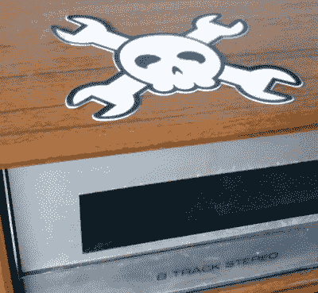

# 介绍 Hackaday 无源排列铁氧体有源量子晶体纳米颗粒参考标签

> 原文：<https://hackaday.com/2017/04/01/introducing-the-hackaday-passive-aligned-ferrite-active-quantum-crystal-nanoparticle-reference-sticker/>

如你所知，在 Hackaday，我们非常重视我们的音频设备。这些年来，我们已经看到了它，并且对经过我们门口的许多高保真产品有一种相当厌倦的看法，但是偶尔会出现一些有点特别的东西。这就是为什么今天我们要向您介绍一种新产品，Hackaday 无源排列铁氧体有源量子晶体纳米颗粒参考标签。

问题是:我们被电子噪音包围着。你看不到，摸不到，也听不到，但你的音频设备可以，当这种情况发生时，它会在你没有意识到的情况下降低你的听觉体验。你可能花了一生的积蓄买了一个顶级的雏里放大器、马克·文森特环绕声处理器、弗里德兰·卡瑞龙线缆和一套 Saisho 落地式扬声器，但是如果你没有处理好系统的磁兼容性，它们永远不会发挥出它们的潜力，你会一直想知道为什么你的更广阔的声场就是不能充满活力。你需要 HPAFAQCNRS。

### 磁性兼容性

Neutralises electromagnetic oscillations.

这就是 Hackaday 无源排列铁氧体有源量子晶体纳米颗粒参考标签的用武之地。与其他贴纸不同，它们不包含墨水，而是来自我们日本实验室的稀土掺杂铁氧体量子晶体纳米粒子，正是这些粒子在激活背景噪声基底以实现磁兼容性方面的作用，产生了它们对您的高保真效果。房间内所有物品(如扬声器支架、电线、CD 架和家具)之间无休止的电磁相互作用和振荡被吸收，问题得到解决。

应用 HPAFAQCNRS 的结果是令人震惊的，与你以前听说过的完全不同。市场上根本没有类似的产品。低音音调变长变柔，高音达到更强的高潮，声场的内在连贯性凝结在丰富、黑暗、巧克力味的呈现中。结构和空间共振完全消失，当你在系统周围贴上贴纸时，全息声景的听觉颜色变得难以辨认，你带进礼堂的贴纸越多，它在消除整体清晰度方面就越好。仅仅是从录音中再现的声音变成了*体验过的*声音，仿佛你*真的在那里*。你趴在一座声波教堂的祭坛前，胖女人就在你耳边唱歌。

### 先验经验

Rich, chocolatey tones.

一个简单的标签，仅仅放在你听音室的有源和无源元件上，怎么可能如此改变你所感知的声音质量呢？这样一个看似简单的调整怎么会产生如此丰富而又毫不费力的细节呢？这似乎是不可能的，或者至少在你亲自尝试过之前是不可能的。我们当然带着一贯的怀疑态度接近他们，但却被这种超然的体验所震撼。少即是多，你对信号路径的干扰越少，你对周围环境的共鸣调整得越多，结果就越令人震惊。

我们已经把 Hackaday 无源排列铁氧体有源量子晶体纳米颗粒参考标签放在我们的商店里，这是我们对它的信心。它只卖 99 美元，一包 10 个卖 899 美元，但是如果你在我们的活动中找到我们，你甚至可以免费得到一个。它的用途不仅限于高保真音响，如果你把它放在笔记本电脑上，它也能提高你的工作效率。