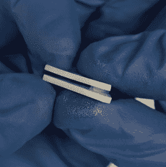

# 微小磁性 PCB 板的入侵

> 原文：<https://hackaday.com/2018/02/19/invasion-of-the-tiny-magnetic-pcb-vises/>

[Proto G]最近写了一篇文章，分享了一种非常巧妙的方法来监视现代电子工作台上散落的所有微型 PCB 和设备。他展示了如何制作带有磁性底座的微型夹子，每个夹子只需几美元，而不是为每个小电路板准备一个笨重的 PCB 老虎钳。结合 ESD 垫下的金属板，他可以在整个工作空间安全地放置多个 PCB。

 这种技术的关键是通常用来在墙上安装标志的小支架。凭借其设计，这些支架已经具有夹紧作用，但每个支架的“夹紧力”随着塑料和橡胶 o 形环的三角形部件的增加而提高。

随着等式的夹紧端的排序，小圆盘磁铁被粘在每个支座的底部。有了合适的表面，磁铁就足够强大，即使钳口中有相当大的 PCB，也能保持直立。

使用多个这样的小 vises 的一个特别好的特点是，可以从多个任意点支持较大的 PCB。用传统的钳子夹住形状不规则或装满元件的 PCB 可能会很困难，将它们放在你喜欢的任何地方的能力看起来会是一个巨大的帮助。

我们最近[报道了一些 DIY 3D 打印解决方案](https://hackaday.com/2018/01/24/printed-it-rubber-band-pcb-vice/)，用于将[小 PCB 放在你想要的地方](https://hackaday.com/2018/02/08/printed-lockable-ball-and-socket-helping-hands-plus/)，但是我们不得不说，如果你在小板上做很多工作，这个解决方案看起来非常有吸引力。

 [https://www.youtube.com/embed/APdgQYRZNhU?version=3&rel=1&showsearch=0&showinfo=1&iv_load_policy=1&fs=1&hl=en-US&autohide=2&wmode=transparent](https://www.youtube.com/embed/APdgQYRZNhU?version=3&rel=1&showsearch=0&showinfo=1&iv_load_policy=1&fs=1&hl=en-US&autohide=2&wmode=transparent)

