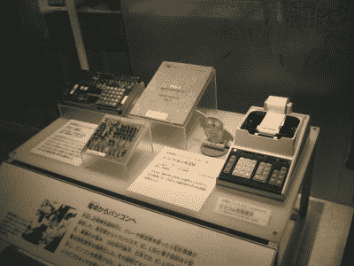
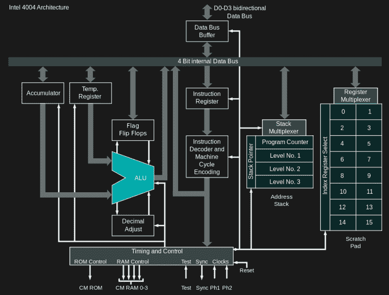
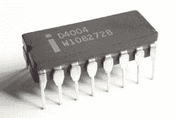
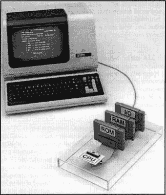

# 发明微处理器:英特尔 4004

> 原文：<https://hackaday.com/2018/01/29/inventing-the-microprocessor-the-intel-4004/>

我们最近看到了集成电路(IC) 和计算器的[起源，这是集成电路的第一个杀手级应用，但令人惊讶的是，计算器在下一个改变世界的奇迹——微处理器——的发明中发挥了重要作用。](https://hackaday.com/2017/11/07/how-the-integrated-circuit-came-to-be/)

关于哪家公司发明了微处理器还存在争议，我们将在后面进一步讨论。但是谁发明了第一个商用微处理器呢？这项荣誉属于英特尔 4004。

## 通往 4004 的道路

Busicom calculator motherboard based on 4004 (center) and the calculator (right)

我们来听听罗伯特·诺伊斯的故事，他在飞兆半导体公司时与人共同发明了集成电路。1968 年 7 月，他离开飞兆半导体公司，共同创立了英特尔公司，生产半导体存储芯片。

虽然英特尔仍然是一家依靠最初 300 万美元融资的初创公司，而且在他们拥有半导体存储产品之前，正如许多初创公司为了生存所做的那样，他们接受定制工作。1969 年 4 月，日本公司 Busicom 雇佣他们为一个计算器家族做 LSI(大规模集成)工作。

Busicom 的设计由 12 个相互连接的芯片组成，被认为是一个复杂的设计。例如，它包括移位寄存器存储器，一种使控制逻辑复杂化的串行类型的存储器。它也使用二进制编码的十进制(BCD)算法。英特尔应用研究部门的负责人小马尔西安·爱德华·霍夫——被称为“Ted”——认为这种设计甚至比 PDP-8 这样结构相当简单的通用计算机还要复杂。他觉得他们可能无法达到成本目标，因此诺伊斯让霍夫继续寻找简化成本的方法。

霍夫意识到一个主要的简化就是用软件代替硬连线逻辑。他还知道扫描一个移位寄存器需要大约 100 微秒，而 DRAM 需要一到两微秒。1969 年 10 月，霍夫提出了一个 4 位机的正式建议，并得到了 Busicom 的同意。

这成为了 MCS-4(微型计算机系统)项目。同样来自英特尔的 Hoff 和 Stanley Mazor 在 Busicom 的 Masatoshi Shima 的帮助下，提出了 MCS-4 4 位芯片组的架构，该架构由四个芯片组成:

*   4001: 2048 位 ROM，带 4 位可编程 I/O 端口
*   4002: 320 位 DRAM，带 4 位输出端口
*   4003: I/O 扩展是一个 10 位静态、串行输入、串行输出和并行输出移位寄存器
*   4004: 4 位 CPU

## 制造 4004 等

1970 年 4 月，诺伊斯雇佣了飞兆半导体公司的费德里科·费金来做芯片设计。当时，框图和基本规范已经完成，包括 CPU 架构和指令集。然而，芯片的逻辑设计和布局应该在 1969 年 10 月开始，所有四个芯片的样品都应该在 1970 年 7 月完成。但到 4 月份，这项工作还没有开始。更糟糕的是，在费金开始在英特尔工作的第二天，Shima 从日本赶来检查 4004 不存在的芯片设计。Busicom 感到不安是可以理解的，但 Faggin 提出了一个新的时间表，将在 1970 年 12 月完成芯片样品。

费金接着开始每周工作 80 小时，以弥补失去的时间。Shima 作为一名工程师留下来帮忙，直到英特尔可以雇用一名工程师来代替他。

[4004 architecture](https://commons.wikimedia.org/wiki/File:4004_arch.svg) by Appaloosa CC BY-SA 3.0

按照计划，4001 ROM 在 10 月份准备就绪，并第一次工作。4002 DRAM 有几个简单的错误，4003 I/O 芯片第一次也正常工作。第一批用于 4004 的晶片在 12 月份就准备好了，但是当他们尝试的时候，却什么也做不了。结果是掩埋接触的掩蔽层被排除在处理之外，导致大约 30%的栅极浮动。1971 年 1 月，新的晶片通过了费金的所有测试。后来发现了一些小错误，1971 年 3 月，4004 完全正常工作。

与此同时，在 1970 年 10 月，Shima 能够返回日本，在那里他开始为 Busicom 的计算器进行固件工作，这将被加载到 4001 ROM 芯片中。到 1971 年 3 月底，Busicom 已经有了一个完整的计算器工程原型。第一次商业销售是在那个时候进行的。

## 软件问题

现在英特尔有了微处理器，他们需要有人来编写软件。当时，程序员看到了使用大型计算机的声望。很难吸引他们留下来研究小型微处理器。一个解决方案是用硬件，比如 sim 卡，与大学交换，以换取编写一些支持软件。然而，一旦媒体开始大肆宣传微处理器，大学生们就来敲英特尔的门。

## 卖还是不卖

[Intel D4004](https://commons.wikimedia.org/wiki/File:Intel_D4004.jpg) by Thomas Nguyen CC BY-SA 4.0

英特尔的市场是大型计算机公司，英特尔内部担心计算机公司会将英特尔视为竞争对手，而不是内存芯片供应商。还有一个问题是他们将如何支持该产品。英特尔的一些人也想知道 4004 是否可以不仅仅用于计算器。但在某一点上，Faggin 使用 4004 本身来制作 4004 的测试器，证明了它有更多的用途。

同时，便宜的 150 美元的手持计算器给 Busicom 公司更贵的 1000 美元的台式计算器制造了困难。他们无法再向英特尔支付商定的合同价格。但是 Busicom 拥有 MCS-4 芯片的专有权。因此，一项重大的交易达成了，Busicom 将支付较低的价格，而英特尔将拥有专有权。决定出售它，并于 1971 年 11 月发布公告。

到 1972 年 9 月，你可以花 60 美元购买 1 到 24 个数量的 4004。总的来说，大约生产了 100 万部。仅举几个应用，它被用于:弹球机、交通灯控制器、收银机、银行出纳终端、血液分析仪和加油站监视器。

## 冠军的争夺者

大多数发明都是在环境合适的时候产生的。这通常意味着发明者不是唯一想到它或正在研究它的人。

AL1 as a microprocessor by [Lee Boysel](http://corphist.computerhistory.org/corphist/documents/doc-4946dbc7a541f.pdf)

1968 年 10 月，Lee Boysel 和其他几个人离开飞兆半导体公司，成立了四相系统，用于制造计算机。1970 年 11 月，他们在秋季联合计算机会议上展示了他们的系统，到 1971 年 6 月，已经有 4 台投入使用。

他们的微处理器 AL1 是 8 位的，有 8 个寄存器和一个算术逻辑单元(ALU)。然而，他们没有把它作为一个独立的微处理器，而是把它和另外两个 al1 一起组成了一个 24 位的 CPU。他们没有把 AL1 作为微处理器使用，他们没有把它作为微处理器出售，也没有把它称为微处理器。但作为 1990 年德州仪器和另一个原告之间专利纠纷的一部分，Lee Boysel 用一个 8 位 AL1 作为唯一的微处理器组装了一个系统，证明它可以工作。

加勒特·艾尔瑟研发的 MP944 于 1970 年完成，用于 F-14 雄猫战斗机。它也不太符合模型。MP944 使用多个芯片协同工作，作为一个微处理器。

1971 年 9 月 17 日，德州仪器发布了 TMS1802NC 片上计算器的新闻稿，基本芯片设计名称为 TMS0100。然而，这只能实现 4 功能计算器的功能。他们也在 1971 年 8 月为微处理器申请了专利，并于 1973 年获得美国专利 3，757，306 计算系统 cpu。

1970 年，计算机终端公司(CTC)以 50，000 美元的价格从英特尔公司承包了大规模集成电路的工作。这是为他们的 Datapoint 2200 终端制造一个单片 CPU。英特尔推出了 1201。德州仪器(Texas Instruments)被聘为第二家供应商，制造了 1201 的样品，但它们都有问题。

英特尔继续努力，但出现了延迟，因此，Datapoint 2200 采用了分立 TTL 逻辑。经过英特尔的重新设计，1201 于 1971 年交付给 CTC，但当时 CTC 已经转移了。相反，他们将所有知识产权转让给英特尔，而不是支付 5 万美元。你肯定听说过 1201:它被更名为 8008，但这是另一个故事。

你以为 4004 是古老的历史吗？不是在黑客日。在易贝买了一个之后，他把它安装在一个电路板上，组装了一个 4001 ROM 仿真器来使用它。

[主要图片来源:[英特尔 C4004](https://commons.wikimedia.org/wiki/File:Intel_C4004.jpg) 作者:Thomas Nguyen CC BY-SA 4.0]