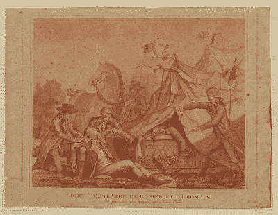
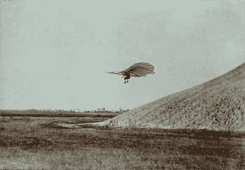

# 发明杀死了发明家

> 原文：<https://hackaday.com/2017/06/01/invention-killed-the-inventor/>

创新和改变世界的欲望会驱使一个人去冒险。有时候，发明家会付出最大的代价。发明家可以是正在开发的设备的早期测试者，有时挑战可能的极限会带来致命的后果。在这个在咖啡杯上贴警告标签的时代，也许有必要回顾一下过去的一些发明家，他们在追求创造新事物的过程中失去了生命。

### 首起空难

Jean-Francoise Pilatre de Rozier 是早期的航空先驱，也是化学和物理教师。1783 年，他和阿尔兰德侯爵第一次进行了载人自由气球飞行。De Rozier 以测试氢气的可燃性而闻名，他“咽下一口，吹过明火，一举证明氢气确实具有爆炸性，眉毛不一定是一个人脸上的永久特征。”(比尔·布莱森，在《几乎所有事物的简史》中)他可能对工作安全有点漫不经心。

但他会被气球带走。经过几次成功的飞行后，他和他的同伴皮埃尔·罗曼于 1785 年 6 月 15 日试图穿越英吉利海峡，但气球突然放气，他们从大约 450 米的高度坠落。两位先驱都在空难中丧生。

### 滑翔机国王

德国航空先驱奥托·李林塔尔首次成功进行了有据可查的重于空气的飞行。他制造了 18 种滑翔机，进行了 2000 多次滑翔机飞行。他还开发了十几种型号的单翼飞机、扑翼飞机和两架双翼飞机。维尔伯·莱特称他为早期飞机先驱中“无疑是最重要的”。

他的最后一次飞行是在 1896 年 8 月 9 日，在其他方面都很正常。他的滑翔机设计有一个机头朝前的问题，因为在某个角度之后，飞行员就不能再向后转移他们的重量来抵消它了。李林塔尔在一次俯冲中失去控制，从大约 15 米高的地方坠落，脊椎骨折。他被送往医院，但在坠机后约 36 小时死亡。他的遗言在哪里！(必须做出牺牲！).

### 原子的危险

很难低估玛丽·居里的成就。她仍然是唯一一个在两个不同的科学领域获得诺贝尔奖的人:在物理学领域，因为她在辐射现象方面的工作；在化学领域，因为发现了镭和钋元素。所有这些都发生在女性不被鼓励或完全被禁止从事学术研究的时代。

她与这些放射性元素有关的工作是她死亡的原因，因为当时还不知道电离辐射的危险。她过去常常把带有放射性物质的试管放在口袋里，没有任何安全措施。即使在今天，她的论文，甚至她的烹饪书都保存在屏蔽箱中，因为它们仍然具有高放射性。诺贝尔奖的大部分奖金，以及她收到的其他金钱礼物，都送给了朋友和家人，并捐赠给了研究。阿尔伯特·爱因斯坦曾经说过，她可能是唯一一个不会被名声腐蚀的人。1934 年 7 月 4 日，玛丽死于长期辐射照射引起的再生障碍性贫血。

### 潜艇革新者

Painting by Conrad Wise Champan. Image from [Wikimedia Commons](https://en.wikipedia.org/wiki/H._L._Hunley_(submarine)#/media/File:Conrad_Wise_Chapman_-_Submarine_Torpedo_Boat_H.L._Hunley,_Dec._6,_1863.jpg).

霍勒斯·劳森·亨里是一名律师，也是路易斯安那州议会的成员，他开发了早期的手动潜艇。亨里明白与欧洲的航运贸易对南部联盟有多重要，所以他与詹姆斯·麦克林托克和巴克斯特·沃森合作，制造了一艘水下船只，帮助保持与欧洲的重要航道畅通。设计并制造了三种不同的模型。不幸的是，第三艘潜艇沉没了，包括亨里在内的八名船员全部遇难。

这艘船被邦联收回，并于 1864 年 2 月 17 日成为第一艘成功的战斗潜艇，击沉了美国海军“胡萨托尼克”号。HL Hunley 号，正如它的名字一样，在那次任务后神秘地消失了，直到一个多世纪后的 1995 年才被发现。直到 2004 年，船员们才得到一个合适的葬礼。

## 行走在未知的土地上

突破界限是科学和发明的本质。我们对德·罗齐尔的死因知之甚少，无法断定他那种漫不经心的态度是否应该对他的死亡负责——当时气球飞行还处于起步阶段，非常依赖风力——但也有可能。在厄运降临之前，李林塔尔进行了 2000 多次类似的飞行。玛丽·居里和当时的其他科学家不知道放射性是危险的。亨利别无选择，只能亲自测试他的潜艇。他们都为自己的发明付出了生命。

我们并不是说在操作角磨机时不应该戴眼镜和听力保护装置。你绝对应该采取一切合理的安全预防措施。我们大多数人永远不会足够接近未知的边界，以至于我们需要像李林塔尔那样跳一跳，更不用说跳几千次了。尽管如此，这些故事有一种悲剧的高贵，强调了创新、成为第一或发现新事物的渴望的力量。