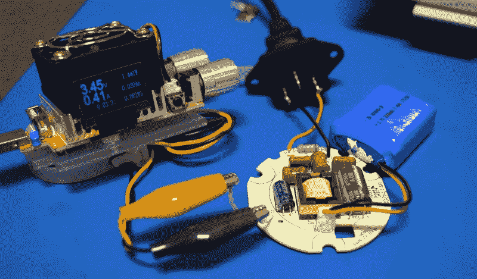
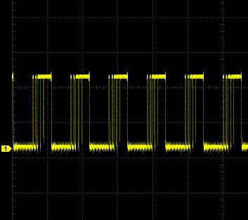

# 研究从灯泡中打捞出来的微型不间断电源

> 原文：<https://hackaday.com/2018/05/21/investigating-the-tiny-salvaged-ups-from-a-lightbulb/>

最近，我有机会拆卸一个电池供电的 LED 灯泡，并发现了一些关于该设备如何工作的有趣细节。本质上，灯泡包含一个低压 DC 不间断电源，可以根据需要在交流电源和内部电池之间自动切换。这其中的含义似乎相当令人兴奋。在大盒子零售商那里，这种小灯泡售价约为 12 美元，是一种为微控制器和其他低功耗设备提供容错电源的廉价而方便的解决方案。

 这次拆解获得了巨大成功，并引发了很多关于 UPS 想法的讨论。有些人讨厌它，有些人喜欢它。但是正如我们对 Hackaday 读者的期望，来自过道两边的评论包含了敏锐的观察和宝贵的现实世界经验。从设备的安全性到制造商声明的准确性，似乎产品的每个元素都得到了解决。

我已经结束了拆卸，并承诺我会继续试验这个小小的回收 UPS，但即使我没有这样做，有这么多的反馈，似乎重温这个主题是必要的。这种小喽罗真的可行吗？在您的项目中安全实现是否太危险？这东西会爆炸吗？

因此，有了你的评论作为指导，摆脱了多少有点限制性的拆卸格式，我开始对这个上个月引起如此多辩论的小电路进行更彻底的调查。不全是好消息，但也不在垃圾桶里。反正还没有。

## 关于安全(或缺乏安全)的一句话

毫无疑问，评论中最常见的抱怨是这款设备不安全，不应该玩。触摸 PCB 上的走线或其中一根电线可能会使您触电。这当然是真的，但在之前[肯定从未阻止过黑客读者。很明显，它从来就不应该从灯泡的盒子里拿出来，正因为如此，它的使用方式把安全性抛到了窗外。](https://hackaday.com/2016/05/11/looking-mains-voltage-in-the-eye-and-surviving-part-1/)

当然，最明显的问题是隔离，或者更准确地说，事实上没有隔离。没错，电路板的交流侧和 DC 侧是相连的。现在，如果这是一个 USB 充电器或类似的东西，这将是一个令人发指的设计缺陷。但是记住，这是个灯泡。用户不应该看到，更不用说触摸内部了。很难指责设计者不担心隔离问题，因为有问题的设备从来没有打算从保护壳中出来。

但是，电路未被隔离的事实是否意味着它不能安全使用？不一定。就像最初的灯泡不危险，因为它是一个密封的单元，如果你的设计不打算被用户接触，没有直接的危险。想象一下像 ESP8266 气象站这样的东西，它只是从传感器读取数据并通过 Wi-Fi 发送数据，这样的设备很可能会在外壳内度过它的一生。

这里真正的风险是，如果你心中有某种项目，希望用户与它进行物理交互，或者更糟，在其中插入一些东西。在这里，电击的风险足够高，你会想要避开。[Big Clive]不久前用这个问题检查了一个 USB 电源，并说明了其危险性:

 [https://www.youtube.com/embed/3Hdn0MuCK_0?version=3&rel=1&showsearch=0&showinfo=1&iv_load_policy=1&fs=1&hl=en-US&autohide=2&wmode=transparent](https://www.youtube.com/embed/3Hdn0MuCK_0?version=3&rel=1&showsearch=0&showinfo=1&iv_load_policy=1&fs=1&hl=en-US&autohide=2&wmode=transparent)

## 负载测试

假设你有一个场景，缺乏隔离不会成为问题，也许是气象站的例子。这个小装置能提供多大的电流？

LED 灯的运行时间在包装上显示为 3.5 小时，由于它有 2000 毫安的电池，信封背面的数学计算表明 400 毫安可能是我们所能希望的最佳值。至少在很长一段时间内是这样。测试这一点很容易，我们只需要在 DC 端放置一个可调负载，并开始提高电流，直到电压下降。

估计的数字被证明是准确的，因为在电压开始下降之前，该设备可以提供大约 410 mA。最大值看起来在 480 mA 左右，所以这是一个相当窄的最佳点。

## 电压调整

作为拆卸过程中的概念验证，我将一个 Wemos D1 Mini 焊接到 UPS 板的 DC 一侧，果然它通电了，工作正常。但这也有一定的风险。根据负载测试仪，该板在其电流容量的上限输出近 3.5 V。当电流较低时，电压高达 3.8 V，对于敏感的 3.3 V 器件，这可能是一个问题。幸运的是，这里的解决方案非常简单，[只需添加一个 3.3 V 调节器](https://hackaday.com/2008/09/22/parts-lm317-adjustable-voltage-regulator/)。

您也可以使用升压转换器来获得最高 5 V 的电压，但输入端只有 400 mA 的电流，它不会做太多有用的工作。

## 真正的问题:交流模式

 到目前为止，我只和用电池运行的电路板打过交道。我的希望是，当我打开空调时，一切都会一样，不会有任何问题。如果要用作不间断电源，这一点很关键。不幸的是，情况并非如此。

一旦你连接上交流电源，DC 一侧就开始以 60 赫兹左右的频率脉动。这是一个问题。还在输出~4 V DC，不过是方波来了；这对于 led 来说很好，但是对于微控制器之类的东西来说就不太好了。

这里的解决方案可能是一个足够大的电容器来承受脉冲。也许用电路板的输出给一个一两法拉的超级电容器充电。

顺便提一下，将这个非隔离电路连接到示波器是购买或[构建独立隔离变压器](https://hackaday.com/2016/10/16/upcycle-an-isolation-transformer/)的一个很好的理由。

## 配件单独出售

在花了更多的时间对电路板进行实验后，我不得不承认，当我第一次把它从 led 灯泡中拔出来时，我已经没有那么兴奋了。似乎无法回避的事实是，您仍然需要添加额外的硬件来使其真正作为低压 UPS 工作。我的希望是，受拆卸过程中对 ESP8266 的快速测试的启发，这将是一个交钥匙解决方案，适合那些希望创建具有集成备用电池的交流供电设备的人。但不幸的是，现实总有办法改变你。

我仍然认为这是一个非常有趣的板，值得跟踪这些电池备份 LED 灯泡之一，只是实验一下。但是，除非你愿意开始在它上面安装额外的组件，否则当使用交流电源时，它的可用性会受到脉冲 DC 输出的严重阻碍。