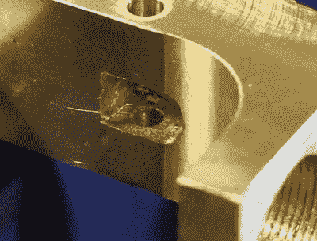

# 黄铜做的是金枪吗？

> 原文：<https://hackaday.com/2018/06/21/is-it-a-golden-gun-if-its-made-out-of-brass/>

在今天的这一集“这是一个非常棒的视频，很快就会被 YouTube 去货币化”[中，来自[John]](https://www.youtube.com/watch?v=0Z353BT6I18) 的这个奇妙的构建。这是金枪，或者至少看起来像金枪，因为它是由熔化的黄铜外壳制成的。这是一次大师级的演示，将一团 13 磅重的金属熔化，变成一台 2 磅重的精密加工仪器。

这种建造开始于简单地切割一个木块，用沙子包装，然后在一个 DIY 炉中熔化大约 1425 个不同口径的弹壳。然后将熔化的黄铜倒入打开的模具中。这是标准的黄黄铜，大约含 70%的铜和 30%的锌。底漆里有一点铝，最终的缸体不太适合加工。[约翰]说这可以通过在熔化物中加入百分之几的铅来解决。对于所有建议他在熔体中添加一些未发射子弹的玩笑者，不要担心，我们已经覆盖了这一点。

chiseling a hole square, with a chisel.

加工过程和你想象的一样，是一个大工厂，但是有几件事让这个视频有价值。对于一些洞，[约翰]必须把角弄平。最简单和最容易的方法是打开一个文件。这是黄铜，虽然，与一些钢凿子挂在商店周围，你的榫眼和榫头技能可能会派上用场。通过非常小心地用力，[约翰]设法用标准的木凿在一个圆上刻下了角。稍后在构建视频中，一些更尖锐的角是通过将一个拉刀推入研磨机并将其卡入工件中而创建的。

当谈到机械制造时，这是很高的艺术。是的，这就像用几百个汽水罐制造一个 AR-15 一样，但这个是由黄铜制成的。它看起来很棒，最后的润色让整个项目看起来像是从电子游戏里出来的。简直太神奇了。

如果你正在寻找更多的方法来拓展你的金属工艺边界，试试铸铁吧！

 [https://www.youtube.com/embed/0Z353BT6I18?version=3&rel=1&showsearch=0&showinfo=1&iv_load_policy=1&fs=1&hl=en-US&autohide=2&wmode=transparent](https://www.youtube.com/embed/0Z353BT6I18?version=3&rel=1&showsearch=0&showinfo=1&iv_load_policy=1&fs=1&hl=en-US&autohide=2&wmode=transparent)

