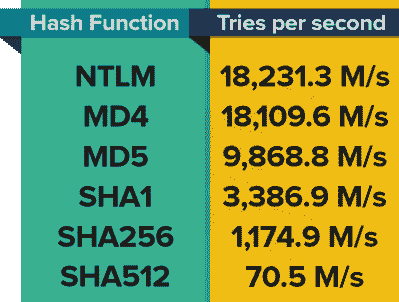

# 我的密码安全吗？为更了解情况的人提供的实践

> 原文：<https://hackaday.com/2017/04/07/is-my-password-safe/>

几周前，一份报告发布了，谷歌 Project-Zero 的著名安全研究员塔维斯·奥曼迪展示了滥用 Lastpass RPC 命令和窃取用户密码的可能性。具有讽刺意味的是……Lastpass 是一款旨在保护您所有密码安全的软件，它的设计方式是，即使他们无法访问您的密码，这些密码也使用强加密技术存储在本地，只有您可以通过万能钥匙访问它们。把你所有的密码都存放在一个地方有它的缺点。顺便说一下，没有证据表明这个 bug 被任何人滥用了，所以如果你使用 Lastpass，现在还不用担心。

但这让我想到，一个普通的互联网用户应该对自己的密码有多担心和多疑？我们中有多少人在网上公开了自己的账户信息？如果你已经存在足够长的时间，很可能你在一些主要的互联网公司至少有几个账户。不要冲进黑暗的网络，试图找到你的账户信息是否被出售。让你开始胡思乱想的最简单的方法就是访问[我被催眠了吗](https://haveibeenpwned.com/)。对于那些从未听说过它的人来说，这是一个由著名的安全专家[Troy Hunt]创建的网站。它记录了他能找到的所有已知的公共安全漏洞，并提供了一个简单问题的答案:“我的帐户有没有任何重大数据泄露？”让我们来看看。

是的。是的，它是。我的一个最老的账户已经卷入了 5 次大泄漏和 1 次小泄漏。其中一些包含相当敏感的信息(不，我没有阿什利麦迪逊帐户)。该网站声称已经登录了惊人的 26 亿个账户。注意十亿分之一的 B。这比 1950 年的总人口还要多。当然，这些账户中有很多是重叠的，我检查过的一些并不是 100%准确，但这仍然是一个非常高的数字。

在这里你可以看到十大泄露密码的网站。

## 有人知道我的密码吗？

请注意，雅虎的漏洞没有出现，再增加 10 亿个账户，再加上另一个雅虎漏洞的 5 亿个账户。这是否意味着攻击者自动获得了我的密码？嗯，没那么容易。

当你在某个地方创建一个账户并发送你的数据时，你的密码(希望)不是以明文形式存储的。通常它根本不被存储，只是一个不可逆的散列表示。简而言之，不是存储纯文本密码，而是使用加密哈希函数根据您的密码计算一个值，这个值就是存储的内容。没有办法逆转这个过程并从存储值中获取密码。这是好消息。

坏消息是，网站选择的哈希函数在数据泄露的情况下对您的安全至关重要，而您对此无法控制。尽管事实上攻击者没有办法逆转加密散列函数，但是测试给定的密码是否与给定的散列函数输出值相匹配是相当容易的。这是一个被称为暴力破解的过程；一个程序通过算法运行每一种可能的密码组合，并将其与泄露的哈希值进行比较。如果匹配，他们知道你的密码。这就是为什么密码越长，字符种类越多(标点符号、大写字母等)。)是普遍推荐的——蛮力更难。

作为一个参考，使用已经过时的 AMD HD 5970 显卡的攻击者可以以每秒数百万次的速度暴力破解不同的哈希函数实现。

正如您所看到的，选择正确的哈希函数来存储密码的网站可以将暴力攻击的速度大幅降低几个数量级(以防泄漏)。这些数字代表攻击者只使用一个风扇冷却的显卡。想象一下使用一个由 170 万加仑水制冷的数据中心，就像美国国家安全局犹他州数据中心一样。但是让我们不要纠结于国家支持的攻击。

哈希函数可以(也应该)通过使用所谓的 *salt* 来补充。salt 实际上是在哈希函数运行之前“添加”到密码中的一个随机数。这确保了相同的密码产生不同的哈希输出值，因此如果攻击者破解了列表中的任何给定密码，共享该密码的其他用户不会受到影响，因为他们的 *salt* 是不同的。这增加了一层额外的安全性。

并非所有泄漏的严重程度都一样。例如，网易泄密事件包含明文密码，非常糟糕。雅虎泄漏包含一些 MD5 散列。LinkedIn 的泄露包含了 SHA-1 散列密码，其中没有使用盐。接下来的几天，超过 90%的密码被破解。Dropbox 泄露有用户名和密码的盐散列，一半是 SHA1，一半是 bcrypt，考虑到当时的情况，这已经很不错了。泄漏安全影响里程变化很大。

## 那么你能做什么呢？不要相信任何人。

很明显，在提供密码时，你不能相信任何网站，因为你通常别无选择，也不知道他们会如何处理你的密码。既然你不能强制任何网站安全地存储你的密码，你能有效地做什么呢？嗯，可以不用 123456 做密码了。而且我也不是说用更安全的版本，123456789。你！是的，你！

我知道，我知道，Hackaday 的读者都是见多识广的观众，肯定没有选择过 2016 年最常见密码中的任何一个密码，但如果这个警告对一个人有用，那就值得一说了。很难相信现在阅读这篇文章的人中有 17%在使用它们。对吗？

无论算法有多好，如何使用，没有任何安全措施可以保护用户免受自身伤害。你能诚实地回答你从来没有过前 25 名的密码吗？

*   **不要选择明显的密码**。真的不要。即使你认为没人关心你或你的特定账户，你也永远不会成为恶意攻击者的目标。这包括单词，名字，日期，电话号码。理想情况下，使用小写/大写字母和 10 个或更多字符的数字。
*   **也不要选择明显的安全答案**。当你的安全问题是你母亲的娘家姓时，30 个字符长的密码有什么用？

由于您无法控制密码的存储方式，所以不要对所有帐户使用相同的密码。这一个会变得棘手。记住额外的安全密码可能很难，但是为每个帐户选择一个不同的密码？这太难了。如果你没有过目不忘的能力，你可以通过将你的账户分成不同的类型来减少你需要记住的密码数量。不太敏感的帐户可以有一个更容易记住的密码，但这并不意味着 123456 是可以接受的。

*   **尽可能使用双因素认证(2FA)** 。越来越多的网站已经通过电子邮件或短信提供 2FA。这可以大大降低密码被盗/泄露的影响。考虑在关键客户中使用硬件令牌，如 Yubikey。
*   **在线检查任何可能影响你的漏洞**。相应地更改您的密码。如果你在多个网站上使用它，它们也必须改变。

有人说使用密码管理器。我必须承认，我不喜欢把所有的鸡蛋放在同一个篮子里。它有优点也有缺点，如果这对你合适，你一定要考虑清楚并做出明智的决定。

## 我的建议是:做你自己的事

在写这篇文章的时候，我一直在思考常识。但是常识是不够的。在安全行业工作的我知道在一家公司实施有效的密码策略有多难。理论上说起来容易，实践起来却很难。如果你把它弄得太复杂，你会开始看到到处都是便利贴。如果太简单，成功的暴力攻击就会像蘑菇一样出现。

我的建议是花些时间想想你的密码，然后找到你自己的东西。你自己的事情是什么？对一些人来说，这可能是他们发音密码字母的方式。尽管是随机的，但选择一些押韵或有音乐感的密码会让你记忆深刻。对另一些人来说，这可能是童年时发明的词汇。加入一些你知道但不公开或不属于你的人的数字。选择你自己的符号或标点符号。

我知道这可能听起来有点模糊，但它的工作。要做到这一点，它*必须*是模糊的，否则这是我的事，不是你的事(并且可能会在开膛手约翰规则中的某个地方被编码)。我见过这种方法在不到半小时内将一屋子的人变成随机密码生成器，但是，和其他事情一样，这需要一些坚持。无论如何，我的建议是我自己的，我很确定你们很多人不同意这个方法。

## **金鱼记忆**

> 好的密码很难记住。我会把它们写在一张纸上。”

嗯，还有更糟糕的事情要做。我是说，你把信用卡放在哪里？如果你真的记不住，当然，写下来，妥善保管，比如放在钱包里。保持它的安全是很重要的，你不会把你的信用卡留在公共场所，对吗？我打赌你也不会把它粘在键盘下面。十五年前[布鲁斯·施奈尔] [预见到了这一天的到来](https://www.schneier.com/crypto-gram/archives/2001/0515.html#8)。把副本放在一个真正安全的地方，比如一个真正的保险箱。提前做好计划，这样如果有人偷了你的钱包或者你存放密码的地方，你就可以迅速更改密码。

## **未来**

人们对密码和整体认证机制的未来有着广泛的争论。有人说密码已死，未来是生物识别技术。众所周知，Hackaday 反对这种观点。有些人，如 PayPal，说传统的生物识别技术不是办法，但更容易使用，“可嵌入、可注射和可摄取的设备”的解决方案是理想的。如果仅仅通过思考就能进行身份验证，会怎么样？如何存储唯一的可识别数据？我们会获得安全感，还是仅仅用我们现在面临的挑战来换取另一系列挑战？

无论如何，记住，“密码”不是一个好的密码。