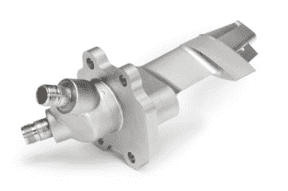
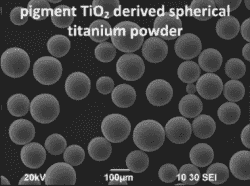
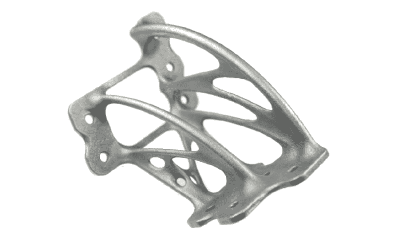
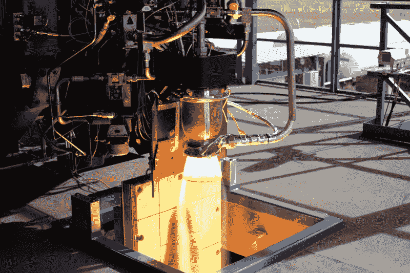
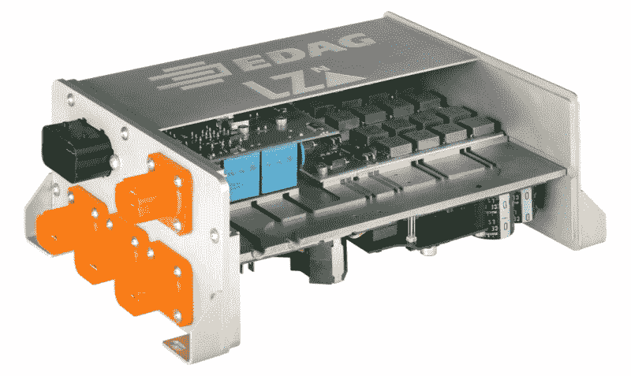
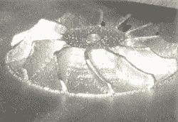

# 是直接金属 3D 打印的时候了

> 原文：<https://hackaday.com/2016/05/19/its-time-for-direct-metal-3d-printing/>

3D 打印的日子不好过。Stratasys 在 Makerbot 上被烧了，信任的支持者在 Peachy Printer meltdown 上被烧了，我在一个全新的酒店上烧了手指，就在昨天，这只是最近的事件。近年来，不少初创公司开始着手开发一种 3D 打印技术，这种技术将有所作为。更多的颜色，更多的材料，更可靠，更大，更快，更便宜，更容易使用。甚至还有一家金属 3D 打印初创公司 MatterFab，它成功制造了一台低成本金属粉末激光熔化 3D 打印机的功能原型，获得了 1300 万美元的资金，然后无声无息地消失了，噗。

这只是购物中心的儿童角落，大人们才刚刚开始掏出他们的钛信用卡。通用电气正在将 [3D 打印、FAA 批准的燃料喷嘴](http://www.geglobalresearch.com/innovation/3d-printing-creates-new-parts-aircraft-engines)引入其飞机喷气发动机，空中客车正在向 [3D 打印轻质部件和内部](http://www.airbus.com/newsevents/news-events-single/detail/innovative-3d-printing-solutions-are-taking-shape-within-airbus/)前进，SpaceX 已经[将带有 3D 打印主氧化剂阀门(MOV)的火箭送入轨道](http://www.spacex.com/news/2014/07/31/spacex-launches-3d-printed-part-space-creates-printed-engine-chamber-crewed)，旨在使 SuperDraco 成为第一个完全 3D 打印的火箭发动机。直接金属 3D 打印正在从实验研究阶段过渡到生产阶段，看看大型工业如何以及为什么会自我分裂是很有趣的。

  GE recently received FAA approval for this 3D printed jet engine fuel nozzle.  DMLS 3D-printing turbine blades, image source: [General Electric, 2013](https://www.youtube.com/watch?v=l0SXlkrmzyw)
Direct metal 3D printing fuses metal powder particles layer by layer into dense objects and does not require post-print infusion like binder-based methods. The selective melting of the particles can be achieved through an electron beam (Electron Beam Melting, EBM) or lasers (Direct Metal Laser Melting, DMLM, synonymous to EOS’s trademarked DMLS). Laser-based direct metal 3D-printing is currently experiencing an extreme push since it typically outperforms the previously hyped EBM technology in terms of resolution and surface finish. DMLM saves the need for a vacuum chamber, but since it requires several high power laser units to catch up to the productivity level of a single beam EBM machine, as well as an inert gas atmosphere and post-print heat treatment, it is also more expensive.

Image source: [Metalysis](http://metalysis.com/3d-metal-printing)

显然，这不是那种把廉价设备放到你桌面上的推动。DMLM 机器的价格大约在 100 万美元以上，除了机器的购买价格，直接金属 3D 打印的单位成本也高得离谱。必须通过气体或等离子体雾化产生精细的高纯度金属粉末材料，以获得一致的球形颗粒。然后是打印过程本身，它利用一个或多个强大的光纤激光器将昂贵的粉末融合成固体形状，持续几天甚至几周。接下来是一个经典的手工过程，包括清洗、退火、去除支撑结构、减法精炼和表面处理。高单位成本直接反映了 3D 打印产品中每一个单独颗粒的加工过程中必须付出的努力，尽管这些努力很快积累起来，但它们的规模却很小。

那么，这是否意味着将增材制造贴上高效、无废物制造方法的标签是天真错误的呢？这取决于应用。通常在 DMLM 机器中使用的镱光纤激光器是熔化金属的一种令人惊讶的有效方式，并且由于其非常长的 MTBF，可以连续工作十多年。然而，即使在每小时高达 500 厘米 3(30 英寸 3(3)T2)的实验建造速度下，它们的优势也主要体现在高复杂性和低数量的应用中。因此，一方面，3D 打印一个简单的钢铁部件，以前是在铸造过程中大量生产的，仍然要比 DMLM 贵 10 到 100 倍。另一方面，将数十到数百个铸造或减法制造的零件结合成一个整体的 3D 打印功能组可能比传统功能组便宜得多。最终，促使 SpaceX、GE 和空客等公司购买该技术的是其非同寻常的影响和成本杠杆效应:

#### 轻质结构

Angular strut based on bionic design principles and mathematical models for structure generation. Source: [“Neue Konstruktionsansätze in der additiven Fertigung”, C. Emmelmann, 2013](http://spectronet.de/story_docs/vortraege_2013/131106_optonet_workshop/131106_01_emmelmann_tu_hamburg.pdf)

添加制造允许复杂性。它生成任意形状和结构的能力使轻质建筑技术成为可能，在这种技术中，多余的材料从基于数学和自然模型的设计中被去除，这通常被称为“仿生设计”。由于在航空领域，即使是很小的重量节省，在一次长途飞行中也会累积成大量的燃料节省，所以飞机制造商在减轻重量方面会不遗余力。

#### 合规和质量保证

Comparison of a conventional assembly with an integral 3D printed component. Source: [“Disruptiver Change Prozess durch 3 D Druck in der industriellen Wertschöpfungskette”, C. Emmelmann 2015](http://www.rkw-bw.de/rde/aktuelles/pdf/Emmelmann.pdf)

客机中的一个功能组可以包含数百个单独的部件，所有这些部件都经过内部质量保证过程，并且必须获得 FAA 批准才能投入使用。将几十个功能部件烘焙成单个 3D 打印单元有助于减少昂贵且耗时的合规性和质量保证工作。

#### 高温材料

3D-printed Super Draco rocket engine, source: [SpaceX, 2014](http://www.spacex.com/news/2014/07/31/spacex-launches-3d-printed-part-space-creates-printed-engine-chamber-crewed)

极端温度应用，从低温燃料阀到白热发动机机体，需要非常耐高温和耐腐蚀的材料，如钴-铬和镍基超级合金或钛和钛基合金。这些材料是非常具有挑战性的机器减法，而他们几乎可以毫不费力地通过 DMLM 处理。

#### 冷却通道

Concept study of a power electronics enclosure for EV onboard chargers. 3D-printed cooling plates with fine pitched, internal coolant channels maximize heat dissipation in constrained spaces. Image source: [“Erfolgreiche 3 D Druckindustrialisierung durch hybride Fertigungsmethoden und Bionic Production”, C. Emmelmann 2015](https://www.hs-owl.de/fb7/fileadmin/download/labore/konstruktion/06_Tagungen/01_RP_Tagungen/20_RP/20_FTRP_Emmelmann_3D_Druckindustrialisierung_Freigegeben.pdf)

3D 打印允许在热应力部件中嵌入内部冷却通道，从而延长部件寿命并提高电子和热力学应用的效率。内部冷却通道也有助于增加注射成型工具的产量。

### 这是你对它的理解

显然，有许多产品，如植入物和假体、电力电子设备的高效冷却解决方案以及汽车中的轻型框架结构，都特别适合直接 3D 打印金属。目前，它们不在直接金属印刷的成本效益操作点。但它们最终会实现这一目标，要么借助更大的行业，要么借助制造商和黑客推动的创新浪潮。

3D printed metal impeller, source: [E-Brochure 2016, Aurora Labs Ltd. 2016](http://auroralabs3d.com/check-out-the-new-e-brochure/)

正如 MatterFab 所展示的那样，低成本的 DMLM 机器在某种程度上是可能的，但需要动力、想法、正确的应用和资金才能变得高效和可行。尽管如此，其他人仍在 MatterFab 似乎停止的地方继续工作。aurora Labs——一个创业团队，碰巧在他们的[技术](http://worldwide.espacenet.com/publicationDetails/claims?CC=WO&NR=2016044876A1&KC=A1&FT=D&ND=3&date=20160331&DB=EPODOC&locale=en_EP)上投入的时间比在他们被取消的 [Kickstarter](https://www.kickstarter.com/projects/460400892/affordable-3d-metal-printer-aurora-labs?ref=nav_search) 活动上投入的时间还多——最近发布了一些来自他们 DMLM 打印机的镜头，看起来他们正在实现这一目标。我给你们留下这个小片段，是一台临时制造的 ti 6 al 4v DMLM 打印机，打印出了一个相当不错的叶轮。
 [https://www.youtube.com/embed/b3PSlKnYN6E?version=3&rel=1&showsearch=0&showinfo=1&iv_load_policy=1&fs=1&hl=en-US&autohide=2&wmode=transparent](https://www.youtube.com/embed/b3PSlKnYN6E?version=3&rel=1&showsearch=0&showinfo=1&iv_load_policy=1&fs=1&hl=en-US&autohide=2&wmode=transparent)