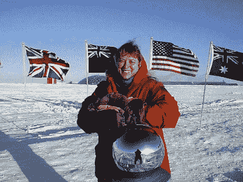
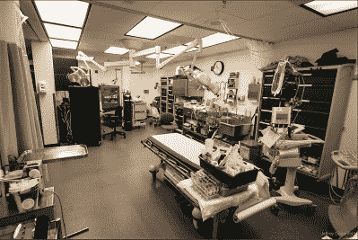

# 杰里·尼尔森:在地球上最后一个地方生存

> 原文：<https://hackaday.com/2017/12/19/jerri-nielsen-surviving-the-last-place-on-earth/>

地球上可能没有比南极更少人去的地方了。尽管有一个永久的研究基地，建筑物围绕着极点，还有活跃的科学项目，相对来说，很少有人进行过艰苦的旅程。从 10 月到 2 月，多达 200 人可能会驻扎在阿蒙森-斯科特南极站度过南极夏季，游客们来来去去地检查他们遗愿清单上的一项。但是到了 3 月份，当太阳在接下来的 6 个月里落到地平线以下时，几乎所有人都离开了，除了几十个“过冬者”，他们定居下来维护空间站，进行研究，并在地球上任何地方大自然母亲酝酿的最恶劣的天气中幸存下来。

过冬意味着接受这样一个事实，无论发生什么，一旦最后一班飞机离开，你将独自度过八个月。这种孤立和自力更生需要特殊的人，而 Jerri Nielsen 博士就是接受挑战的人之一。但是，当她和其他过冬者在 1998 年看着最后一架飞机离开北极，并为约翰·卡彭特的电影《那件事》的首夜放映做准备时，她不知道她必须做些什么才能战胜当时正在她体内生长的癌症。

### 世界上唯一的医生

Dr. Jerri Lynn Nielsen. Source: [National Science Foundation](https://www.nsf.gov/news/news_images.jsp?cntn_id=115075&org=NSF)

尼尔森受雇为阿蒙森-斯科特南极站的医务人员工作了一年，他知道事情并不容易。即使是在短暂的夏季，飞机有规律地来来去去，运送人员和物资也是一种考验，为漫长的冬季夜晚做准备需要做的一切都需要小心翼翼地照料。尼尔森全身心地投入到工作中，将挑战作为从痛苦的离婚中继续前进的一种方式。

该站的医疗部门虽然设备齐全，但显然有限。虽然自尼尔森博士任期以来，诊所已经升级，但像核磁共振扫描仪这样的高级诊断仍然不可行，医生不得不依靠像 x 光和简单的血液测试这样的简单工具。尼尔森医生作为急诊室医生的背景使她能够很好地应对这一挑战，但即使是世界上其他地方最简朴的医院也可能至少有另一位医生会诊，并有某种工作人员协助。不在极地——尼尔森是基地里唯一的医生，负责照顾过冬船员健康和福利的方方面面。尼尔森不知道几个月后，她会成为自己的病人。

The hospital at the bottom of the Earth, c. 2013\. Source: [Jeffrey Donenfeld](https://www.jeffreydonenfeld.com/blog/2013/02/the-south-pole-medical-clinic/)

6 月，她感到乳房有肿块。在没有其他人可以求助的情况下，她通过电子邮件联系了美国的医生，描述了她的发现。肿块的性质必须确定，没有乳房 x 光照相所需的专门 x 光设备，尼尔森医生将不得不对自己进行活检。她向她的一些越冬同事简要介绍了这一过程，以便他们能够提供帮助，但最终，尼尔森不得不将皮下注射针穿过她的乳房，进入肿块，以吸取足够的细胞进行检查。这在别人身上很难做到，但在自己身上几乎不可能。再加上知道自己可能会得知自己患有癌症时的焦虑，尼尔森能够完成这个微妙的手术真是一个奇迹。

### 正人先正己

尽管面临挑战，尼尔森设法获得了足够的活检材料，在与家里的病理学家进行了更多的咨询后，她准备了细胞切片。病理学家有设备齐全的实验室，有各种各样的细胞制剂供他们使用，让他们分析细胞的形态并作出诊断；Jerri 只有一些简单的染色剂可以用。更糟糕的是，她不是一名训练有素的病理学家，所以她准备的切片必须成像并送回美国进行诊断。尽管样本准备很差，从临时拼凑的显微镜上获得的图像质量很低，病理学家还是能够告诉她这个肿块很可能是癌症。

为了有任何生还的机会，Jerri 需要尽快开始治疗。南极的医疗诊所没有处理肿瘤病例的设备，在理想的情况下，她应该被疏散。但是极地的环境从来都不理想，在隆冬时节，救援是不可想象的。气温约为零下 75 摄氏度(-100 华氏度)，地面旅行到海岸基地无异于自杀，当着陆滑板冻结在跑道上或燃料变成果冻时，试图着陆的飞机很有可能再也无法起飞。

但是空投是可能的，Jerri 的支持团队很快为她准备了一捆物资。他们想要更好的图像，所以添加了更好的细胞染色试剂盒，以及用于肿瘤直接成像的西门子超声波机器。六捆补给品被推出军用运输机的货舱门，扔进了寒冷的南极夜，但只有五捆幸免于难。一个降落伞未能打开，不幸的是，超声波仪器被摧毁了。

Jerri 坚持不懈，通过第二次活检获得的更好的图像，她和她的支持团队确认了癌症的初步诊断。由于无法自己进行乳房切除术，她开始使用护理包中包含的药物进行化疗和激素治疗。她不得不再次训练她的同事来帮忙，但在 7 月和 10 月之间，当抢救最终成为一种选择时，她不仅成功地治疗了自己，处理了化疗的严重副作用，还满足了其他人的医疗需求，包括一位臀部受伤严重需要和她一起撤离的同事。

尼尔森医生回到美国，经历了多轮治疗和手术，包括乳房切除术。她的治疗使她得到了缓解，她写了一本关于她的经历的书，并环游了世界，甚至回到了南极洲。但是在 2005 年，她的癌症复发了，已经转移到她的骨骼、肝脏和大脑。她于 2009 年去世。

当面对不可能的机会时，尼尔森医生用她手头仅有的一点钱做了她能做的一切。她组织了一个由受过最少训练的人组成的临时医疗团队，设计了一个治疗计划，临时准备了工具，并利用她可用的有限技术来完成这项工作。凭借一点点运气和大量的勇气和技巧，她在地球上的最后一个地方幸存了下来，至少在一段时间内。