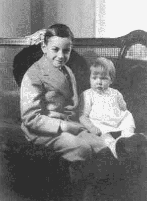
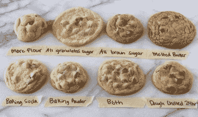
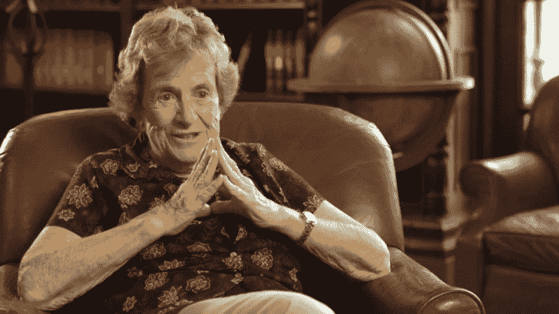

# 琼·费曼在阳光下找到了自己的位置

> 原文：<https://hackaday.com/2017/11/21/joan-feynman-found-her-place-in-the-sun/>

在谷歌上搜索“琼·费曼”，你会感觉到这个搜索巨头在考虑要求澄清。你是说: ***理查德*** 费曼？图片搜索更偏向理查德。在琼的大概七张照片之后，是无尽的理查德一个人的画卷，理查德在打手鼓，理查德和他一生的挚爱艾琳在一起。

是的，琼被她的哥哥盖过了，但那个时代的物理学家不是吗？理查德不是故意的。事实上，没有人比他更支持琼的科学梦想，甚至他们的母亲也不支持。在理查德用他的才华照亮世界之前，他照亮了他的妹妹琼。

Baby Joan works on the Feynman smirk. Image via [r/physics](https://www.reddit.com/r/Physics/comments/g1keo/found_richard_feynmans_sister_joan_feynman_at_my/)

### 来自上方的信号

琼·费曼于 1927 年生于纽约市皇后区，露西尔和梅尔维尔·费曼是她的父母，九年前理查德出生。两个孩子都被培养成无止境的好奇心。他们的父母鼓励他们总是问为什么，并注意他们周围的世界。

琼非常钦佩她的哥哥，并且总是对他所做的事情感兴趣。理查德马上利用了这一点，让琼成为他的第一个学生。她三岁时，他教她如何将简单的数字相加。每当琼答对一题，理查德就让她拉他的头发，并做鬼脸。理查德学到的任何关于数学或科学的东西，他都会在家里到处重复，这有双重效果，既加强了他的理解，又激起了琼的兴趣。

他们的工作关系也在继续。琼五岁时，理查德雇用她在他卧室的电子实验室里帮助他。每周只需几美分，她就能在适当的时候打开开关。有时她不得不把手指放在火花隙里逗他的朋友们开心。

琼还很小的时候，一天晚上，理查德把她从床上拉起来，领着她沿着街道来到附近的一个高尔夫球场。他告诉她抬头看天空，天空闪耀着绚丽的北极光。琼被迷住了。在那一刻，她的命运变得清晰。

No one could foil Joan’s plans. Image via [Popular Science](http://www.popsci.com/scitech/article/2002-04/my-mother-scientist)

### 女性应该出现在大学水平的天文学教科书中

当时，没有人知道是什么导致了极光。琼决心揭开他们的秘密。不过，她的母亲有其他想法。当琼在八岁时向她宣布她想成为一名科学家时，她母亲告诉她“女人不能做科学，因为她们的大脑不能理解足够多的科学知识。”琼被击垮了。从那天起，她开始怀疑自己的能力。

露西尔·费曼并不是想冷酷无情或不思进取。她十几岁时就开始争取妇女选举权。尽管如此，她认为女性在智力上不如男性。这是当时。

有一段时间，琼的抱负被搁置了。不管怎么说，在 20 世纪 30 年代，除了玛丽·居里之外，没有多少女科学家值得尊敬。她很有代表性，也许太有代表性了。琼把她视为神话，一只科学伟人的威严的独角兽，而不是一个她可以试图模仿的人类女性。

尽管如此，琼还没有气馁到失去对科学的兴趣。首先，理查德从未停止支持她。当她 14 岁时，他给了她一本大学水平的天文学教科书。她发现材料很难，但当她卡住时，她接受了他的建议，从头开始。

在第 407 页，琼发现了一些东西，这些东西会给她一件她最需要的东西，来决定她的未来——认可。这一页上有一张光谱吸收线图，是塞西莉亚·佩恩的作品。琼欣喜若狂。一个女科学家！最后，她母亲错了的具体证据。女性不仅可以理解科学，她们还可以在教科书中引用自己的工作。琼的信心恢复了。

The science of homemaking. Image via [NPR](https://www.npr.org/sections/thesalt/2014/09/04/345530660/the-science-behind-baking-your-ideal-chocolate-chip-cookie)

### 家政科学

当然，成为一名科学家并不那么简单。琼处处面临逆境。在奥柏林大学本科学习期间，她做了所有的实验室实验，而她准备不足的实验室伙伴得到了所有的荣誉。锡拉丘兹大学的一位教授告诉琼，她应该写关于蜘蛛网的论文，因为作为家庭主妇，她会经常遇到蜘蛛网。

1958 年获得博士学位后，琼试图在《纽约时报》的分类广告中寻找一份研究科学家的工作。列表是按性别分类的，他们告诉她不允许在男性中发布。但是谁会在女区找天体物理学家呢？

20 世纪 60 年代初，琼为一家制造固态设备的小公司工作。她还和丈夫里奇·赫什伯格一起抚养两个年幼的儿子，里奇·赫什伯格是她在奥柏林遇到的一位科学家同事。当通勤变得太多时，她辞职去尝试全职家庭生活。三年来，琼除了做饭、照顾男孩和打扫家里的五居室外，什么也不干。她生活中唯一的科学表象是烘焙食品。琼很痛苦。在精神病医生的建议下，她去了哥伦比亚大学的拉蒙特天文台找工作，但她担心自己离开得太久了。很快，她收到了三份工作邀请。

### 太阳干扰

在拉蒙特，琼研究了磁层和太阳风之间的相互作用。在那些日子里，天体物理学家认为磁层是封闭的，像泪珠一样逐渐变细。琼发现它实际上是开放的，在太阳风不到的太阳对面有一条长尾巴。在开放模型中，太阳磁场更直接地影响磁层。

几年后，在美国宇航局喷气推进实验室(JPL)，琼能够证明极光发生时，太阳粒子穿透磁层。当这些粒子与磁气圈中的粒子混合时，碰撞显现出明亮的颜色。

Solar Wind vs. Magnetosphere. Image via [NASA](https://ccmc.gsfc.nasa.gov/educational/MagnetosphereWebPage.php)

她还研究了太阳黑子周期和日冕物质抛射。这些太阳风暴可以极大地影响磁层，并能够使卫星瘫痪和中断地面通信。当时，很难精确定位日冕物质抛射。琼的研究表明，无论哪里有日冕物质抛射，太阳风中的氦也会显著增加。

琼还证明了日冕物质抛射是成群发生的。从这项研究中，她设计了一种统计计算方法，来预测普通宇宙飞船在其寿命期间可能反弹的高能粒子的数量。这一重要的发展导致了更好的设计和更长的寿命。1999 年，美国宇航局授予她杰出科学成就奖。

琼于 2002 年从 JPL 退休。从那以后，她将注意力转向了太阳周期变化对气候变化和历史气候异常的影响。在 90 岁的时候，她仍然对太阳做的所有疯狂的事情着迷，并且仍然决心找到解释。

Joan thinks the Sun is excellent. Image via [BBC](http://www.bbc.co.uk/programmes/p01842jw)

 [https://www.youtube.com/embed/tD_XAX--Ono?version=3&rel=1&showsearch=0&showinfo=1&iv_load_policy=1&fs=1&hl=en-US&autohide=2&wmode=transparent](https://www.youtube.com/embed/tD_XAX--Ono?version=3&rel=1&showsearch=0&showinfo=1&iv_load_policy=1&fs=1&hl=en-US&autohide=2&wmode=transparent)

