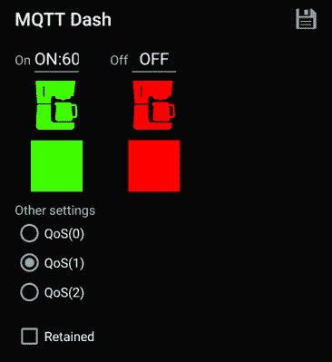

# 通过 WiFi 控制的电源插座激活 Joe

> 原文：<https://hackaday.com/2017/09/09/joe-activation-with-a-wifi-controlled-electrical-outlet/>

[Mike]是他家里唯一喝咖啡的人，他使用简单的单份咖啡机，没有自动开启功能。因为没有人真的想在早上站着煮咖啡，[迈克]的解决方案是把他的电源插座物联网。

[MQTT Dash](https://play.google.com/store/apps/details?id=net.routix.mqttdash&hl=en) is an Android app “for nerds only ;)”

该项目包括一个由 ESP8266 封装 Adafruit Huzzah 控制的中继板。它全部由 9V 电源供电，稳压器为继电器线圈和 Huzzah 提供 5V 电源。[Mike]正在使用 [CloudMQTT](https://www.cloudmqtt.com/) 与插座通信。

当谈到添加用户侧仪表板时，我们经常看到这些自动化项目碰壁。[Mike]正在使用一款名为 [MQTT Dash](https://play.google.com/store/apps/details?id=net.routix.mqttdash&hl=en) 的免费 Android 应用，该应用支持许多不同的 UI 组件，甚至已经内置了咖啡机图标。你自己的项目当然值得一看。[Mike]用它打开插座 10 分钟，当他抓到一半时，插座又关闭了。

事实证明，将咖啡壶连接到互联网是我们读者的一种驱动力。这个[在咖啡煮好的时候提醒整个办公室](https://hackaday.com/2015/07/24/alarm-notifies-the-office-when-the-coffee-is-ready/)，而另一个[由 Alexa](https://hackaday.com/2017/01/06/alexa-robot-coffee-maker-brews-coffee-speaks-for-itself/) 控制。话又说回来，有时候你所能做的就是[对咖啡互联网进行逆向工程](https://hackaday.com/2016/10/11/reverse-engineering-the-internet-of-coffee/)。