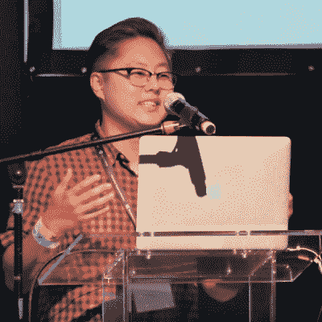
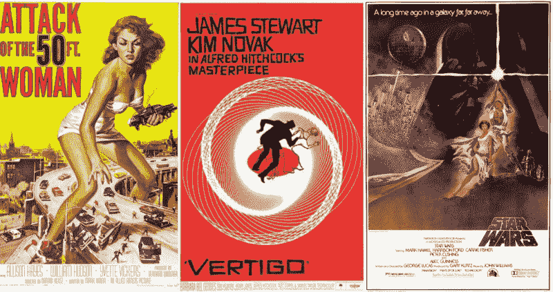
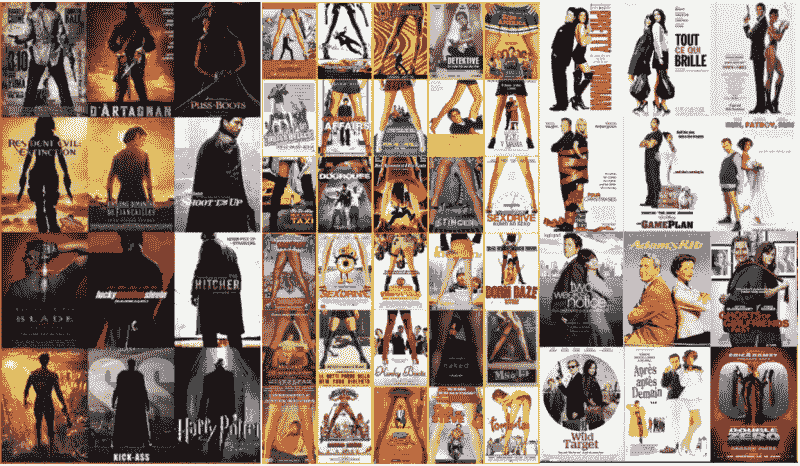

# 乔·金:技术和艺术碰撞的地方

> 原文：<https://hackaday.com/2017/12/05/joe-kim-where-technology-and-art-collide/>

作为 Hackaday 的一名作家，回报是很多的，但除了像秘密的 Hackaday 握手和进入私人作家的洗手间这样明显的额外待遇之外，有机会写原创内容的文章可能是这份工作最好的部分。不过，更好的是，在你提交一篇文章后，你最终会收到 Supplyframe 艺术总监 Joe Kim 的电子邮件，其中有一个 Dropbox 链接，链接到他为你的作品创作的原创艺术。无论我身在何处，当那封邮件进来时，我都会立即点击链接，急切地想看看乔想出了什么。我从不失望。

 乔在繁忙的日程安排中抽出一些时间，在 2017 年超级大会上发表了关于“艺术与技术的平衡”的演讲，他保持了 Hackaday 的视觉风格的新鲜和令人兴奋一个整天从事艺术创作的人会对艺术在当今社会的地位有一些强烈的看法，这并不奇怪，但可能令人惊讶的是乔对技术对图形艺术的影响的态度。作为一名专业的像素骑师，乔整天在 Photoshop 中处理数字图像，但他谴责在许多情况下，技术“将艺术家从艺术中带走了”

乔正确地指出，艺术总是跟随技术，从木炭和赭石羚羊在一个洞穴墙壁上由一盏油灯的微弱光线素描，一直到渲染农场，产生从未出现过的地方和人的详细活动图像。但是，技术已经使创作过程民主化了，我们已经到了这样一个地步，人们使用带有高分辨率数码相机的袖珍超级计算机向世界展示他们午餐吃的是什么，或者将他们最新的鸭脸造型永久化。

创作的民主化已经从艺术中吸取了很多灵魂。他的电影海报艺术的例子非常贴切，从好莱坞黄金时代的美丽手绘艺术到索尔·巴斯风格化的海报和标题，再到前数字时代的照片写实主义绘画。但是现在，任何有一点 Photoshop 经验的人都可以(而且确实)创作电影艺术，我们看到一切都汇聚到几个共同的主题中，这些主题可以快速、廉价地制作出来。套用《超人总动员 中的[综合症，“当每个人都是艺术家时，没有人会是。”](https://www.youtube.com/watch?v=A8I9pYCl9AQ)

Movie posters were once classics of modern art. Credits (L to R): Reynold Brown, Saul Bass, Tom Jung

Now anyone with Photoshop can do it. Montages by Christophe Courtois.

乔的观点很有道理。毕竟，在摄影术出现之前，绘画大师们努力了多年才创作出我们今天称之为照片般逼真的肖像。一旦任何人都能拍出和肖像画一样好的快照，优秀的艺术家就转向了其他的表现领域，于是我们有了毕加索和梵高这样的艺术家。事实上，这并不是一个糟糕的交易，乔善意地开玩笑指出，随着湿式摄影的复兴和对更抽象的艺术形式的探索，潮人文化正开始向不同的方向推动艺术。

看起来乔对这些天艺术的发展很乐观，很高兴知道我们的团队中有一个不仅仅是推动像素的人。乔将艺术家的情感带到了桌面上，无论我们作家给他的种子想法有多单薄，他都能看到文章的本质，并创造出抓住它的艺术。这是一个罕见的人才，我们很幸运有他在身边。

 [https://www.youtube.com/embed/3E0kqOXGT6c?version=3&rel=1&showsearch=0&showinfo=1&iv_load_policy=1&fs=1&hl=en-US&autohide=2&wmode=transparent](https://www.youtube.com/embed/3E0kqOXGT6c?version=3&rel=1&showsearch=0&showinfo=1&iv_load_policy=1&fs=1&hl=en-US&autohide=2&wmode=transparent)

