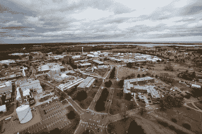
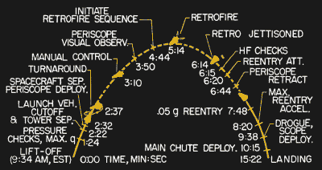
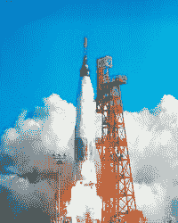
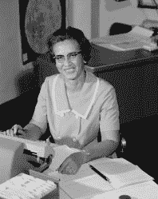

# 凯瑟琳·约翰逊:通向星星的电脑

> 原文：<https://hackaday.com/2018/02/28/katherine-johnson-computer-to-the-stars/>

1962 年，约翰·格里恩坐在他的太空舱里，等待他的火箭发动机点火，将他送上太空。但首先，他坚持让凯瑟琳·约翰逊仔细检查电子计算机的轨迹计算。虽然这是最近的电影[隐藏的人物](https://en.wikipedia.org/wiki/Hidden_Figures)中给出的事件的戏剧性版本，但现实并不遥远。格伦当时没有坐在发射台上，但在发射前的几周，他坚持让约翰逊仔细检查计算机的计算。

那么，在这样一个众所周知的历史事件中扮演了重要但却鲜为人知的角色的这个女人是谁呢？在她漫长的一生中，她是一位妻子、母亲、非裔美国人、教师和人类计算机，这个词现在很少使用。她的计算在早期太空飞行中发挥了重要作用，2015 年，她被奥巴马总统授予总统自由勋章。在弗吉尼亚州汉普顿的兰利研究中心，也有一栋建筑以她的名字命名。

## 像火箭一样起飞

她于 1918 年 8 月 26 日出生在西弗吉尼亚州绿蔷薇郡的白硫磺泉，原名凯瑟琳·科尔曼。她的母亲是一名教师，父亲是一名伐木工人、农民、杂工，在一家酒店工作。由于她母亲的影响，她四岁就能阅读了。她喜欢数数所有的东西，对数字很有天赋。他们的县没有为八年级以上的非洲裔美国人提供公立学校，所以她的父亲带着全家 130 英里(210 公里)到西弗吉尼亚州的 Institute，她可以在那里上高中。他们在学院度过了学校时光，在白硫泉度过了夏天。她当时十岁，十四岁毕业。

这所学校是西弗吉尼亚州立学院的一部分，西弗吉尼亚州立学院是一所历史上的黑人学院，所以她在那里上大学，学习所有可用的数学课程。她有多个导师，包括 W. W. Schiefflin Claytor，他是第三个获得数学博士学位的非洲裔美国人。有一次，他说，“你会成为一名优秀的研究数学家，我要看到你准备好了。”这种鼓励是她在成长过程中经常得到的。18 岁时，她以最高荣誉毕业，获得了数学和法语学位。

## 通往星星的数学家

NASA Langley Research Center – 2011

她渴望成为一名研究数学家，但起初只能找到教学工作。然后在 1952 年，一个亲戚提到 NACA(NASA 的前身)在找数学家。原来，NACA 位于弗吉尼亚州汉普顿的兰利纪念航空实验室的导航部门需要数学家。她从 1953 年开始为他们工作。

她首先在一群做数学计算的女性中工作，主要是分析飞行测试的黑匣子数据，但也做其他数学工作。她称这些女性为“穿裙子的电脑”。工作两周后，她转到了飞行研究部门的制导和控制部门，再也没有回来。

1957 年，俄罗斯向太空发射了世界上第一颗人造卫星 Sputnik 1 号。作为追赶竞赛的一部分，1958 年，NACA 更名为 NASA。她所在的小组成为了太空任务小组，任务是研究如何将人类送上太空并返回。正如她所说:

> 我们编写了自己的教科书，因为没有其他关于太空的教科书。我们只是从我们所知道的开始。我们不得不回到几何学，把这些东西都弄清楚。因为我一开始就在，所以我是那些幸运儿中的一员。

## 计算太空中的第一个美国人

Alan Shepard’s trajectory

她为艾伦·谢泼德 1961 年 5 月的自由 7 号任务做了轨迹分析，这是水星飞行计划的一部分，也是美国人第一次进入太空。从佛罗里达州卡纳维拉尔角发射，这是一次 15 分钟的亚轨道飞行。该轨迹是一条抛物线，最高点在 187.5 公里(116.5 英里)，向下移动 487.3 公里(303 英里)，溅落在大西洋。目标是测试谢泼德在发射期间如何处理高 g 力和重返大气层的热量。

这些计算涉及基本几何学。用约翰逊的话说:

> 早期的轨迹是抛物线，很容易预测它在任何一点的位置。早些时候，当他们说他们想让太空舱降落在某个地方时，他们试图计算它应该什么时候开始。我说，‘让我来吧。你告诉我你什么时候想要它，你想让它在哪里着陆，我会倒着做，然后告诉你什么时候起飞。

## 做这件事的“女孩”

Launch John Glenn’s Friendship 7

1962 年 2 月，约翰·格里恩的友谊 7 号任务包括绕地球飞行三圈。这增加了地球引力的复杂性，所以美国宇航局使用了一台数字计算机 IBM 7090 进行计算。它通过轨道计算来控制太空舱从发射到溅落的轨迹。但是电脑容易打嗝和断电，所以宇航员们对它很警惕。

我们不知道格伦是什么时候提出以下要求的，但在发射前一周的某个时候，他在提到约翰逊时说:

> 让那个女孩去做。[当时所有工作的女性都被称为“女孩”。我希望这台人类计算机检查电子计算机的输出，如果她说它们是好的，你知道，我就可以去作为我飞行前检查清单的一部分。

在她的台式计算器的帮助下，她做了和电脑一样的计算。根据来源的不同，计算需要一天半或三天，但她得到了与数字计算机完全相同的数字。剩下的就是历史了。

## 阿波罗 11 号及以后

Katherine Johnson at NASA, in 1966

她最自豪的是阿波罗 11 号任务的成功，她是计算往返月球路径的小组成员之一。开始计算时，原则上他们只需要知道你从地球上的哪里发射，以及月球在哪里。虽然大多数人关心的是到达那里，但她更关心的是返回。在任务期间，她在电视上看着这些事件，回想起当时的想法，如果宇航员偏离一度，那么他们将无法绕地球飞行。她希望他们计算正确。

她说她对太空旅行最大的贡献是帮助计算同步阿波罗月球着陆器和月球轨道上的指令舱。

她的工作并没有就此结束。当阿波罗 13 号在太空中出现故障时，她还帮助制定了应急程序。她参与了航天飞机、地球资源卫星和火星任务的计划。

她于 1986 年退休。

## 隔离和荣誉

当时，种族隔离在美国南部仍然非常普遍。约翰逊一生都经历过这种情况，但从未让它影响她的生活。在电影《隐藏的人物》中，她在兰利工作时，不得不走很长一段路去使用有色人种的女厕所。事实上，这部电影中也提到了美国国家航空航天局的工程师玛丽·杰克逊。约翰逊转而使用未贴标签的白人女性卫生间，起初并不知道有种族隔离。她发现了，就直接无视了。

她也经历了作为一个女人的障碍。她坚持参加通常只有男性参加的会议。直到她的名字成为第一个——她职业生涯中 26 个合著者中的第一个，女性的名字才作为合著者出现在报告中。

关于那份职业，她说“我在兰利找到了我一直在寻找的东西。这是一位研究数学家所做的。33 年来，我每天都开心地去上班。”

在她获得的荣誉中，2015 年 11 月 24 日，奥巴马总统授予她总统自由勋章，2016 年 5 月 5 日，美国宇航局将兰利研究中心一座 40，000 平方英尺的新建筑命名为凯瑟琳·约翰逊计算研究设施。

她将于 2018 年 8 月 26 日庆祝她的 100 岁生日。

这里有一个简短的视频采访，很好地总结了她对数学、工作和生活的态度:“尽你所能，但*喜欢*它，然后你会尽你所能。”

 [https://www.youtube.com/embed/FgW2kpNQ7BY?version=3&rel=1&showsearch=0&showinfo=1&iv_load_policy=1&fs=1&hl=en-US&autohide=2&wmode=transparent](https://www.youtube.com/embed/FgW2kpNQ7BY?version=3&rel=1&showsearch=0&showinfo=1&iv_load_policy=1&fs=1&hl=en-US&autohide=2&wmode=transparent)

