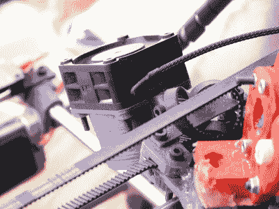
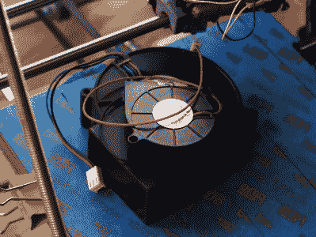
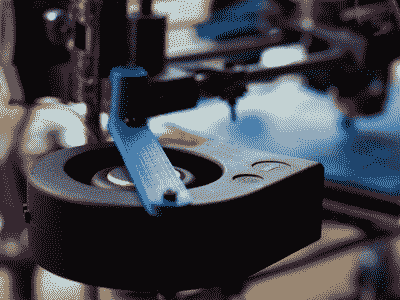

# 让您的喷嘴保持高温，让您的打印保持凉爽

> 原文：<https://hackaday.com/2016/01/29/keep-your-nozzle-hot-and-your-prints-cool/>

尽管[完美地调整了我的挤压机步骤](http://wp.me/pk3lN-MFU)，并在较大的印刷品上立即获得了良好的效果。我仍然有很多小零件的问题。PLA 因其低气味、低翘曲和良好的材料性能而成为受欢迎的印刷材料。它也有许多缺点，但对最终用户来说，最大的缺点在于其较大的玻璃化转变温度范围。像所有的热塑性塑料一样，它在冷却时会收缩，但由于范围很大，它会保持膨胀，并且在很长一段时间内都是可弯曲的，这已成为我的专业术语储备。如果不冷却，塑料会在膨胀状态下堆积变形。

The old cooling fan on my trusty and thoroughly battered Prusa i2.

我正在做一个项目，需要一个微小的部分，如上图。左边的部分是我用当前的冷却设置和温度设置得到的结果。它与把它带到这个世界的 CAD 文件几乎没有相似之处。

当塑料在其熔点刚刚离开喷嘴时，3d 打印中层之间的结合就会发生。几乎在那之后，塑料立即从液态转变为玻璃态，就像将两片玻璃压在一起一样，不再发生进一步的粘合。这意味着，为了在印刷层之间获得牢固的结合，塑料必须具有足够的热质量来熔化其下的塑料。让聚合物链变得舒适并握在一起。喷嘴的几何形状可以有所帮助，通过提供热源将两层挤压并熔化在一起，但在大多数情况下，熔化是由液体塑料完成的。这就是为什么大直径喷嘴[产生更强的零件](http://e3d-online.com/blog/volcano_release)。

我想说的是，我喜欢让我的喷嘴温度比实际需要或合理的温度高一点。这往往会产生更好的结合，有时有助于防止堵塞(良好的挤出机设计)。它还会降低精确度并增加光泽。所以，我解决问题的第一个尝试可能是考虑到我没有 100%正确地运行我的喷嘴，我尽可能降低温度。这就产生了一个尺寸更精确的零件，但却非常脆弱。我试验了一系列的温度，但是发现除了最低的温度外，所有的温度都会产生粘性部分。

在确认我不能通过微调我的温度来获得明显的质量回报后，我大幅度降低了喷嘴的速度。通过降低速度，我能够产生三个打印部分的中间部分，如开始的图像所示。非常缓慢地移动喷嘴给了环境空气和我的旧冷却风扇足够的时间来冷却零件。然而，以前五分钟的部分现在需要二十分钟才能打印出来。更大一部分将是一场噩梦。

This will do.

所以，如果我不能调节温度来得到我想要的，而我可以调节速度；这告诉我，我只需要更好地冷却零件。塑料的玻璃态对我来说毫无用处，原因有二。第一，如前所述，没有结合发生。第二，当塑料保持膨胀和可弯曲时，新的一层被放在了错误的地方。当塑料收缩到它的最终尺寸时，就是我想放置下一层的时候。是时候用传统方式解决了:过度杀戮。

不久前，我的朋友送给我一个小鼠笼风扇，他在 3d 打印机上用得很成功。受此启发，我还从一个坏了的 Power Mac G5 电源上偷了一个 12v、1.7A 的风扇。当它旋转起来的时候，我必须小心不要让它自己从桌子上掉下来。

I should have added a rib to this bracket, this fan is heavy!

我为粉丝们打印出了坐骑。大的连着 Z 轴，小的骑在挤压机后面。我启动了之前的 gcode，开始打印，却发现我的喷嘴在中途停止了挤压。什么？我很快发现我的冷却太多了，以至于我的喷嘴降到了 160C 冷挤压切断点以下，固件正在阻止它损坏自己。我的加热床也不再能保持高于 59 摄氏度的温度。在这一点上，我觉得我是对的东西。

我用玻璃纤维绝缘材料和 [kapton](http://hackaday.com/2016/01/04/the-unreasonable-effectiveness-of-adhesive-tape/) 胶带包裹我的挤出机，自信地调高喷嘴温度，将速度设置为最大，然后点击打印。随着过度冷却的增加，我能够在我的三个示例打印中获得右边显示的部分。这是全速，并实现了充分的债券。还不错！这就结束了我的冷却冒险的这一章。结果给我留下了深刻的印象。接下来，我想尝试冷却 ABS 打印。有些人报告了可怕的结果，有些人报告了相当好的结果，我很感兴趣。我还想知道，当塑料沉积时，用一种温度刚好低于玻璃状态的液体来冷却它。想法？