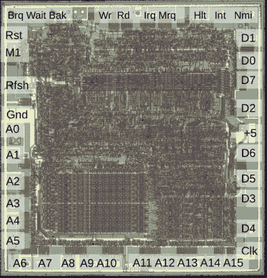
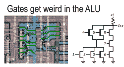
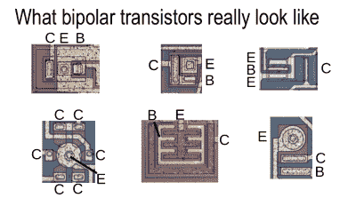
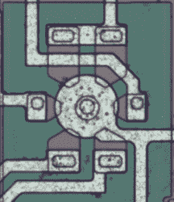
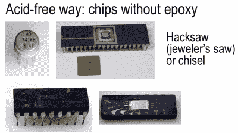

# 肯·希尔瑞夫带我们走进 IC，寻找乐趣

> 原文：<https://hackaday.com/2016/12/27/ken-shirriff-takes-us-inside-the-ic-for-fun/>

[Ken Shirriff]见过的集成电路的内部比大多数人见过的肚脐还要多。(这是夸张的说法。)但关键是，当我们看到一个疯狂混乱的电路时，[肯]看到了一个待解之谜，他找到了一种方法来引导他穿过疯狂。

在 2016 年 Hackaday SuperConference 的演讲中，[Ken]向观众介绍了一些著名的芯片，展示了他如何接近它们，以及如果你想或需要，你可以如何做同样的事情。从照片上看 IC 不是给心脏衰弱的人看的，只要有一点毅力，它就能给你通往王国的钥匙。我们很高兴[Ken]与我们分享了他的方法，并让我们对一些经典芯片有了更深入的了解，从 Z80 处理器到 555 定时器和 LM7805 稳压器，等等。

 [https://www.youtube.com/embed/aHx-XUA6f9g?version=3&rel=1&showsearch=0&showinfo=1&iv_load_policy=1&fs=1&hl=en-US&autohide=2&wmode=transparent](https://www.youtube.com/embed/aHx-XUA6f9g?version=3&rel=1&showsearch=0&showinfo=1&iv_load_policy=1&fs=1&hl=en-US&autohide=2&wmode=transparent)

## 深入了解:Z80

 【肯】不浪费时间，直扑 Z80 8 位 CPU 的死镜头。首先，他将外部引脚与数据手册进行交叉引用，从而标记出与外部引脚相连的焊盘。这告诉了你很多东西——你知道引脚必须做什么，所以它使猜测每组晶体管的用途变得容易得多。

当你看到一串重复的微小电路时，你可能在看内存。由于 Z80 的 CPU 中有 16 个寄存器，[Ken]开始寻找 16 个重复的存储块，并找到了它们(左下角)。由于它们与密码板上的地址线相连，他更加肯定了自己的预感。寄存器的另一端通向数据总线，这是另一个问题。

命令解码器原来是一个可编程逻辑阵列(PLA ),它通过水平线接收一个位模式，对其进行匹配，然后沿垂直线发送一个逻辑高电平，通向算术逻辑单元(ALU)。具体到 Z80，[Ken]指出，虽然它采用 8 位指令，但它只有 4 位宽。事实证明，CPU 内存速度受到限制，所以他们通过使用四位 ALU 节省了空间(和金钱)。鬼鬼祟祟！

 一旦他弄清楚了芯片的大致轮廓，就该深入研究晶体管了。在简单介绍了用晶体管设计逻辑电路之后，他带我们进入了 ic 的实际结构。如果简单的逻辑门如 NAND 和 NOR 还不够混乱，Z80 的设计者使用了一些“疯狂的门”，可以有效地计算他们需要的特定操作。

ALU 是芯片的心脏，它经过了高度优化。例如，Z80 的 ALU 与 6502“完全不同”。加法器不仅仅是加法器。在 ALU 中，你会发现疯狂的门和特定于芯片的实现。对于初露头角的芯片阅读侦探来说，弄清楚这一切是如何运作的是下一个阶段。[Ken]在他的网站上有更多关于 Z80 的信息。

## 聪明的计算器和被遗忘的记忆

1974 年的辛克莱科学计算器是一个小奇迹:它从一个简单的“几乎不会乘法”的计算器中取出一个 TI 芯片，并添加了对数和三角函数。辛克莱是怎么做到的？[Ken]想要找到答案——我们仍然认为这是我们最喜欢的方法之一。

从引出线开始，【Ken】找到了指令 ROM。他为自己的发现建造了一个软件模拟器，并开始逆向工程。同样，如果你喜欢聪明的节省空间的算法，[去他的网站](http://www.righto.com/sinclair)。

在 1970 年，RAM 存储非常昂贵。英特尔公司推出了“移位寄存器”存储器，事实上，它只是一个 512 位长的移位寄存器。在这种情况下，随机存取是如何工作的？你就像在行李传送带上一样等待，直到你的位出现——导致缓慢和随机的随机访问时间。酷毙了。但我们也能看出他们失宠的原因。

## 模拟 IC:555 定时器、LM741 和 LM7805

 你用过 555 定时器吗？想看看它是怎么工作的吗？首先，您必须了解双极结型晶体管(BJT)的实现细节。虽然 BJT 的布局比 FET 多得多，但模拟电路通常更小，更容易理解。[Ken]给你一个良好的开端，然后开始扭转两个标志性的芯片:555 定时器和 LM741 运算放大器。

741 IC 由一个硅内电容主导，这确实是一个愚蠢的想法，但由于“工程师很懒”，这意味着他们少了一个可以布局的芯片，结果证明它是物有所值的，LM741 卖了数十亿。另一方面，它到处都有电流镜，用来代替硅中的电阻。而且它有一些奇怪的晶体管，其中一个有六个(！)收集器，因为设计者需要在一个地方放置六个电流镜。

最后，[Ken]拆开了 LM7805 稳压器。输出晶体管(不足为奇)约为 IC 芯片的一半，7805 需要推动一些电流。该芯片最酷的部分是一个可变电阻，它可以设置输出电压。这是一个简单的技巧，它使 LM7812 和 LM7805 之间的差异不超过内部电阻值，利用相同的设计实现不同的工作电压。

## 他是怎么做到的？

[Ken]使用一种金相显微镜，从上方照射光线，而不是透过样品。他在易贝花了几百美元买了他的。然后，他从芯片周围的不同位置拍摄多张图像，这些图像有明显的重叠，并让 Hugin 软件为他将这些图像拼接在一起。

 “专家们”用沸腾的硫酸或硝酸给他们的芯片解封。[肯]不需要超级基金网站，所以他经常把死亡照片留给别人。像[zeptobars.com](http://zeptobars.com)、 [visual6502](http://visual6502.org) 和[silicon pron](http://siliconpr0n.org)这样的网站有一大堆芯片正等着你开始解码，不需要化学学位。

对于不在环氧树脂中的芯片，[Ken]自己打开它们，要么用凿子敲击，要么用锯子切开。他刚刚在 8008 CPU 上启动了。通过这次演讲和[Ken]网站上的资源，你已经有了一个良好的开端。剩下要做的就是靠你自己去搞清楚一些 IC，这是一项好的、艰苦的、有趣的工作。