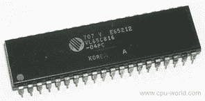
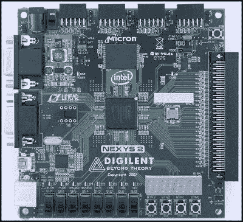

# Kestrel 计算机项目

> 原文：<https://hackaday.com/2016/03/25/kestrel-computer-project/>

许多成功的大型项目并不是从大规模开始的:它们从一个小的工作核心开始，并从那里发展壮大。建造一台完全开源的个人电脑不是一个周末项目。这既是对事件的复述，也是导致请求帮助的背景信息。你会发现，为了创造一台完全开放的个人电脑，已经进行了相当多的艰苦工作。

当我注意到[Kestrel 计算机项目](http://kestrelcomputer.github.io/kestrel/)已经通过 Hackaday tips 热线提交时，我很快找到并联系了[Samuel]，带着一个轻浮的女学生的兴奋问了一大堆问题。在我们的电子邮件交谈中，我发现[塞缪尔]在很大程度上保持了项目的隐蔽性，因为他喜欢在业余时间从事这项工作。现在这个项目已经接近硬件设计的需求，我向[Samuel]提出了一个问题:“你想让我写一篇短文总结你多年来在 Kestrel 项目上的工作吗？”但在他回答这个问题之前，我接着问了另一个问题:“更好的是(Samuel)，我们来讲一个更全面的 Kestrel 项目的历史，并向 Hackaday 社区寻求一些帮助，将这个项目带回家，怎么样！?"

[Samuel]讲述他的项目的时候和我了解这个项目时一样兴奋。这篇文章既是他的，也是我的，事实上，如果我知道如何把他添加到文章中，我会这么做的。

# Kestrel 计算机项目

2007 年，软件工程师[塞缪尔·a·法尔沃二世]创立了[Kestrel 计算机项目](http://kestrelcomputer.github.io/kestrel/)。他自己的开源、开放硬件、全栈个人电脑项目。他一直在业余时间从事这项工作，同时记录他学到的经验和取得的成就。尽管我们很快就会发现，GitHub 并没有在 Kestrel 项目的一开始就被使用，[Samuel]用手绘的图表补充了它的缺失，以填补历史。

## 红隼 1 号

Image credit: [CPU-World](http://cpu-world.com)

这一切都始于 2007 年的红隼 1 号。Kestrel-1 自制电脑和当时的许多电脑一样:一把芯片放在一个典型的试验板上，许多电线连接到各处。它旨在为一个更雄心勃勃的目标提供概念证明，即一台与他成长过程中使用的老式 8 位计算机功能相似的单板计算机。最初的 Kestrel-1 是围绕 65816 CPU 设计的，这是 6502 的 16 位升级。[Samuel]拨入 40 针 DIP CPU，以 4MHz 运行，连接 32KB RAM 和一个 VIA 芯片。

那些通过捕捉一个精神示意图来跟上的人会注意到 ROM 的缺乏。你发现它不见了绝非偶然，(E)PROM 程序员不是板凳上最便宜的东西，因为[塞缪尔]买不起，他就用现有的东西凑合。他决定将 RAM 放在高内存中，将 I/O 放在低内存中，通过使用单个 74ACT00，大大简化了地址解码。然后，系统软件必须通过一种特殊的 DMA 电路加载到 Kestrel-1 中，这种电路被称为初始程序加载(IPL)电路，由主机驱动。

[Kestrel-1](https://hackaday.io/project/10035/files) CPU, RAM, VIA, and Address Decoder

这是在[Samuel]采用 GitHub 导致许多技术图纸永远消失之前，幸运的是[Samuel]能够从记忆中回忆起这个原理图，并为存档而重新绘制。

不幸的是，IPL 电路原理图已被遗忘。IPL 电路通过 PC 并行端口控制，用位来控制 RDY、复位和 BE(总线使能)信号。类似 SPI 的协议允许主机 PC 输入地址和数据总线位的设置。

## 红隼-2

Image credit: NKC Electronics

到 2011 年，FPGA 开发板变得更加经济实惠，于是[Samuel]决定采用 Digilent Nexys-2 开发板。这是他实现最初设想的最终目标的时候。

随着开发的推进，他选择 Wishbone 总线架构作为标准互连，并开始为最终成为视频核心的内容编写 Verilog:单色图形接口适配器(MGIA ),采用适当的 65xx 系列“接口适配器”形式。

为了证实 Wishbone 互连的工作,[Samuel]开发了一个简单的 16 位处理器，其功能足以完成这项工作。在只有 300 行的 Verilog 中，他从一个叫做 Steamer-16 的旧设计中派生出来的是残酷的基本 HDL。[Samuel]的 S16X4 处理器和后来的增强功能在四年后继续成为 Kestrel-2 的核心。尽管指令集受到限制，但事实证明它非常灵活，尤其是在与 65816 进行较量时。如果你感兴趣，[Samuel]写了一份[数据表，你可以用 PDF 格式](https://github.com/KestrelComputer/Kestrel2/blob/master/cores/S16X4A/doc/datasheet.pdf)查看。

随着时间的推移，他建立了一个[键盘接口适配器(KIA)](https://github.com/KestrelComputer/Kestrel2/tree/master/cores/KIA/doc/datasheet.pdf) 和通用接口适配器(GPIA)来处理各种 IO，然后在 GPIA 的基础上建立了一个位碰撞 SD 卡接口，最终系统软件和编译器发展到可以在 S16X4 系列上运行。

就在这个时候，一些取悦大众的演讲开始了,[塞缪尔]用红隼本身做了关于红隼项目的介绍。

不幸的是，由于极度精简的指令集，对于只能寻址 64kb RAM 的处理器来说，S16X4 的指令密度相当低。系统和应用软件已经发展到这样的规模，即使考虑覆盖，它也不能运行比交互式 hello-world 应用程序或简单的幻灯片演示程序更复杂的应用软件。需要访问更多的内存，这意味着 CPU 的能力更强，数据路径更宽。

经过一些研究后，[Samuel]确定 RISC-V 提供了与 S16X4 相当的代码密度，同时提供了 64 位数据路径和处理能力。结合指令集的自由许可，他知道这将是一个赢家。

## 红隼-3

与 Kestrel-2 不同，Kestrel-2 的硬件是在任何支持软件之前开发的，Kestrel-3 是首先在软件中模拟的。这个想法是，它将大大简化系统软件的调试，使以后的硬件开发更容易。

Kestrel-3 的开发测试骡子设计基本上是重新设计的 Kestrel-2，但处理器采用 64 位 RISC-V 内核，并配备至少 512 KB 的静态异步存储器。这里的目标是一个可调试的系统。

作为 Kent Beck 真理的信奉者，“让它工作，然后让它正确，然后让它快速”，[Samuel]正在围绕现成的 FPGA 开发板中常见的限制，有意构建初始的 Kestrel-3 设计。例如，许多便宜的电路板仅提供 16 位数据路径到相对较慢的异步 RAM。基于 70 纳秒存取内存的选择，结合单个操作码需要两次内存命中的瓶颈，他预计处理器执行代码的速度不会超过 6 MIPS。这对于概念验证和初始开发任务来说应该是令人满意的，但是，当您考虑 Commodore-Amiga 500 或早期型号 Atari ST 通常执行接近 2 MIPS 的代码时，由于每个内存周期由四个时钟周期组成，这应该是令人满意的。

因此，他为 RISC-V 指令集编写了一个仿真器，仅涵盖基础知识，并对 70ns 16MiB 内存的 Nexys-2 内存容量进行建模。以此为开发平台，[Samuel]目前的目标是获得稍微加速的 Commodore 64 或 128 的能力。保持处理器设计简单有助于实现这个基本目标。在这种情况下，简单意味着没有乘法或除法指令，没有浮点，没有向量，没有分页内存管理单元(这些都是未来的升级)。该处理器还只支持单一的特权级别，即机器模式。在一个非常真实的意义上，该处理器是有意设计的，甚至可以说是残缺的，或多或少是 64 位 6502 的模型。

一旦开发进一步深入，改进将允许更复杂的操作系统在计算机上运行，如 Harvey OS、FreeBSD 或 Linux。当然，这也意味着将用户和管理员模式添加到特权堆栈中。

目前，[塞缪尔]正试图将[OBE Ron 系统 2013](https://en.wikipedia.org/wiki/Oberon_%28operating_system%29)移植到 Kestrel-3 上，希望有一个或多或少稳定但功能强大的系统软件基础来进行构建。Digilent Nexys-2 已经停产，因此任何想玩实际硬件的人都需要调整设计，以适应他们选择的本地 FPGA 开发板。[Samuel]还没有为他的 Nexys-2 选择替代品，尽管 Terrasic 的 Altera DE-1 被强烈推荐。

从长远来看，[Samuel]也有构建完全定制的主板的想法，很可能使用 GNU gEDA 工具链，并且几乎完全采用 Lattice iCE40K 系列 FPGAs，以便利用该平台开源开发工具的最新发展。

现在看来，由于依赖于 MGIA 核心，Kestrel-3 仍然是一台无声的黑白计算机。然而，支持声音和颜色，甚至更高分辨率，图形的计划是存在的。

就通用扩展而言，[Samuel]渴望在单一或绑定 SPI 链路上使用 [RapidIO](https://en.wikipedia.org/wiki/RapidIO) 技术，其形式适合并兼容大多数自由和开源软件(FOSS)黑客预算。显然，它不会被命名为 RapidIO，因为这将构成商标侵权。然而，它将是当前开放 RapidIO 协议规范集的开放发展。

最后，还有“肯的挑战”一位前同事对 Kestrel-2 的状态留下了深刻的印象，要求[Samuel]在工作中使用 Kestrel-3，在办公室工作整整五个工作日。在 TCP/IP/以太网链路上使用 VNC，让 Kestrel-3 充当一个美化了的、图形化的、愚蠢的终端，肯定能应对挑战，所以这就是[Samuel]想要走的路。这里没有金钱上的刺激。奖励是一些令人印象深刻的吹牛的权利。显然，为了迎接这一挑战，CGIA 核心将需要取代 MGIA，并且需要增加对鼠标和中等性能以太网链路的支持。通过 SSH 建立隧道无疑是一个额外的好处。

如果你想加入行动，在硬件或软件方面帮[Samuel]一把，你可以去他的 [hackaday.io 红隼电脑项目](https://hackaday.io/project/10035-kestrel-computer-project) 看看情况。

# 黑客硬件帮助

现在，Kestrel-3 的模拟器以一种非常基本的形式存在，Oberon 编译器的最开始已经被移植，功能足够强大，可以产生 ROM 镜像用于引导。然而，要完成 Oberon 环境还需要做更多的工作。特别是，[Samuel]仍然需要实现驻留在磁盘上的目标文件，以及一个合适的链接器来将它们绑定到引导映像中。一旦完成，有趣的工作就开始了:移植 Oberon System 2013 的内核和内核组件。

CGIA 的设计还没有具体化，但是一旦有了足够可靠的单色计算机，这将是下一步要解决的任务之一(特别是考虑到“肯的挑战”)。虽然 640×480 对于简单的任务来说是不错的，但是特别是对于像 Oberon 系统这样简单的系统，你真的想要一个 1024×768 的显示器，并且有一些色彩功能。

[Samuel]在音频方面缺乏经验，这将限制 Kestrel-3 在开源数字音频工作站领域的吸引力。然而，如果任何人希望在这方面有所帮助，他愿意做出贡献。

对于现成的 FPGA 板，支持类似 RapidIO 的扩展功能不会有太大意义；然而，它将是很好的定制主板。我们倾向于在 Hackaday 上看到相当多的 FPGA 项目，而且正如[Samuel]的兴趣所证明的，社区对 Lattice devices 的兴趣越来越大。