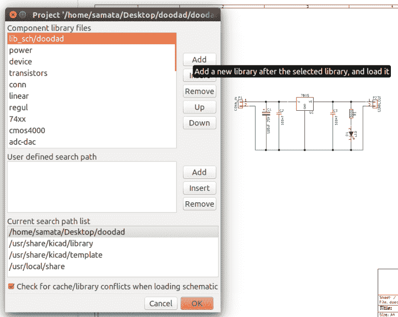
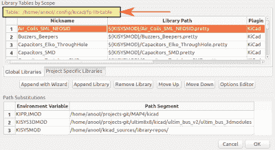
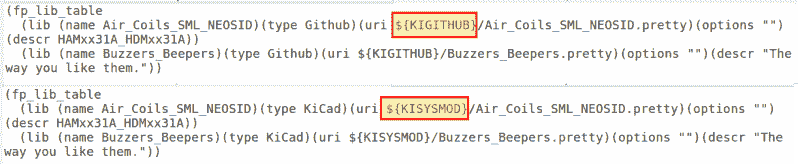
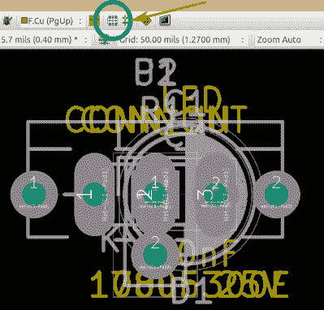
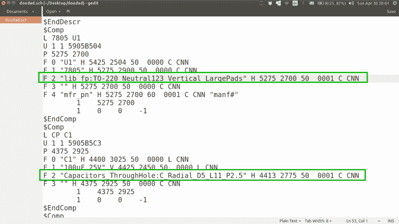

# KiCAD 最佳实践:图书馆管理

> 原文：<https://hackaday.com/2017/05/18/kicad-best-practises-library-management/>

我们从大多数 KiCAD 新用户那里听到的一个常见抱怨与原理图和封装外形库有关。诀窍是在项目中只使用一个原理图符号和示意图库。这样，对默认原理图库的任何更改都不会影响您的项目，并且可以轻松地与其他人共享您的项目，而不会破坏它。我花了一些时间来完善这项技术，并在本文中向您介绍这个过程。

我们在过去已经多次介绍过 KiCAD(以及其他)电子设计自动化(EDA)工具。[Brian Benchoff]从头到尾使用他能找到的各种 EDA 软件包做了一整个系列的项目。没有一个 CAD 或 EDA 软件是完美的，用户必须学会掌握他们决定使用的程序的特性。这通常会导致在最初阶段，当一个人不知道“我到底是怎么做到的”时，会有很多咒骂和拉扯头发，尤其是来自习惯于以不同方式做事的新皈依者。

请继续阅读，了解使用 KiCAD 及其库管理的最佳实践。

### 项目管理

KiCAD 将原理图符号和元件示意图保存在不同的库中，您需要使用几种不同的方法之一将符号链接到示意图。这让很多人望而却步，但是一旦你习惯了，它就能很好地工作。

在计算机出现之前的日子里，大多数设计师会先快速画出一个原理图，然后创建一个“材料清单”，在那里他们充实要使用的组件的规格。这将有助于他们选择元件尺寸，从而进入电路板布局阶段。KiCAD 试图遵循这一工作流程。这是一个典型的文件夹结构，我用它来组织一个 KiCAD 项目，并在多年的软件工作中完善了这一技术。

```
doodad
 ↳3d_models     // .STEP and .WRL model files for all footprints
 ↳datasheets    // data sheets for components used
 ↳gerber        // final production files
 ↳images        // SVG images and 3D board renders
 ↳lib_sch       // schematic symbols
 ↳lib_fp.pretty // footprints
 ↳pdf           // schematics, board layouts, dimension drawings
```

### 管理原理图库

当您使用 KiCAD 自带的内置库中的符号绘制原理图时，EESCHEMA 会创建一个本地备份库— **doodad-cache.lib** 。一旦你完成了原理图的绘制，将这个文件复制到 **↳lib_sch 文件夹**并重命名为 **doodad.lib** 。

接下来，进入 **↳PREFERENCES↳Component 库**，选择“当前搜索路径列表”指向你的本地项目文件夹~/doodad/，点击弹出窗口顶部的添加按钮(不是弹出窗口中间的添加按钮)，最后选择 doodad.lib，它会被添加到列表中当前所选库的下面。

KiCAD 按顺序读取这些库，因此您需要选择 doodad.lib，并使用 UP 按钮将其置于列表的顶部。如果在不同的库中有相同名称的符号，那么它的第一个实例被使用。此时，您可以删除所有其他列出的库，或者忽略它们，只要您确保您使用的每个符号都被添加到 doodad.lib 中，并且只从该文件中调用 get。

您的项目现在仅使用一个原理图符号库— ~/doodad/lib_sch/doodad.lib —对默认原理图符号库的任何更改都不会影响您的项目。此外，使用上面定义的文件夹结构，很容易在 GitHub 上共享您的项目。当您的项目被克隆或下载时，这可以确保没有库冲突。

当 KiCAD 在 EESCHEMA 和原理图库中实现 s-expression 格式(已经在 PCBnew 中实现)时，上述所有内容都可能发生变化，因此我们将在那时重新讨论这个问题。

### 为符号指定轮廓线

有多种方法可以做到这一点，但本质上，您可以选择一个原理图符号，并从一个默认库中为其指定一个示意图。自从 KiCAD 将 footprint 库转移到 GitHub 之后，这已经成为许多人心痛的原因。首先，所有的库都是在线托管的，KiCAD 每次启动时都需要查找它们。对于那些不改变这种行为的人来说，如果你没有连接到网络，它会减慢程序的启动速度。在线库是一个好主意，因为足迹保持更新，但是如果设计中使用的足迹之一发生变化，它肯定会破坏您的设计。这不会立即显示出来，因为您必须显式地重新读取网表，并让 KiCAD 替换更改的封装。但是对于克隆你的设计的其他人来说，他们的 KiCAD 版本加载了更新的足迹，这将打破一些东西。

解决方案是将所有的 KiCAD 库克隆到您计算机上的一个本地位置，然后将 KiCAD 指向这个位置。但是当你这样做的时候，它否定了访问更新库的优势。我不认为有一个理想的方法可以让它工作，但这里有一些适合我的方法。

我将 GitHub 库克隆到我的本地计算机上，并通过定期提取来更新它们。这有助于我使用现有的足迹或修改它们以满足我的要求。但是我的项目没有直接使用这些克隆库。相反，我生成一个特定于项目的 footprint 库，其中包含项目中使用的所有 footprint(~/doodad/lib _ FP . pretty)。这再次确保了当项目被克隆时，所有正确的足迹都已经可用，而不依赖于外部源库。

### 如何使 KiCAD 足迹成为本地的和项目独特的

首先(从 GitHub)将 [KiCAD 足迹库](https://github.com/KiCad)克隆到您的计算机上。最好使用 PCBnew 中的“**封装库向导**”来完成。在我的例子中，我已经将它克隆到了**~/kicad _ sources/library-repos**。在 KiCAD 的 PCBnew 中，选择 **↳PREFERENCES ↳CONFIGURE 路径**并编辑 **KISYSMOD** 以指向本地封装库路径(~/kicad_sources/library-repos)。



path to fp-lib-table

在某些情况下，可能需要额外的步骤才能使事情正常进行。选择 **↳PREFERENCES ↳FOOTPRINT 图书馆管理器**并确定 PCBnew 使用的“ **fp-lib-table** 文件的位置。这是一个文本文件，告诉 PCBnew 在哪里寻找封装库——在 Github 上，本地路径等。在文本编辑器中打开这个文件，并检查它是否使用 KISYSMOD 作为路径。如果没有，搜索并替换当前路径的所有实例，并用 KISYSMOD 替换它。



现在，您可以编辑每个原理图符号，并向其添加封装外形——从 EESCHEMA 中或使用独立的 Cvpcb 模块。分配完所有封装尺寸后，确保在进入 PCBnew 之前重新生成网表。

[](https://hackaday.com/wp-content/uploads/2017/04/pcbnew_01.png)

MODE : footprint

现在，您可以启动 PCBnew 并读取网表，它将所有的足迹堆积在画布上。选择**模式:足迹**图标，然后右键点击任意一个足迹，选择 **↳Global 展开，放置↳Spread 所有足迹**。

这将展开所有足迹，从而更容易选择和移动它们。一旦您完成了您的电路板布局，并且您的所有封装外形都被锁定，选择**文件↳Archive Footprints↳Create 库和归档封装外形**并提供路径/名称到。项目中的 pretty 文件夹(~/doodad/lib_fp.pretty)。这会将布局中使用的所有示意图复制到目标文件夹中。

然后，**我的 computer↳上的 Preferences↳Footprint 图书馆 wizard↳files**(导航到~/doodad/lib_fp.pretty)并确保在点击完成之前选择“仅到当前项目”。至此，您已经使用了来自 KiCAD 全局库的封装外形并将其应用于原理图符号，制作了一个网表，将网表导入到 PCBnew 中，放置了封装外形并对电路板进行了布线，制作了所有封装外形的存档，并配置了 PCBnew 以使用该存档库。



Replace Library paths

接下来，返回 EESCHEMA，编辑每个符号的 footprint 关联，指向新的 lib_fp.pretty 文件夹，而不是您计算机上的本地 GitHub 存储库。最简单的方法是打开。SCH 文件并进行搜索/替换。在本例中，我们将用本地项目库文件夹“lib_fp”替换“电容器 _ 通孔”或“电阻器 _ 通孔”或“led”等实例

最后一次打开原理图，保存一个新的网表，打开 PCBnew，读取该网表，但这次选择**交换足迹**下的**更改**选项。您的电路板布局现在将使用保存在 lib_fp.pretty 文件夹中的封装外形，对 KiCAD 全局库的更改不会影响布局。

### 包裹

这可能在开始时听起来有点复杂，但随着时间的推移，它会变得很容易，当你变得更好时，你可以消除一些步骤。例如，我已经有了自己的库来存放我使用的大部分常用部件，并在开始一个新项目之前复制这些足迹。随着时间的推移，随着您越来越熟练，您将开始从元件数据表构建自己的原理图符号和示意图，而不是使用外部版本。就像我开始说的，它并不完美，对我来说这个过程非常好。如果您对如何改进有任何意见或建议，请留言告诉我们。