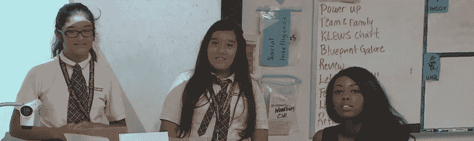

# 孩子和黑客:电磁蛋

> 原文：<https://hackaday.com/2016/01/20/kids-and-hacking-electromagnetic-eggs/>

我最喜欢做的事情之一是拜访对工程或科学感兴趣的学生。然而，实际上，在一堂可能持续 30 到 90 分钟的课上，你能做的事情是有限的。最近，我有机会与我以前的一位同事、一位教师和教学频道合作，创建了一个持续两周的课堂使用的工程单元。

这个新单元集中在一个鸡蛋下降。这不是一个原创的想法，但我们确实增加了一个有趣的转折:该项目开发了一个“太空舱”来保护鸡蛋，但也有一个电磁下降系统来测试胶囊。下落系统允许从固定高度干净地释放卵囊进行一致的测试。因此，除了经典的落蛋胶囊之外，孩子们还必须建造一个电磁铁、一个安全开关电路和一个测试结构。更好的是，孩子们的团队可以做不同的部分，并将它们集成到最终产品中，密切模仿真实工程项目的工作方式。

这种复杂性有几个原因。首先，给你十节课，你可以比一天做更多的事情。第二，我总是认为如果你能找到能吸引许多不同兴趣的练习是很好的。过去，出于这个原因，我使用过机器人和 3D 打印机。有些学生对电子学感兴趣，有些对机械学感兴趣，还有一些对编程感兴趣。一些孩子会从事 3D 建模(机器人模拟或 3D 物体)。关键是每个人都有适合自己的东西。

### 拖放控件本身可以是一个类

这种多样性不仅有助于吸引学生，还提供了许多教学机会。例如，你可以很容易地使用这个系统作为讨论不同类型的力和能量(电、电磁、重力)的跳板。开关电路可以是简单的 SPST 开关，也可以是带有安全开关甚至指示灯的复杂系统。不需要很复杂。我的原型使用了价值几美元的家得宝开关(见左)。

事实上，尽管你可以随心所欲地制造复杂(昂贵)的东西，但它根本不需要花费太多。精打细算的学校可以使用拉链包作为胶囊，锡罐盖作为磁性附件，自制电磁铁，放弃开关，直接连接电池。或者，你可以让你的 Arduino 类创建一个复杂的火力控制系统。

要改变练习的重点，您可以调整项目的各个部分。例如，您可以将不同的部分分配给不同的类或组，并让一个组集成最终产品。教师可以提供完整的部分来弱化这些部分。例如，现成的测试台或电磁铁可以使项目更短或更容易。

### 了解设计决策

正如你在视频中看到的，托尼·卡斯蒂利亚和我和孩子们在一起很开心。当他们设计系统的部件时，我喜欢讨论设计权衡:成本、重量、功耗和其他因素的平衡，以决定什么设计选择是“最好的”。他们总能用创造性的解决方案给我带来惊喜。我们见过坐垫，降落伞，甚至安全带。作为设计师，我们理所当然地认为“最好”不一定意味着没有上下文。哪种卡车最好？如果你运输的是汽油而不是鸡，答案就不同了。像这样的练习有助于未来初出茅庐的工程师获得同样的洞察力。

它还可以提高你的沟通技巧。我们试图让孩子们做的一件事是在他们建造东西之前画出图画。我以前的制图老师(Stewart 先生)总是强调，你必须在图纸上有足够的尺寸，有人才能建造这个东西。如果你有太多的维度，他可能会标出几个点。但是，如果你没有足够的钱，你就会得到 f。然而，令我们惊讶的是，当一些孩子画出他们的盒子，用尺子在纸上测量线条，并尽职尽责地在纸上写下线条的尺寸时！这让我们很惊讶，但这是不应该的。这是对我们指示的完全可以理解的解释，除非你有我们都有的背景。

教学频道在向学校提供像这样的课程材料方面做得非常好。如果你浏览他们的[视频部分](https://www.teachingchannel.org/videos?default=1)，你会看到他们有很多类似的模块。然而，真正的无名英雄，是像命运·伍德伯里这样的老师。为了确保这些未来的工程师获得实践经验，他们投入了大量额外的时间，这无异于自取其辱。

去年，我发布了一个非常简短的“蛋蛋下降”版本，那是我和孩子们在一起一个小时的时候做的。虽然没有那么复杂，但他们仍然玩得很开心，我也可以继续我的设计贸易谈判。在这种情况下，他们对材料的选择决定了重量和成本，但仍然必须有效。无论是哪一个项目，你甚至可以把 A 放在 STEM 中，让学生装饰鸡蛋、胶囊和控制器盒。

下面的视频是这个单元的概述。如果你想要实际的材料和笔记，你必须访问[TeachingChannel.org 网站](https://www.teachingchannel.org/videos/engineering-model-blueprint-challenge-boeing)下载支持材料。

我鼓励任何对技术有足够兴趣的人阅读 Hackaday，加入像教学频道这样的组织，或者仅仅是你当地的学校和老师。你的成本很小，回报却可能很高。引用视频中的话，一名学生告诉另一个班的老师“这是我一生中最美好的一天！我要当工程师了！”你不能给它定价。