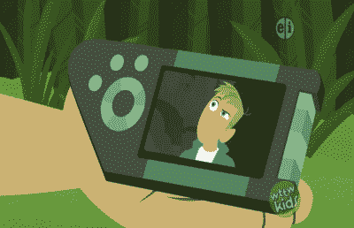
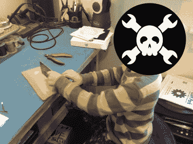
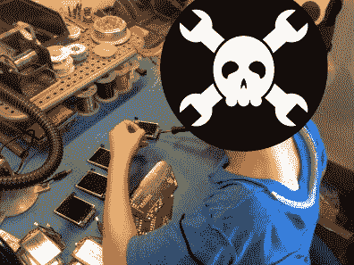
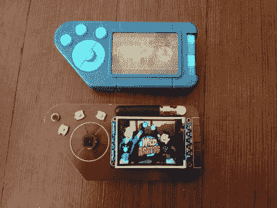
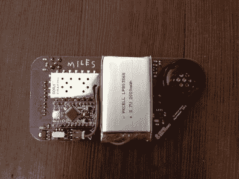

# 孩子们用卡通技术构建探索工程

> 原文：<https://hackaday.com/2015/10/14/kids-explore-engineering-with-cartoon-tech-build/>

“去托尔图加！”我丈夫和我听到了后院的公告。我们的两个男孩，本(7 岁)和迈尔斯(3 岁)，已经愉快地迷上了自然界中最酷的兄弟——克拉特兄弟。从这两个充满活力的热爱动物的兄弟被我们的孩子发现的那一刻起，他们就成了我们的超级粉丝。我们的房子被运到了索诺拉沙漠，在那里我们救了一只吉拉怪物，然后去了澳大利亚内陆，去了解这个多刺的魔鬼。我们甚至去南美洲和蜘蛛猴一起荡秋千，然后回到美国，利用走鹃的速度——因为我们毕竟是跑者家族！

Creaturepod【来源:[WildKratts Wiki](http://wildkratts.wikia.com/wiki/Creature_Pod)】

我们的男孩们已经做了几个月的兄弟了，而且没有任何停止的迹象。夏末，我决定奖励孩子们一个 Creaturepod，一个塑料玩具，看起来像 PBS 儿童节目[Wild Kratts 节目](http://pbskids.org/wildkratts/)中使用的同名虚构对讲机。他们喜欢它，但很快发现它自己什么都不做。他们都有丰富的想象力，喜欢将他们的大部分游戏带入生活，但玩具并不适合他们。克里斯和马丁·克莱特在现实生活中是兄弟，本和迈尔斯·格兰德在现实生活中是兄弟，本认为拥有“现实生活”的生物舱是正确的。他可以用真正的对讲机和他的朋友交流，进行野生 Kratts 冒险。这种天生的兴趣为男孩们提供了一个将学习、设计和建造变成乐趣的机会。这是一种令人惊叹的方式，通过有一个想法，制定一个计划，并聚集每个人完成项目所需的技能，你可以改变你周围的世界。

### 结果是

在这种情况下，一个父亲能做些什么呢？对我们来说，很多。本和迈尔斯的爸爸是乔·格兰德，一名现实生活中的计算机工程师，也是黑客和创客社区的常客。乔和男孩们一起建造了机器人、3D 打印机和看起来很疯狂的电路板。两个孩子都有“元件盒”，贴满贴纸的鞋盒，他们把所有喜欢的电子零件藏在里面，当焊接时间到来时，他们会用烙铁争夺第一次机会。他们倾向于与电子产品打交道，但工程探索的道路以前所未有的方式向家庭开放。诀窍是让你和你的孩子一起参与到这个过程中来。

乔抓住机会帮助这些男孩，我抓住机会了解并记录这个过程。开始时只是一厢情愿的想法，后来变成了一个全家人都参与的项目。作为一名健身专家和华德福的家长，我觉得科技是有时间和地点的。虽然我宁愿玩像捉人游戏这样的物理游戏，或者写关于魔法冒险的故事，但我的孩子们看到电子产品时眼中的火花是不可否认的。我的工作就是帮助培养这种激情——即使我缺乏技术专长。

### 它始于一个计划

乔和本坐在厨房的桌子旁，头脑风暴他们版本的 Creaturepod 实际上会做什么。本对它的功能和外观有一个设想。他画了一些画，乔做了笔记。有些人可能知道，乔是一个电子产品的极简主义者。他喜欢简单、便宜、有用的东西，不要加入超过实际需要的东西。Creaturepod 也不会有什么不同。本和乔最终缩小了范围:这将是一个对讲机系统，你可以从三个朋友中选择一个来交谈。显示屏将显示所选朋友的照片。而且，它必须看起来像虚构的生物。

从那里，工程开始了。Joe 创建了一个高级框图，孩子们帮助他浏览 Digi-Key 和 Adafruit 来选择一些主要元件。Ben 选择了橙色，Miles 选择了蓝色作为频道/朋友选择按钮。他们希望中央按钮(按键通话)又大又圆。组件被订购，三个建造者耐心地等待好东西的到来。男孩们还摆好姿势，当他们的频道被选中时，他们的照片最终会显示在 LCD 上。

接下来的繁重任务是制造原型。乔之前对本的焊接技术惊叹不已，声称“他比大多数成年工程师焊接得都好。”Ben 将接头引脚焊接到 Arduino 模块和分线板(LCD 和收音机)，而 Joe 将它们插入 Parallax Professional 开发板(一种功能丰富的原型板)并构建电路。第一个目标是让 LCD 显示本和迈尔斯朋友的照片。使用 Adafruit 预先存在的图形库并没有花费很长时间，但是他们有一些连线问题需要解决。在他们调试的时候，到了本的就寝时间。他想去睡觉，但是当他知道乔正在楼下试着安装显示器时，他太兴奋了。他先下来“找玩具”，然后下来“拿水”我们让步了，让他和他爸爸一起熬夜，直到液晶显示器启动。

第二天，乔完成了原型的编码。与使用标准异步串行和一系列“AT”命令配置的 [DRA818U](http://www.dorji.com/docs/data/DRA818U.pdf) (PDF)无线电收发器模块(基本上是一种无头 ham 无线电)进行接口，并创建基本操作行为，即读取按钮和设置 TX/RX 频率，并将正确的图像加载到 LCD 上，这是一项相对简单的任务。按照 Ben 的说法，编码是“最无聊的部分”

### (无聊)代码完整；测试时间到了

如果你觉得手机广告很难听(“你现在能听到我说话吗？”)，试着听一个 7 岁的孩子和一个兴奋的爸爸试图通过双向无线电在你的街区街道上来回交流。一如既往，挑战极限——看看这个信号能走多远。静态噪音，然后“你能听到我吗？这是爸爸。进来一号生物舱。你懂我的意思吗？”一遍又一遍。DRA818U 收发器支持 0.5W(低)和 1W(高)发射功率。在低功率下，信号几乎覆盖了整个社区，比孩子们在他们的房子之间通话所需的距离要远得多。

Joe 和 Ben 注意到麦克风在传输过程中偶尔会中断，因此他们添加了一个小型晶体管麦克风前置放大器，以使收音机的输入电平稍微高一点。这有助于改善语音质量，但并没有阻止信号的中断。经过进一步研究，Joe 发现当收发器模块进行传输时，会有大量噪声进入电源线和地线。他不确定这是由劣质天线引起的，还是因为他在试验板上制作了无线/射频系统的原型，这种系统通常不能处理高频。当他在传输过程中触摸天线时，麦克风就会停止工作。显然，这是一个射频问题，他希望通过一个设计合理的 PCB 来解决这个问题。我很高兴地告诉大家，的确如此。

### 虚构生物

一旦测试成功，就该进行电路板布局了。本测量了木板的尺寸，并画出了他想要丝网印刷在上面的艺术品。乔花了几个晚上坐在床上，用他的笔记本电脑进行设计，将其改进为看起来就像虚构的玩具 Creaturepod 一样，并添加了一些艺术功能。他不想让任何焊盘或走线在电路板的顶部可见，所以他想出了将它们隐藏在其他元件下面的方法。这将使组装更加困难，因为某些组件必须在其他组件之前安装，但对于一次性项目来说，这不是什么大事。正是在这个时候，我们迎来了一个重要的认识。本说:“爸爸，我没有意识到这需要多少工作！”是真的。工科很难！

他们在星期二把冲浪板运到了奥什公园。因为 Laen 和他的团队太棒了，他们将订单升级为超级快捷服务，电路板于周五发货。住在离莱恩不远的路上，他们不用等很久就能拿到包裹。星期六，乔和男孩们兴奋得头昏眼花，每次他们以为听到了邮差的声音，就一直往外看。当董事会终于抵达，他们冲进乔的办公室，撕开信封。这一天剩下的时间都花在了组装上:Ben 和 Miles 检查了 PCB 并打磨掉了面板化引起的边缘上的小“尖头”，Ben 焊接了通孔部分，Joe 焊接了其余部分，他们将固件编程到单元上(使用 Joe 扔在一起的 pogo 引脚适配器)，并做了一些测试。一切都很好，除了扬声器输出的增益太高。一个快速的电阻变化把事情带到了一个更容易管理的水平。

  Sanding Board Edges  Soldering LCD Screens

### 当你自己制作玩具时，它们更有意义

经历了这一切，终于到了玩的时候了！在我们完成 Creaturepods 的几个星期后，他们仍然在几乎每个游戏日进行巡回演出。它们经受住了我们精力充沛的孩子和他们的邻居朋友的大部分使用(除了一个液晶显示器没有经受住跌落，导致玻璃芯片破裂，并要求 Joe 不情愿地更换 10 针通孔模块)。但往好的方面想，他确切地知道从哪里获得替换零件，不像商店里买的电子产品。

    

组建一个家庭是我们永远不会忘记的事情。我们一起兴奋、沮丧、无聊，然后又兴奋起来。我们的孩子体验了将一个想法从概念变为现实的激动，并了解了这样做所需要的关注和努力。没有任何事情强加给他们，他们只是在他们能处理的时候做他们能处理的任务。即使没有像我们这样的父亲来帮助电子设计，世界各地都有黑客空间和创客社区，充满了愿意探索、建设、分享和教授的创造性、智慧的头脑。使用[开源设计文件](http://www.grandideastudio.com/portfolio/creaturepod/)构建你自己的 Creaturepod 副本，或者基于你喜欢的技术开发你自己的项目。这是激励我们未来的黑客和建设者的最好机会。就像本和迈尔斯在他们的下一次创世之旅中可能会说的那样:“激活工程师能力！”

* * *

Keely Grand ( [@keelygrand](https://twitter.com/KeelyGrand) )是一位母亲、运动员、私人教练和作家，她致力于激励人们过上健康、有益和快乐的生活。她在下午担任越野和田径教练，帮助高中生体验跑步带来的所有好处。当月亮很高，星星闪闪发光时，她在键盘上敲敲打打，为她在全国各地的朋友和客户写博客帖子或书籍摘要。自 2002 年以来，她倾听、编辑并容忍她的“焊接苏丹”丈夫乔·格兰德。