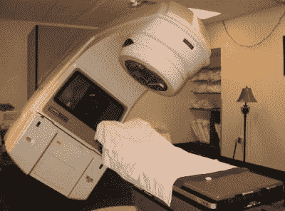

# 被机器杀死:Therac-25

> 原文：<https://hackaday.com/2015/10/26/killed-by-a-machine-the-therac-25/>

Therac-25 不是任何人都乐于见到的设备。那是一台放射治疗机。通俗地说，这是一种“癌症退烧药”；以人类为目标的线性加速器。使用 X 射线或电子束，放射治疗机器杀死癌组织，甚至深入体内。这些房间大小的医疗设备总是会对肿瘤周围的健康组织造成一些附带损害。与化疗一样，我们希望净效果是治愈病人多于伤害他们。在 1986 年和 1987 年，Therac-25 对六名不幸的病人做了不可思议的事情:它让他们暴露在大剂量的辐射下，导致四人死亡，两人终身受伤。在调查过程中，确定问题的根本原因是双重的。首先，控制机器的软件含有被证明是致命的错误。其次，为了安全起见，机器的设计仅依赖于控制计算机。没有硬件联锁或监控电路来确保软件错误不会导致灾难性的故障。

Therac-25 事件已经成为历史上最著名的杀手软件错误之一。几所大学用这个案例作为警示，告诉人们什么会出错，调查会如何被引入歧途。这在很大程度上要归功于[Nancy Leveson]的工作，她是一名软件安全专家，对这些事件及其导致的诉讼进行了详尽的研究。许多关于 Therac 的公开信息(包括这篇文章)都是基于她的研究和 1993 年与[Clark Turner]发表的题为“Therac-25 事故调查”的论文。[南希]在第二篇论文中发表了更新的信息[,这也包括在她的书中。](http://sunnyday.mit.edu/papers/therac.pdf)

### 历史与发展

Therac-25 由加拿大原子能有限公司(AECL)制造。这是该公司的第三台放射治疗机器，之前是 Therac-6 和 Therac-20。AECL 与法国 CGR 公司合作建造了 Therac-6 和 20。当设计 Therac-25 的时候，合作关系已经结束。然而，两家公司都保留了早期机器的设计和源代码。Therac-20 代码库是从 Therac-6 发展而来的。所有三台机器都使用 PDP-11 计算机。然而，Therac-6 和 20 并不需要那台电脑。两者都被设计为独立运行的设备。在手动模式下，放射治疗技师将物理地设置机器的各个部分，包括将三个设备中的一个放置在电子束路径上的转盘。在电子模式下，扫描磁铁将被用来分散电子束以覆盖更大的区域。在 X 射线模式中，目标被放置在电子束中，电子撞击目标以产生指向患者的 X 射线光子。最后，可以在光束中放置一面镜子。当镜子还在的时候，电子束永远不会打开。镜子将反射光线，这将有助于放射治疗技师精确地瞄准机器。

在 Therac-6 和 20 上，硬件联锁防止操作员做一些危险的事情，比如在没有 x 射线靶的情况下选择高功率电子束。试图在无效模式下激活加速器会烧断保险丝，导致一切停止。为了方便起见，添加了 PDP-11 和相关硬件。技术人员可以在 VT-100 终端上输入处方，计算机将使用伺服系统来定位转盘和其他设备。医院喜欢计算机的设置速度比人快。更少的设置时间意味着在价值数百万美元的机器上每天有更多的病人。

到了设计 Therac-25 的时候，AECL 决定只用计算机控制。他们不仅取消了许多手动控制，还取消了硬件联锁。计算机会跟踪机器的设置，如果检测到危险情况，就会关闭机器。

### 事故

A safer modern radiotherapy machine

Therac-25 于 1983 年开始服役。几年来，成千上万的病人都没有出现问题。1985 年 6 月 3 日，一名妇女正在接受乳腺癌治疗。医生给她开了 200 拉德的剂量，剂量为 10 兆电子伏的电子束。当机器启动时，病人感到非常热。当时还不知道，但她被 10，000 到 20，000 拉德的辐射灼伤了。患者活了下来，但由于辐射，失去了左胸和左臂。

7 月 26 日，第二名患者在加拿大安大略省汉密尔顿市的安大略癌症基金会被烧伤。该患者于当年 11 月死亡。验尸结果表明死亡是由于一种特别严重的子宫颈癌。然而，如果她还活着，她将需要一个完整的髋关节置换来纠正 Therac-25 造成的损伤。

1985 年 12 月，第三名妇女被安装在华盛顿州亚基马的 Therac-25 烧伤。她在臀部形成了一个条纹状烧伤图案，与 Therac-25 上的光束阻挡带非常匹配。这位病人活了下来，但最终需要植皮来愈合辐射烧伤造成的伤口。

1986 年 3 月 21 日，德克萨斯州泰勒市的一名患者计划接受第 9 次 Therac-25 治疗。他背上的一个小肿瘤被注射了 180 拉德。当机器打开时，他感到热和疼痛，这是意想不到的，因为放射治疗通常是一个无痛的过程。Therac-25 本身也开始以一种不寻常的方式嗡嗡作响。当患者被第二次辐射脉冲击中时，他开始离开治疗台。这一次他真的站了起来，开始敲门寻求帮助。他服用了大量的过量药物。他因放射病住院，5 个月后去世。

1986 年 4 月 11 日，德克萨斯州泰勒市发生了第二起事故。这一次，病人正在接受耳部皮肤癌的治疗。在 3 月 21 日的事故中，操作机器的是同一个操作员。当治疗开始时，病人看到一道亮光，听到煎鸡蛋的声音。他说感觉自己的脸着火了。三周后，患者因大脑右颞叶和脑干放射烧伤而死亡。

最后一次用药过量发生在很久以后，这次是 1987 年 1 月在亚基马谷医院。这名病人后来因伤势过重死亡。

### 调查

每次事故发生后，当地医院的物理学家会给 AECL 和他们各自国家的医疗管理局打电话。起初，AECL 否认 Therac-25 能够释放过量的辐射。这台机器有如此多的安全措施，以至于它经常抛出错误代码，暂停治疗，辐射量低于规定量。安大略事件之后，很明显出了问题。这种过量的唯一可能是转盘的位置不对。如果扫描磁铁或 X 射线目标不在适当的位置，患者将被类似激光的辐射束击中。

AECL 小心翼翼地进行了一次又一次的测试，却没能重现错误。他们能想到的唯一可能的原因是决定转盘位置的三个微动开关暂时失灵。微型开关电路被重新设计，使得任何一个微型开关的故障都可以被计算机检测到。这种修改很快就被添加进来，并在接下来的事故中得以实施。

如果这个故事有一个英雄，那就是[Fritz Hager]，德克萨斯州泰勒市东德克萨斯癌症中心的物理学家。在他的工厂发生第二起事件后，他决心要把问题搞清楚。在这两种情况下，Therac-25 都显示“故障 54”信息。手册中没有提到这一信息。AECL 解释说，故障 54 意味着 Therac-25 的计算机无法确定辐射量是否不足或过量。

同一个放射治疗技师参与了两起事故，因此[Fritz]将她带回控制室，试图重现问题。这两个“锁上门”的美国宇航局风格，工作到晚上，并通过周末试图重现问题。在技术员操作机器的情况下，两人能够确定问题所在。用于输入 Therac-25 处方的 VT-100 控制台允许通过光标上下键移动光标。如果用户选择 X 射线模式，机器将开始为高功率 X 射线设置机器。这个过程大概用了 8 秒钟。如果用户在这 8 秒内切换到电子模式，转盘将不会切换到正确的位置，使转盘处于未知状态。

值得注意的是，到目前为止，所有的测试都是缓慢而谨慎地进行的，正如人们所预料的那样。由于这种缺陷的性质，这种测试永远不会确定罪魁祸首。在发现错误之前，需要一个熟悉这台机器的人——他每天都与数据输入系统打交道。[弗里茨]实践，并最终能够产生故障-54 自己的意愿。即使有了这个确凿的证据，在 AECL 能够在他们的实验室机器上获得同样的行为之前，也需要几次电话和传真的详细说明。芝加哥一家癌症中心的物理学家弗兰克·博格证明了 Therac-20 的软件中也存在这个漏洞。通过在他的旧机器上执行[Fritz 的]程序，他收到了类似的错误，并且机器中的保险丝会烧断。保险丝是硬件联锁的一部分，在 Therac-25 中已被移除。

随着调查和诉讼的进展，Therac-25 的软件受到了审查。Therac-25 的 PDP-11 完全是用汇编语言编程的。不仅是应用程序，还有底层的执行程序，它们取代了操作系统。计算机的任务是处理机器的实时控制，包括正常操作和安全系统。今天，这类工作可以由一两个微控制器处理，由一台 PC 运行 GUI 前端。

AECL 从未公开发布源代码，但包括[南希·莱韦森]在内的几位专家确实获得了调查权限。他们的发现令人震惊。该软件似乎是由一个几乎没有实时系统编码经验的程序员编写的。很少有评论，也没有证据表明进行了任何时间分析。据 AECL 说，一个程序员根据 Therac-6 和 20 代码编写了这个软件。但是，这个程序员已经不在公司工作了，找不到了。

#### 余波

FDA 宣布 Therac-25“有缺陷”。AECL 发布了软件补丁和硬件更新，最终使该机器恢复使用。这些诉讼在庭外解决了。直到 1987 年 1 月 17 日，华盛顿亚基马的另一名病人服药过量，问题似乎才得到解决。这个问题是一个新问题:计数器溢出。如果操作员在计数器溢出的那一刻发出命令，机器将跳过设置一些光束附件，包括移动不锈钢瞄准镜。结果又是一次未扫描的光束和过量。该患者 3 个月后死亡。

值得注意的是，虽然软件是 Therac-25 的关键，但它不是根本原因。整个系统的设计才是真正的问题。安全关键负载被放置在一个计算机系统上，而该系统并不是为控制它们而设计的。未执行计时分析。单元测试从未发生过。未创建硬件和软件的故障树。这些任务不仅是软件工程师的责任，也是项目中系统工程师的责任。Therac-25 早已不复存在，但它的遗产将永存。这是一个分水岭事件，它表明当生命关键系统的软件没有被正确设计和充分测试时，事情会变得多么糟糕。