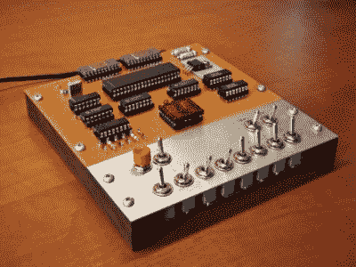
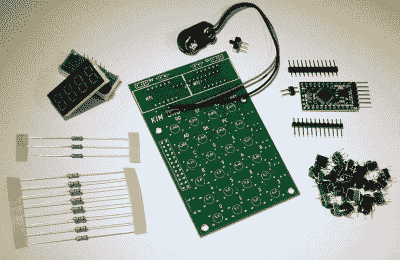

# KIM-1 到 COSMAC Elf 的转换——算是吧

> 原文：<https://hackaday.com/2017/07/25/kim-1-to-cosmac-elf-conversion-sort-of/>

在 20 世纪 70 年代中期，如果你有自己的电脑，你可能会自己制造。如果你有很多钱和相当的制造技能，你可以花 395 美元制造一台 Altair 8800 比花 650 美元制造它要好。然而，更便宜的替代品也不远了。

1976 年，大众电子公司发表了一项名为 COSMAC Elf 的计算机计划，你可以用不到 100 美元就能制造出这种计算机，如果你有一个好的垃圾箱，价格会更低。该设计非常简单，您可以在一块 perf 板上或使用绕线来构建它。我们展示了整个流行电子产品收藏的在线档案，但是如果你想直接跳到文章的开头，可以点击这个 PDF 文档的第 33 页。COSMAC Elf 是一个围绕 40 针 RCA 1802 处理器构建的小型机器，对许多人来说，这是他们拥有的第一台计算机。我在一场风暴中失去了我最初的 1802 电脑，而我最近重建的电脑又在另一场完全不同的风暴中丢失了。但有一种方法可以让你不必从头开始就能重拾那些辉煌的日子。我要重新规划另一个复古计算娱乐；金正日 1 号。

我承认，给一个真正的 KIM-1 重新布线以获得一个 1802 CPU 将是困难和不必要的，这不是本文所要讨论的。然而，我确实用 Arduino mini pro 拥有了一台经典电脑的[KIM UNO](https://hackaday.com/2014/11/07/the-kim-1-computer-minified/)——【奥斯卡】respin。看着键盘，我想到 Arduino 可以像模拟 6502 一样轻松地模拟 1802。见鬼，只差两位数，对吧？

结果相当令人满意。一个“真正的”精灵有 8 个拨动开关，但也有几个有小键盘的变体，所以离它不远了。大多数 Elf 电脑有 256 字节的内存(没有升级)，但 1802 UNO(我这么称呼它)有 1K。还有一系列其他功能，包括一个 ROM 和一个监视器，用于加载和调试程序，不需要仿真 1802 中的任何空间。

## 改变…的用途

 金宇诺有 24 个开关。当然，十六进制数字有 16 个。上面两行模仿了最初的 KIM-1 的功能。一个真正的 Elf 有办法输入一个字节(通常 8 个拨动开关)，一个负载开关，一个运行开关，一个存储器保护开关，和一个连接到 CPU 管脚的按钮。这意味着硬件有足够多的开关。

在显示方面，一个普通的 Elf 有一个单字节的十六进制显示，尽管一些克隆体有更多。还有 Q LED，程序可以点亮或熄灭。KIM UNO 硬件有许多 7 段显示器，因此可以像 Elf 克隆一样使用这些数字。然而，除了 Arduino 的内置 LED 之外，没有 LED，这在操作中通常是不可见的。但是，数字显示器有小数点，它们连接到 Arduino。因此，如果你不介意使用这些，你也有足够的 led。

硬件是开源的，易于复制。[Oscar]有时也有套件，而且非常便宜(大约 20 美元)。

KIM UNO 软件是开源的，所以我从那里开始。我首先从主文件中去掉了除驱动显示器和键盘的部分之外的所有代码，然后构建了支持 1802 仿真所需的一切。你可以在[我的 1802UNO GitHub 库](https://github.com/wd5gnr/1802UNO)里找到所有代码。

## 在 1802 年

1802 指令集非常有规律，非常简单。大多数指令使用前 4 位作为操作码，后 4 位选择 16 个 16 位寄存器中的一个。因此，0x12 递增寄存器 2，0x15 递增寄存器 5。不遵循这种模式的操作码屈指可数。还有一个名为“D”的 8 位累加器(不要与寄存器 D 混淆)。

1802 体系结构的一个独特特征是程序计数器。没有了。更准确地说，有 16 个。任何寄存器都可以是程序计数器，子程序调用可以像切换程序计数器一样简单。不幸的是，这不是很重入(或者对递归很好)。如果你想要一个合适的子程序调用，你必须自己编码。RCA 提供了“标准的调用和返回技术”,但不幸的是，它会破坏累加器。

由于指令如此之少，模拟器变成了几个 switch 语句和一些非常简单的代码。虽然它是与 KIM UNO 硬件一起运行的，但像 KIM UNO 一样，你应该能够通过串行端口将它与任何 Arduino 一起使用。它没有拥有真正的硬件有趣，但是更简单。

## 虚构的

模拟器相当准确，除了它不模拟中断(因为没有中断源)。然而，它没有忠实地再现使用 DMA 的 1802 的加载模式。相反，加载模式只是将数据输入内存的完全自定义的代码。它不模拟在加载模式下使用 DMA 在真实 1802 中进行的周期和寄存器操作。

除了用替代加载模式加载程序之外，还可以通过串行端口将 ram 在 EEPROM 或 PC 之间来回移动。

## 串行和按钮

串行端口就是通常的 Arduino 串行端口，设置为 9600 波特。默认情况下，串行输入将模拟硬件按键。但是，您可以使用管道字符(' | ')将串行端口转换为终端模式。然后 1802 代码可以从串口读取数据。您将失去前面板功能，并且除非您使 1802 代码释放端口，否则无法返回，直到您重启电源。

一些按钮有特殊功能，如果你按住它们超过一秒钟。例如，AD 按钮将 EEPROM 数据写入 RAM。例如，这对于存储自包含的演示很有用。

您可以在 GitHub 网站上找到键盘和串行命令的摘要。串行端口可以做你不能从前面板做的事情，比如设置跟踪模式，转储 CPU 寄存器，等等。

## 建筑物

 硬件不需要对库存金宇野套件做任何改动。有很多东西需要焊接，一旦你焊接上显示器，就很难将 Arduino 从电路板上拆下来。

你或许可以使用 Arduino IDE 来构建软件，但是我使用的是平台 IO。这让我可以使用我选择的编辑器，但是您也应该能够让代码在 IDE 中工作。有足够的内存让 RAM 稍微大一点，但我没有这么做。由于保存和加载 RAM 的一种方法是 EEPROM，所以我不希望 RAM 比 EEPROM 大。此外，RAM 像真正的 Elf 一样“映射”(即位置 0x0 的 RAM 也出现在 0x4000、0x8000 等)。如果你增加 1K 多一点的内存，这将更加困难。

1802config.h 顶部还有几个其他选项，你可以选择屏幕和键盘刷新的频率。较高的值刷新较慢，但执行代码较快。您可以更改与键盘、显示器和串行端口相关联的 I/O 端口。您还可以更改串行转义字符。

## 例子

提供了一些闪烁 led 和操作串行端口的示例。如果你环顾四周，网上有很多 1802 代码。但是，请注意，大多数 1802 没有硬件 UART。它们使用 Q 输出和一个 EF 输入来仿真串行端口。这对于真实设备来说没问题，尽管它需要很多代码，但是对于这个虚拟设备来说，这是不实际的。你需要去掉任何串行 I/O 的代码，代之以单一 I/O 指令。

如果你有一个二进制文件(或者一种你可以转换成二进制的格式),我有一个用 C 写的转换器，包含在 GitHub 中。您可以在几乎任何平台上编译它，并使用它进行转换。它总是假定地址。如果不正确，您可以在文本编辑器中打开输出并进行调整。

此外，还有三个 rom 可供您尝试。默认有一个简单的高低博弈。还有两个显示器，一个用于内置键盘，另一个用于串行端口。要选择一个 rom，请编辑 1802rom.h 并更改注释，这样您想要的 ROM 不会被注释，而其他的会被注释。

## 实用？

模拟器很有趣，但正如歌曲所唱，没有什么比真正的东西更好的了。如果那对你来说还不够真实，即使在今天，也有可能建造一个看起来非常[真实的精灵](https://hackaday.com/2017/03/06/vintage-cosmac-elf-is-pretty-close-to-original/)。real 1802s 仍然存在的原因是它们有几个可取的特性，即低功耗和抗辐射。

Arduino 模拟没有这些特征。然而，这是一个有趣的逆向计算玩具，不贵，也是一个很好的学习工具。CPU 足够简单，可以直接用机器码编程，并且比大多数其他老式学校计算机的便携性更好。

如果你想了解更多关于 1802 的信息，有几个网站致力于此，还有一个非常有用的网站[雅虎集团](https://groups.yahoo.com/neo/groups/cosmacelf/info)。[一个网站](http://www.elf-emulation.com/)有一个非常多产的软件作者，但是大部分代码放不进 1802 UNO 的 1K RAM。也许将来会有一个内存更大的版本。