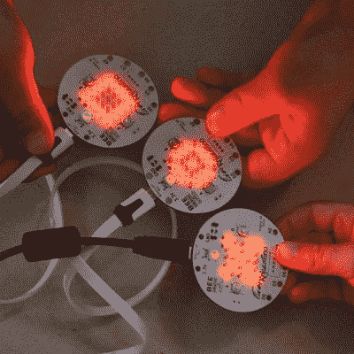

# Kniwwelino 是一个 ESP8266 微位

> 原文：<https://hackaday.com/2018/04/05/kniwwelino-is-an-esp8266-microbit/>

Kniwwelino 是我们见过的一系列受 T2 微比特启发的项目中的最新一个，但这个项目有一个转折:它在核心部分使用了 ESP8266 和 WiFi，而不是 nR51 ARM/BTLE 芯片。这意味着学生可以通过笔记本电脑、手机或任何可以上网的东西进行连接。

然而，这并不是唯一的权衡。为了降低价格，Kniwwelino 放弃了 micro:bit 的加速度计/磁力计，转而采用可编程 RGB LED。有了更少的管脚，Kniwwelino 也能够抛弃 micro:bit 的爱它或恨它的卡边连接器。事实上，由于所有这些变化，很难称之为 micro:bit 克隆，它更像是一个超级 blinky ESP8266 开发套件。

 那么他们还有什么共同之处呢？中间是标志性的 5×5 LED 矩阵，以及专用于该设备的[块状视觉编程方言](https://doku.kniwwelino.lu/en/installation)。基于 ESP8266，Kniwwelino 自然也有一种 Arduino 方言，当学生厌倦了在彩色斑点周围移动时，他们可以“毕业”到这种方言，当然，你可以用 ESP8266 上运行的任何其他东西来闪存芯片。

我们手里没有，但我们喜欢这个主意。RGB LED 在第一天就很有趣，而且 Kniwwelino 非常适合现有的代码体，这使得从新手到中级程序员的过渡更加容易。这些都是个人喜好，但在我们的书中，就纯粹的普遍性和互操作性而言，WiFi 胜过蓝牙。最后，Kniwwelino 的制造成本大约是 micro:bit 的一半，这使得它在没有大型制造商补贴的学校中也是可行的。他们估计每件 5 美元。([零售](https://www.electronic-shop.lu/DE/products/167138)更高。)另一方面，Kniwwelino 将比其基于 ARM 的竞争对手使用更多的电力，并且没有加速度计。

Kniwwelino 显然是从一个卢森堡单词“kniwweln”中派生出来的，这个单词的意思显然是制作某种东西。德语 [Calliope Mini](https://hackaday.com/2016/10/18/germans-react-to-uks-microbit/) 以程序员的缪斯宙斯的女儿命名。我们很高兴看到这么多可爱的开发板进入学生的手中，不管你怎么称呼它们。