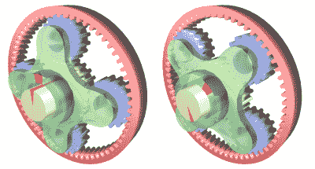

# 激光切割纸板行星齿轮组很漂亮，但是没用

> 原文：<https://hackaday.com/2015/11/22/laser-cut-cardboard-planetary-gearset-is-pretty-but-useless/>

[Shane]做了一个直击我们内心的项目——结合激光切割、纸板和齿轮。怎么会更好呢？嗯，它可以做任何事情。但这是吹毛求疵。仅仅看着[激光切割纸板行星齿轮转动](http://www.wattnotions.com/laser-cut-planetary-gear/)就已经足够有趣了。(休息后的视频。)

它是在激光切割机上使用[齿轮扩展](https://github.com/jnweiger/inkscape-gears-dev)在 [Inkscape](https://inkscape.org/en/) 中生成齿轮制作的，这是每个人都喜欢的免费 SVG 编辑器。

在他的文章中，[Shane]提到了所有相关的细节:所有的齿轮节距都需要相同，太阳齿轮(中间)的齿数需要等于齿圈(外侧)的齿数除以行星(中间)的数量。到目前为止一切顺利。

 [https://www.youtube.com/embed/0ScTsyQPHaw?version=3&rel=1&showsearch=0&showinfo=1&iv_load_policy=1&fs=1&hl=en-US&autohide=2&wmode=transparent](https://www.youtube.com/embed/0ScTsyQPHaw?version=3&rel=1&showsearch=0&showinfo=1&iv_load_policy=1&fs=1&hl=en-US&autohide=2&wmode=transparent)

我们看着它走了几分钟，然后对自己说，不是应该有别的东西在转吗？这东西是怎么传输能量的？

 

【图由埃里克·皮尔斯提供，via [维基百科](https://en.wikipedia.org/wiki/Epicyclic_gearing)

一个快速的[维基百科](https://en.wikipedia.org/wiki/Epicyclic_gearing)得出了答案。它没有将行星连接在一起的种族！行星很好地旋转着太阳，但如果不把它们绑在一起并驱动其他东西，这一切都只是一场表演。

我们要求满意！你欠我们一场航母比赛。我们直接给[谢恩]发了邮件。他说这是他的下一步，但没有什么比轻松的公开羞辱更能激发项目动机了！

与此同时，通过盯着[这个基于行星齿轮的时钟](http://hackaday.com/2015/03/01/laser-cut-clock-uses-planetary-gear/)或[这部复古的军队电影](http://hackaday.com/2015/01/13/retrotechtacular-planetary-gears-are-out-of-this-world/)来调整你的齿轮。