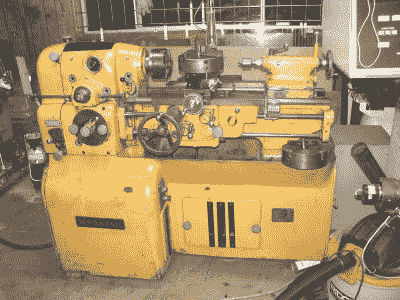

# 买机床:国外的还是国内的，新的还是二手的？

> 原文：<https://hackaday.com/2018/03/21/lathes-foreign-and-domestic/>

上次我们讨论机床时，我们谈到了如何选择你的钱包渴望投入的新金属加工车床的尺寸。下一个要做的重大决定是“新的还是旧的？”如果你在北美，这个问题和经典问题“进口还是美国？”。答案归结为你的需求是什么，你想从这台机器中得到什么。

如果你是机械加工新手，并且想学习技能，我推荐你从亚洲进口机器开始。如果你小心选择哪一个，你会得到一台价格非常合理的车床，它可以在板条箱外做精确的工作。如果你有兴趣了解这些工具是如何工作的，并做一个修复项目，一个老的美国机器是一个很好的选择。让我们更详细地看一下这两条路线。

## 浏览亚洲进口工具世界

购买亚洲进口商品可能具有挑战性，因为有很多选择。让事情变得复杂的是，有很多当地经销商进口这些机器，修理(或不修理)，重新喷漆(或不喷漆)，然后转售。有时你会得到技术支持和英文手册，有时则不会。

看着来自[小机械商店](http://littlemachineshop.com)、[海港货运](https://www.harborfreight.com)或[灰熊](http://www.grizzly.com)的机器，看到它们看起来都一样，很容易认为它们来自中国的同一家工厂，因此除了价格之外，它们都是一样的。不要犯那个错误！这些经销商通常与工厂达成协议，以不同的方式制造他们的机器(更好的轴承、不同的床身处理等)，一些经销商在进口后自行改进机器。研究是这里的关键。

你确实得到了你所付出的。如果一台外观相同的机器在 [Precision Mathews](http://www.precisionmatthews.com) 的价格比 [Grizzly](http://grizzly.com) 高 400 美元，这可能是因为他们升级了轴承或包括了更高质量的卡盘。联系经销商，网上调查，知道你买的是什么。

## 考虑超过你的第一台车床的时间表

也就是说，这些机器的平均质量水平现在已经足够好了，如果你刚刚开始，你会学到很多东西，并且可以在任何一台机器上做得很好。预先购买更高质量的产品将有助于你花更长的时间来适应这种机器，所以尽你所能多花钱。你越熟练，就越能从一台好机器中获益(也越能应付一台坏机器)。

机械师势利者仍然称这些进口品为“铸造工具”。可笑的是，它们需要如此多的修补才能变好，以至于除了作为一桶车床形状的铸铁块，你可以用来制造车床之外，它们毫无用处。当消费类机床浪潮开始时，这可能是真的，但现在肯定不再是这样了。

## “老铁”还是新品

现在让我们谈谈美国。毫无疑问，美国人(还有德国人、瑞士人、英国人和其他人)在 20 世纪制造的机器质量一流。这些机器不像今天的消费级亚洲机器那样是按预算价位制造的。它们可以使用一辈子，公司依靠它们来完成真正的生产工作，并据此定价。

We covered this [Monarch 10EE renovation](https://hackaday.com/2012/05/28/turning-a-1942-lathe-into-a-functional-piece-of-art/) a few years ago. The [photo album](http://www.practicalmachinist.com/vb/redirect-to/?redirect=http%3A%2F%2Fs65.photobucket.com%2Falbums%2Fh228%2Fmacona%2FMonarch%252010EE%2F) tells the painful tale of transporting old iron.

如今，由于这些国家的生产已经实现了数控化，旧的手工机器只需很少的钱就可以买到。由于最初的质量如此之高，它们通常处于非常好的状态。在一台旧车床中，首先要寻找的是床(又名“方式”)磨损和损坏，尤其是在卡盘附近。你可以学习在磨损的地方工作，但是这是不可修复的。如果方法是好的，其他一切都是可以解决的(取决于你愿意做修复工作)。不过，要找到一台价格合理、随时可用的老式机器可能很难，所以如果你正在寻找一个项目，旧熨斗路线是最佳选择。

请注意，修复旧车床通常也需要使用车床，因为您可能需要制作轴、轴承、衬套等。同样值得注意的是，老铁通常又大又重。非常大。而且非常重。在购买那辆漂亮的 Monarch 10EE 之前，问问你自己，“self，我有办法在我的余生里移动和服务一辆 3300 磅的大卡车吗？”。在没有铲车和装卸台的情况下移动这些机器可能是一个需要多天时间的项目，并且您需要知道您将要面对的是什么。这是可以做到的——人们已经把它们搬下狭窄的地下室楼梯，但是研究一下其中的技术，看看你是否准备好了。

在世界上的一些地方，亚洲进口将是你唯一的选择，因为 20 世纪的贵妇人基本上不可能以任何值得的价格运出他们的原籍国。他们将永远留在他们出生的国家。如果你在澳大利亚、日本或南美等地，寻找当地的经销商，他们可以避免猜测和直接从中国和台湾工厂购买的风险。

## 只花你预算的一半

我将留给你最后一个深深烙在你心灵深处的想法。只花一半的预算在车床上。你将会在工具上花费更多的钱。有经验的机械师总是这么说，新机械师从不相信。是真的。你会惊讶于所有你需要的工具、工具夹、钻头、卡盘、指示器、千分尺、锉刀、石头、研磨机、铰刀、天平、角尺、方块、量具、卡尺等，以及你需要它们的速度。也不要低估股票的成本。学习时，你想使用高质量的易切削钢、铝和黄铜；不是你在 Arby 的垃圾箱后面找到的废神秘金属。优质股票可能相当昂贵，但它在学习时非常有帮助，会帮助你做优质工作，所以不要忘记它。

有更多的考虑因素围绕特定的车床功能，将决定正确的机器给你，但我们将进入下一次！